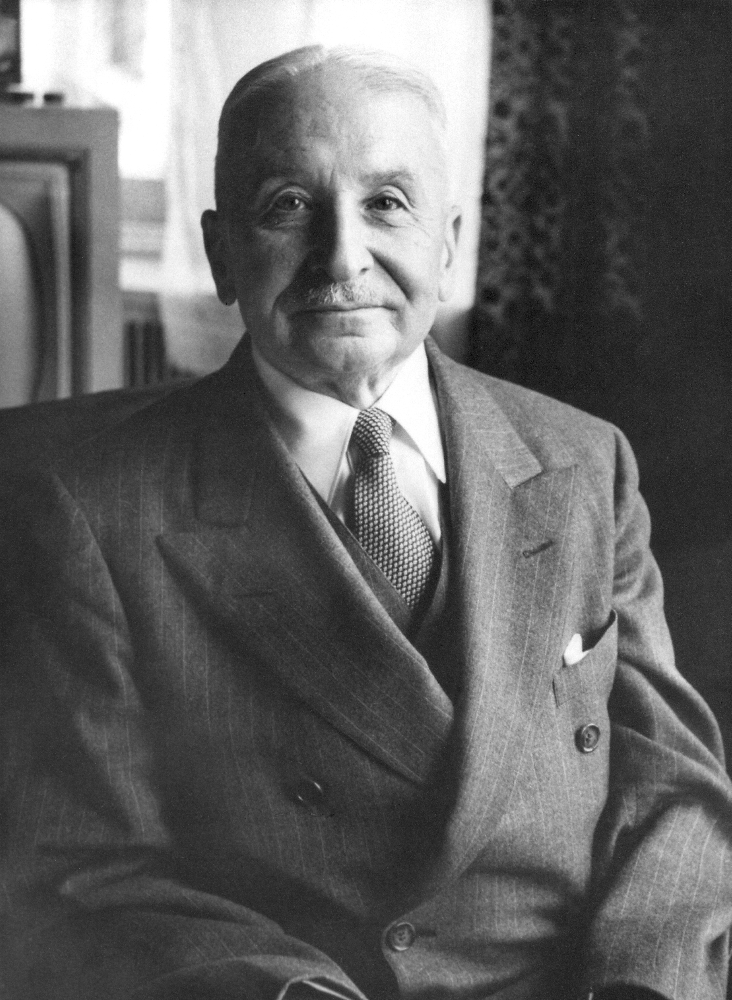

With every news about cryptocurrencies (most often it’s bitcoin) often there are people with comments like: “bitcoin has no value”, “bitcoin has no backing”, “nobody is behind bitcoin”, “value of bitcoin is arbitrary”, “bitcoin has no use-value”, “it’s used only for speculations”, “bitcoin is a bubble ready to pop”, “bitcoin is a pyramidal Ponzi-scheme”, “bitcoin is a magic internet money that someone just made up”. The purpose of this article is to explain closely bitcoin like the most well-known cryptocurrency, and all other cryptocurrencies.

## ORIGIN OF MONEY

To better understand cryptocurrencies, it's very important not to take our understanding of money for granted. What is money? Money is generally defined as something that can be used as a medium of exchange between equal values of work and resources. It that way money can store value, be a unit for counting and a medium for exchange.

Across generations, people developed different mediums for transferring of value between them and each of these methods fixed inefficiencies of some past mediums i.e. methods of exchanging value. Historically, people used barter where they traded something they had for something they needed/wanted. A medium of exchange in this system was almost everything - from livestock, wheat, textile etc. - depending on what was in stock and what was needed.

Value of these goods is not guaranteed in any way. Parties in an exchange have a sort of a duty to examine the goods and determine their unique value themselves. Also, there is no common procedure of return if one of the parties changes his opinion after the transaction has been executed. Barter is pretty limited because of few reasons:

* It relies on parties having needs that are mutually complementary, that means, for example, that you can have ten apples that you want to exchange for a chicken, but if the other party that has a chicken does not want apples then you have a problem.

* There is a possibility of a lack of a common measure of value between the parties in the exchange.

* Many goods can't be easily divided.

* Goods that can be spoiled lose value fast.

There gold and silver come into the picture - exchangeable goods or materials, that can be also be bought and sold. Gold and silver became the most popular materials in use, firstly because people valued their physical properties. What makes gold and silver usable and wanted as a medium of exchange?

* They are scarce.

* They are very durable which means they will last through time.

*  They are divisible, which makes them more suitable for an exchange.

* They are distinctive, so they are hard to fake.

In practice, gold, and silver were used in barter, there had to be a physical exchange of gold and silver to facilitate trade. Likewise, there is no central authority who will guarantee their value, instead of that, in determining their value it is believed that they will be desirable in the future.

Although trading with gold and silver more suitable than trade, people are still limited because storage and transport of gold and silver can be quite difficult. Because of gold and silver not being very practical, states started to introduce paper money for easier day-to-day use. In the United States, paper money traditionally had a backing in gold, but that kind of gold standard was repealed by Richard Nixon in 1971. when dollar losses his material backing, and central banks - many of which are in private hands, theoretically gain a possibility of issuing money indefinitely. In this kind of system value of money is determined by the trust that people have towards the government, but very often money is print to achieve some political goals and by that existing money in circulation losses value and citizen lose their buying power.

## HOW MONEY GET'S IT'S VALUE?

Many of those who never used Bitcoin look at it with confusion. Why this "magic internet money" even has value? How is that Bitcoin is even considered money? Those who got used to "hard money", the idea of us having money "from nothing", i.e. some computer code is very hard to comprehend.

In trying to understand why bitcoin and other cryptocurrencies have value one economist can help us - Ludwig von Mises, in 1912. he publishes his "Theory of money and credit" - a book that was a hit in Europe and was published in German and after that was translated into English. Although there he explains every aspect of money his main contribution is following the value and price of money and not just money, to its origins i.e. Mises explains how money get's it's price in form of goods and services that can be bought with it. Later he named that process "theory of regression" and as you will understand - bitcoin, and other cryptocurrencies, satisfy every condition of this theorem.

Mises teacher, Carl Menger, demonstrates that money originates for the market - not form the states or "social contract". It appears gradually, in a procedure of searching for an ideal form of indirect exchange, instead of barter - people gain a certain good, not for consuming it, but because of further trade. That good becomes money, good that is exchanged most often on the market and that is most suitable for exchange. Mises adds that the value of money traces backward in time to its value as a bartered commodity. Mises said that this is the only way money can have value.

*"The theory of the value of money as such can trace back the objective exchange value
of money only to that point where it ceases to be the value of money and becomes
merely the value of a commodity…. If in this way we continually go farther and farther
back we must eventually arrive at a point where we no longer find any component in the
objective exchange value of money that arises from valuations based on the function of
money as a common medium of exchange; where the value of money is nothing other
than the value of an object that is useful in some other way than as money.… Before it
was usual to acquire goods in the market, not for personal consumption, but simply in
order to exchange them again for the goods that were really wanted, each individual
commodity was only accredited with that value given by the subjective valuations based
on its direct utility"*

Mises' explanation solves a big problem that puzzled economists for a long time. Ask yourselves: "Would salt ever be money if it is otherwise completely useless?", "Would beaver pelts ever had and monetary value if it did not have value as a commodity?", "Would gold and silver have any monetary value if they did not have value as goods first?" The answer in all cases of monetary history is obviously no.

At first glance, bitcoin looks like an exception, bitcoin can't be used in any other way than like money. It can not be worn as a jewelry, you can not make a machine out of it. It can not be eaten, or decorate a room with it. His value is manifested only in facilitating a direct exchange. Nevertheless, bitcoin is money. It's used every day. You can see exchanges every day, that's not a myth, but a reality.

But, what about "theory of regression"? Is Mises wrong? Maybe we have to dismiss his whole theory, maybe his theory is applicable only in history, while in digital age some other rules are valid? Maybe his theory of regression proves that bitcoin is really just an empty story because it can't be reduced to some valuable good like for example salt can be reduced? To solve this problem "in our heads" we have to understand a difference between bitcoin as a currency and Bitcoin as a payment system.

## BITCOIN AS A PAYMENT SYSTEM VS BITCOIN AS A CURRENCY

We are used to thinking about currencies as being split from systems of payment. This kind of thinking is a direct consequence of limitations that were present in history. There is a dollar and they are credit cards, there are euros and there is PayPal. In every case, transfer of money relies on trust that you have towards institutions that facilitate the transfer i.e. institution that facilitates the transfer has to believe that you will pay.

The hitch between money and payment system was always present except in cases of physical proximity. If you give someone two dollars for a kilo of pears there is no third party.
But different systems of payment - third parties, and trust become important as you leave geographic proximity. This is where companies like Vise and institutions like banks become irreplicable - they are responsible for applications of a monetary system in a way that we want it to be applied.

The problem is that today's payment systems are not widely available to everyone. In fact, most of the mankind does not have access to these tools, which is one of the main reasons for poverty in the world. "Financially disadvantaged" are destined to local traded and they cannot extend it to the whole world.

Big, if not the only, purpose of bitcoin is to solve this problem. 
The protocol set out to wave together the currency feature with a payment system. The two are utterly interlinked in the structure of the code itself. This connection is what makes bitcoin different from any existing national currency, and, really, any currency in the history of mankind.

Let's look at what Satoshi Nakamoto(pseudonym of the original creator or creators of bitcoin protocol ) says in an introduction to his whitepaper. Observe how central the payment system is to the monetary system he created: 

*A purely peer-to-peer version of electronic cash would allow online payments to be sent
directly from one party to another without going through a financial institution. Digital
signatures provide part of the solution, but the main benefits are lost if a trusted third
party is still required to prevent double-spending. We propose a solution to the double-spending problem using a peer-to-peer network. The network timestamps transactions
by hashing them into an ongoing chain of hash-based proof-of-work, forming a record
that cannot be changed without redoing the proof-of-work. The longest chain not only
serves as proof of the sequence of events witnessed but proof that it came from the
largest pool of CPU power. As long as a majority of CPU power is controlled by nodes
that are not cooperating to attack the network, they'll generate the longest chain and
outpace attackers. The network itself requires minimal structure. Messages are
broadcast on a best effort basis, and nodes can leave and rejoin the network at will,
accepting the longest proof-of-work chain as proof of what happened while they were
gone."*

Bitcoin as a protocol solves the Byzantine generals problem - the problem of coordinating armies for next action on a big geographic area in presence of potentially malicious actors. Because generals are geographically distant, no one can be sure that the other general received a message, much less accuracy of the message.

Putting a ledger, that everyone has a right to access, on the Internet overcomes this problem. Leger stores amounts, time and public addresses of every transaction. Information that is shared all across the globe is always updated. This ledger guarantees the integrity of the system and enables the currency to become a form of digital property.

Once we understand this, we can see that Mises's theory of regression is still valid for this case. Value of bitcoin is interlinked with the payment network. Value is not incorporated in the unit of value but in a brilliant and innovative system of payment in which bitcoin "lives". When we would find a way to separate [blockchain][blockchain] from bitcoin (which is really not possible), the value of the currency would instantly fall to zero.

The first price of Bitcoin appeared on 9. September 2009. and that's when you could get 1,309.03 bitcoin for one American dollar (which some people considered too expensive in that time) i.e. the first value of bitcoin was little more than one-tenth of a penny. You could ask a question: What happened between January 9 and October 5, 2009, to cause bitcoin to obtain a market value? The answer is that traders, enthusiasts, entrepreneurs, and other were trying out the blockchain. They wanted to know if it worked. Did id transfer the units without double spending? Did a system that depended on voluntary CPU power actually suffice to verify and confirm transactions? Do the rewarded bitcoins land in the right spot as payment for verification services? Most of all, did this new system actually work to the seemingly impossible - that is, to move secure bits of title-based information through geographic space, not by using some third party but rather peer-to-peer?

It took ten months to build trust in the network, and then another eighteen months for bitcoin to reach parity with the US dollar. It is very important to understand these historical facts, especially when we rely on the theory that speculates about pre-history of money, as Mises' regression theorem does. Bitcoin was not always a money with value. It was once a pure accounting unit attached to a ledger. This ledger obtained what Mises called "use value". All conditions of the theorem are thereby satisfied.

## CONCLUSION

Bitcoin appeared as any other currency - from salt to gold. People consider that bitcoin payment system is useful. Bitcoin is transferable, divisible, exchangeable, durable and scarce. Bitcoin as money has all the best properties of money as his payment network adds weightlessness and spacelessness that enables the whole world to trade without relying on some third party and that's pretty much it.  There no any "catch". After all, bitcoin is an open source software, everyone can see it's code and propose improvements to it - and that's where all the stories about his bad properties or that it's created for the sake of someone becoming rich should stop. Those who bought bitcoin, i.e. those who where "early in the game" today enjoy a great profit, but it would be the same if they lost money in case others did not recognize it's valued and it's price dropped, that's a property of every market - those who can recognize value in something earlier and they buy something earlier have a right on all the gains that they later have, nothing to be worried about.

[blockchain]: https://bitfalls.com/2017/08/20/blockchain-explained-blockchain-works/
