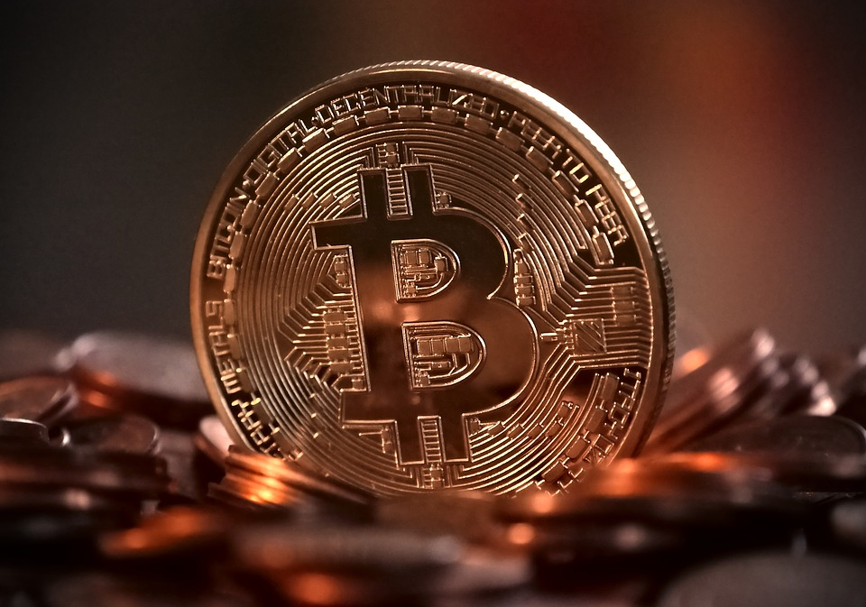
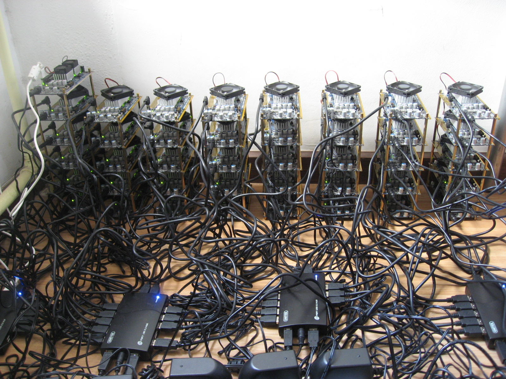

Kod svakog objavljivanja neke vijesti vezane za kriptovalute(najčešće je to bitcoin) često se javljaju ljudi s komentarima kao što su: „bitcoin nema nikakvu vrijednost“, „bitcoin nema nikakvo pokriće“, „nitko ne stoji iza bitcoina“, „vrijednost bitcoina se određuje arbitrarno“, „bitcoin nema uporabnu vrijednost“, „koristi se samo za špekulacije“, „bitcoin je balon koji samo što nije puknuo“, „bitcoin je piramidalna ponzi-shema“, „bitcoin je neki čarobni internetski novac kojeg je netko samo izmislio“.  Svrha ovog članka je pobliže objasniti bitcoin kao najpoznatiju kriptovalutu, ali i sve kriptovalute.

## KAKO NOVAC DOBIVA NA VRIJEDNOSTI?

U jednom od naših prethodnih [članaka][članak] raspravili smo povijest novca. Ovaj članak će pokazati kako novac dobiva svoju tržišnu vrijednost - što je jako važno sa stajališta kriptovaluta i njihovog vrednovanja.

Mnogi od onih koji nikada nisu koristili Bitcoin na njega zbunjeno gledaju – zašto ovaj „čarobni internet novac“ uopće ima vrijednost? Kako to da se Bitcoin uopće smatra novcem? Oni koji su navikli na „opipljivi novac“, ideja da možemo imati novac „iz ničega“, tj. izračunanog koda može biti vrlo teška za shvaćanje.

Kod shvaćanja zašto bitcoin i ostale kriptovalute imaju vrijednost može nam pomoći jedan ekonomist – Ludwig von Mises , 1912. godine on objavljuje „Teoriju novca i kredita“ – knjigu koja je bila hit u Europi kada je objavljena na Njemačkom, i kasnije kada je prevedena na engleski. Iako je u njoj objasnio svaki aspekt novca njegov glavni doprinos je praćenje vrijednost i cijene novca, i ne samo novca, do njegovog podrijetla tj. Mises objašnjava kako novac dobiva svoju cijenu u obliku dobara i usluga koje se njime mogu dobiti. Kasnije je taj proces nazvao „teorem regresije“ i kako na kraju ispada – bitcoin, i druge kriptovalute, zadovoljavaju svaki uvjet ovog teorema.

Misesov učitelj, Carl Menger, demonstrira da sam novac potiče iz tržišta – ne iz države ili „društvenog ugovora“. Pojavljuje se postupno, u postupku potrage za idealnim oblikom neizravne razmjene, umjesto trampe – ljudi stječu neko dobro, ne zbog konzumacije, nego zbog trgovine. To dobro postaje novac, dobro koje se najviše razmjenjuje na tržištu i koje je najprikladnije za razmjenu. Mises dodaje da se vrijednost novca može pratiti natrag u prošlost kao razmjenjivo dobro koje je utrapljeno, on kaže kako je to jedini način na koji novac može imati vrijednost.

*„Teorija o vrijednosti novca kao takva može pratiti natrag u vremenu objektivnu razmjenjivu vrijednost novca samo do točke gdje ona prestaje biti vrijednost novca i postaje samo vrijednost dobra... ako na ovaj način nastavimo kontinuirano ići unatrag eventualno moramo doći do točke gdje više ne nalazimo komponentu u objektivnoj razmjenjivoj vrijednosti novca koja proizlazi iz vrednovanja vrijednosti novca koja proizlazi iz vrednovanja temeljenih na funkciji novca kao učestalog medija razmjene; gdje je vrijednost novca ništa drugo od vrijednosti objekta koji je na neki način koristan, osim kao novac... prije nego je bilo uobičajeno stjecanje dobara na tržištu, ne za osobnu potrebu, nego jednostavno za daljnju razmjenu za dobra koja su stvarno potrebna svako pojedinačno dobro je vrednovano na temelju danih subjektivnih procjena njegove izravne koristi.“*

Misesovo objašnjenje rješava veliki problem koji je dugo mučio ekonomiste. Zapitajte se: „Bi li sol ikada postala novac da je inače potpuno beskorisna?“, „Bi li dabrovo krzno ikada imalo monetarnu vrijednost da isprava nije imalo vrijednost kao komoditet?“, „Bi li zlato i srebro imali monetarnu vrijednost da isprva nisu imali vrijednost kao dobra?“ Odgovor u svim slučajevima monetarne povijesti je očito ne.

Na prvi pogled, bitcoin se čini kao iznimka, bitcoin se ne može koristiti nikako drugačije osim kao novac. Ne može se nositi kao nakit, od njega se ne može napraviti stroj. Ne može se jesti, niti se njime može dekorirati. Njegova vrijednost se očituje jedino kod olakšavanja indirektne razmjene. Ipak, bitcoin je novac. Koristi se svaki dan. Možete vidjeti razmjene svaki dan, to nije mit, nego prava stvar.

Ali, što s „teorijom regresije“? Je li Mises u krivu? Možda moramo odbaciti cijelu njegovu teoriju, možda se njegova teorija isključivo moguće primijeniti na povijest, dok u digitalnom dobu vrijede nova pravila? Možda njegova teorija regresije dokazuje da je bitcoin stvarno samo prazna priča jer se ne može svesti na neku korisnu robu kao što se može svesti npr. sol? Kako bi riješili ovaj problem „u glavi“ moramo razumjeti razliku između bitcoina kao valute i Bitcoina kao sustava za plaćanje.

## BITCOIN KAO SUSTAV ZA PLAĆANJE VS BITCOIN KAO VALUTA

Svi smo naviknuti misliti o valute odvojenoj od sustava plaćanja. Ovakvo razmišljanje je posljedica tehničkih ograničenja koja su bila prisutna u povijesti. Postoje dolar i postoje kreditne kartice, postoje euri i postoji PayPal. U svakom slučaju, transfer novca se oslanja na povjerenju između vas i institucija koje uređuju transfer tj. institucija koja uređuje transfer vam mora vjerovati da će te platiti.

Ovaj „klin“ između novca i sustava plaćanja je uvijek bio prisutan osim u slučaju fizičke blizine. Ako nekome date deset kuna za kilu krušaka na postoji treća strana. Ali različiti sustavi za plaćanje – treće strane, kao i povjerenje postaju važni jednom kada se napusti geografska blizina. Tu nam kompanije kao što su Visa i institucija kao što su banke postaju nezamjenjive – oni su zaslužni za primjenu monetarnog sustava na način na koji želimo.

Problem je što današnji sustavi za plaćanje nisu dostupni svima. Zapravo, velika većina čovječanstva nema pristup takvim alatima, što je jedan od glavnih razloga za siromaštvo u svijetu. „Financijski obespravljeni“ su osuđeni samo na lokalnu trgovinu i ne mogu je proširiti na cijeli svijet.

Velika, ako ne i glavna, svrha bitcoina je rješavanje ovog problema. Protokol je dizajniran tako da zajedno „utka“ svojstvo valute i sustava ta plaćanje. To dvoje je potpuno povezano u strukturi samog koda. Ova povezanost je ono što čini bitcoin drugačijim od bilo koje druge nacionalne valute, i, u stvari, bilo koje druge valute u povijesti čovječanstva.

Pogledajmo što Satoshi Nakamoto (pseudonim izvornog tvorca ili tvoraca bitcoin protokola) kaže u uvodu svoga *whitepapera*. Uočimo kako je sustav plaćanja važan monetarnom sustavu kojega je stvorio:

*“Čista peer-to-peer inačica elektroničkog novca ne bi dopuštala izravno plaćanje jedne stranke drugoj bez prolaska kroz financijsku instituciju. Digitalni potpisi pružaju dio rješenja, ali glavne prednosti su izgubljene ako je treća strana još uvijek potrebna kako bi se izbjegla dvostruka potrošnja. Mi predlažemo rješenje problema dvostruke potrošnje korištenjem peer-to-peer mreže. Mreža vremenski označuje tako da ih hashira u neprekidan lanac hash-baziranog dokaza o radu, tako oblikujući zapis koji se ne može mijenjati bez dokaza o radu. Najduži lanac ne koristi samo kao dokaz slijeda osvjedočenih događaja, nego i dokaz da je došao iz najvećeg “bazena” CPU snage. Dok god je većina snage CPU-a u kontrolirana od strane čvorova koji ne surađuju kako bi napali mrežu, oni će generirati najduži “lanac” i nadmašiti napadače. Mreža sama po sebi zahtjeva minimalnu strukturu. Poruke se odašilju bez ikakve garancije da će uspjeti, a čvorovi se mogu proizvoljno pridružiti ili napustiti mrežu, prihvaćajući najduži lanac dokaza o radu kao dokaz onoga što se dogodilo dok nisu bili na mreži.”*

Ono što je upečatljivo je to što nema niti jednog spominjanja same valute. Spominje se samo problem “dvostrukog trošenja”, novac ovdje, čak i po riječima njegovog kreatora, je platna mreža, ne sam Bitcoin. Bitcoin ili digitalna jedinica izražava vrijednost mreže. To je računovodstveni alat koji apsorbira i nosi vrijednost mreže kroz  vrijeme i prostor.

Ova mreža je blockchain. To je vrsta popisa transakcija koja “živi” u digitalnom oblaku, distribuiranoj mreži i njen se radi može pratiti od strane bilo koga u bilo koje vrijeme. Pažljivo se prati od strane svih korisnika. Ona omogućava transfer sigurnih i neponovljivih bitova informacije od jedne do bilo koje druge osobe bilo gdje u svijetu, i ti informacijski bitovi su osigurani u digitalnom obliku vlasništva. To su ono što Nakamoto naziva “digitalni potpisi”. Njegov izum popisa transakcija “u oblaku” omogućuje da se takva vlasnička prava mogu verificirati bez ovisnosti o nekoj trećoj strani.

Bitcoin protokol rješava problem Bizantskih generala - problem koordiniranja vojske za sljedeću akciju na velikom geografskom području  u prisutnosti potencijalno aktera koji potencijalno namjerno žele nanijeti štetu. Zbog toga što su generali geografski udaljeni, niti jedan ne može biti siguran da je drugi primio poruku, a još manje njenu točnost.

Stavljanje popisa transakcija, oko kojeg su svi suglasni, na Internet nadilazi ovaj problem. Popis transakcija sprema količine, vrijeme i javne adrese svake transakcije. Informacija koja se dijeli diljem planete se uvijek ažurira. Taj popis transakcija garantira integritet sistema i omogućuje da valuta postane oblik digitalnog vlasništva.

Jednom kada ovo razumijemo, možemo vidjeti da Misesova teorija regresije i dalje vrijedi i za ovaj slučaj. Vrijednost bitcoina povezana je s platnom mrežom. Vrijednost nije ugrađena u samu jedinicu valute nego u briljantom i inovativnom sustavu za plaćanje na kojem bitcoin “živi”. Kada bi se našao način da se [blockchain][blockchain] odvoji od bitcoina (što, u stvarnosti, nije moguće), vrijednost valute bi trenutno pala na nulu.

Prva cijena Bitcoina se pojavila 9. listopada 2009. i tada ste za jedan američki dolar mogli dobiti 1,309.03 bitcoina (što su mnogi smatrali preskupim u to vrijeme), tj. prva vrijednost bitcoina je tek nešto više od pola jedne lipe. Mogli bi si postaviti pitanje: “Što se dogodilo između 9. siječnja i 5. listopada 2009. godine da bitcoin dobije tržišnu vrijednost? Odgovor leži u tome što su trgovci, entuzijasti, poduzetnici i drugi isprobavali blockchain. Željeli su znati funkcionira li. Je li transferirao vrijednosti bez dvostrukog trošenja? Je li sustav koji je zavisio o proizvoljnom dijeljenju procesorske snage kako bi potvrdio transakcije? Jesu li bitcoin koji se dodjeljivao kao nagrada došao do prave adrese kao naknada za usluge verifikacije? I na kraju, omogućuje li ovaj sustav ono što je na prvu nemoguće - a to je prijenos vlasništva kroz geografski prostor, ne koristeći neku treću stranu nego samo peer-to-peer mrežu?

Bilo je potrebno 10 mjeseci kako bi se izgradilo povjerenje prema mreži, a zatim još 18 mjeseci da bitcoin po vrijednosti bude izjednačen s američkim dolarem. Ove povijesne činjenice je vrlo važno razumjeti, posebno kako se oslanjamo na teoriju koja špekulira o pra-povijesti novca, kao što to radi Misesov teorem regresije. Bitcoin nije uvije bio novac s vrijednosti. Jedno vrijeme je bio isključivo računovodstvena jedinica povezana s popisom transakcija ili ledger-om. Ledger je dobio ono što Mises naziva “uporabljiva vrijednost”. Svi uvjeti ovog teorema su time zadovoljeni.

Kada Vam bilo tko kaže da je bitcoin mačak u vreći, bio on laik koji je "proučavanju" bitcoina posvetio cijele 3 minute čitajući nešto u novinama ili školovani ekonomist podsjetite ih na dvije važne činjenice:

* Bitcoin nije samostalna valuta nego obračunska jedinica povezana s platnom mrežom
* ta mreža, i posljedično bitcoin je svoju tržišnu vrijednost dobiva testiranjem u stvarnom vremenu u tržišnim uvjetima.

## ZAKLJUČAK

Bitcoin se pojavio kao svaka druga valuta, od soli do zlata. Ljudi smatraju da je bitcoin platni sustav koristan. Bitcoin je prijenosan, djeljiv, zamjenjiv, trajan i rijedak. Bitcoin kao novac ima sva najbolja svojstva novca i njegova platna mreža dodaje nedostatak ikakve težine i besprostornost koja omogućuje da cijeli svijet trguje bez da se oslanja na treću stranu i to je to. Nema nikakve "kvake". Uostalom, bitcoin je software otvorenog koda, svatko može vidjeti njegov kod i predlagati promjene - i tu bi uglavnom sve priče o njegovim lošim svojstvima ili da je stvoren u cilju nečijeg bogaćenja trebale stati. Oni koji su kupili bitcoin, tj. "ušli" ranije danas uživaju u velikom profitu, ali isto tako bi imali gubitke da ostali nisu prepoznali njegovu vrijednost i da mu je pala cijena, to je svojstvo svakog tržišta - oni koji prepoznaju neku vrijednost ranije i ranije nešto kupe imaju pravo na sve dobitke koje kasnije imaju, ništa oko čega bi se trebalo zabrinjavati.

[blockchain]: https://bitfalls.com/hr/2017/08/20/blockchain-explained-blockchain-works/
[članak]: https://bitfalls.com/hr/2017/08/20/cryptocurrency/
