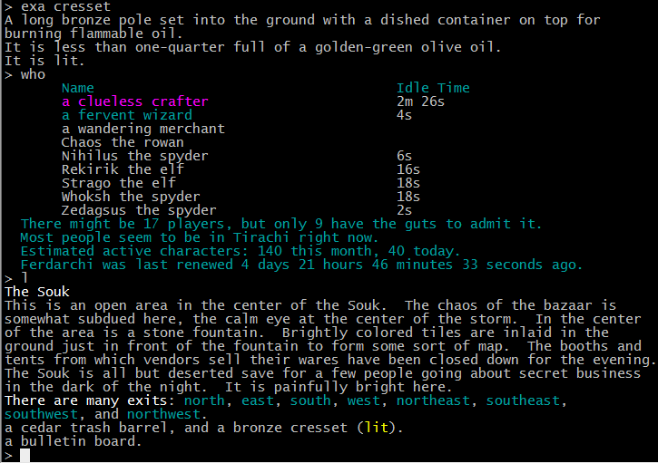

As a gamer in the 90s, I was very much a fan of MUDs. MUDs or Multi User Dungeons are interfaces in which everything you see is described with text, and all commands issued to the game are typed out too. Here's a screenshot from an old MUD.

Granted, this is far from what modern day games offer with their multi-trillion polygon models, but for us retro gamers this stuff still holds a certain Dungeons & Dragons style charm. Additionally, forcing yourself to imagine the described scenes makes you somehow more involved, if that makes sense. You're an active participant through both your actions and your imagination. But enough about MUDs, what's all this got to do with the blockchain?

---

## State Channels

If you've been in Ethereum long enough, you probably remember the time [CryptoKitties](https://bitfalls.com/2018/02/18/15-alternatives-cryptokitties-no-idea-existed/) slowed the whole network down because of pending transactions. Around that time, the idea of payment channels started to take shape across the various blockchain projects. 

### Payment Channels

A payment channel works like this: two parties deposit a stake into a multi-signature wallet, and then exchange messages about the state of that wallet until they're ready to close the wallet and each withdraw their share. So Alice and Bob may start out with A:1eth / B:0eth, and end with A:0.3eth / B:0.7eth. Between those two states (the opening and closing state), there may have been a thousand transactions - but all of them were free and instant because they were only communicated between the two parties. Once Alice and Bob are ready to broadcast their wallet states to the world, they send a transaction to the blockchain which contains the closing state, and to the outside world it looks like Alice just straight up sent Bob 0.7 eth. This is a payment channel because it channels payments, and we explained it with an illustrated example [here](https://bitfalls.com/2018/04/15/lightning-network-work/) - highly recommended you read this.

The most notable examples of payment channels are Bitcoin's Lightning Network (which [cannot work](https://www.youtube.com/watch?v=yGrUOLsC9cw) and is already [driving users away](https://twitter.com/abrkn/status/1078193601190989829)) and Ethereum's Raiden Network which is just Eth's version of Lightning (Raiden is the god of thunder and lightning in Mortal Kombat) and, in my opinion, just as questionably useful.

Personally, I'm a much bigger fan of state channels.

### State Channels

State channels are like payment channels, but for _state_. Technically, wallet balance is also state - the state refers to the current data of the blockchain, such that the balances of everyone are known. But while payment channels focus on tokens in particular (native like BTC or ETH or implementations like ERC20), state channels abstract that even further and consider not only token balances state, but also all other data points state. 

So instead of exchanging messages about changes in wallet balance with another party, you exchange messages about data.

Example of a payment channel:

- Alice and Bob open a payment channel with 0.5 eth each (<- transaction happens)
- Alice sends Bob 0.1 eth
- Alice sends Bob 0.1 eth
- Alice sends Bob 0.1 eth
- Bob refunds 0.25 eth
- Alice and Bob close a payment channel with Alice having 0.45 and Bob having 0.55 eth. (<- transaction happens)

Example of a state channel:

- Alice buys a crypto kitty "AngryCat" on the open market for 0.5 eth (transaction outside state channel, on something like [Opensea](https://opensea.io/))
- Bob buys a crypto kitty "BloatyCat" on the open market for 0.2 eth (transaction outside state channel, on something like [Opensea](https://opensea.io/))
- Alice opens a channel with CryptoKitties, committing her AngryCat as a deposit along with 1 eth (<- tx happens)
- Bob opens a channel with CryptoKitties, committing his BloatyCat as a deposit along with 0.5 eth (<- tx happens)
- Alice puts AngryCat to breed for the breed-buy price of 0.2 eth
- Bob notices a breedable kitty AngryCat, and decides to accept the offer
- Bob sends 0.2 eth to CryptoKitties for breeding BloatyCat with AngryCat
- CryptoKitties sends 0.2 eth to Alice and creates a new cat - AngryFartCat - assigning it to Bob. This turns out to be a rare cat because angry farts are special.
- Bob decides to put AngryFartCat up for breeding for the breed price of 0.5 eth.
- A third user, Charlie, notices this cat and decides he wants in on the action. He has a cat from before: CombatCat, so he opens a channel with CryptoKitties and 0.5 eth (<- tx happens)
- Charlie breeds CombatCat with AngryFartCat, sending 0.5 eth to CK. CK mints a new cat: NerveGasCat, and assigns it to Charlie, sending 0.5 eth to Bob.
- Bob decides he's had enough of the game for now and closes the channel. He ends up with a rare AngryFartCat and 0.8 eth. Bob profited. (<- tx happens)
- Charlie puts NerveGasCat up for breeding for 1 eth. 
- Alice would like to breed AngryCat with it. 1 eth out of her 1.2 eth is sent to CK. CK mints SaiyanCat and assigns it to Alice, sending her 1 eth to Charlie.
- Alice and Charlie have now had enough, and exit the game by closing their channels (<- tx happens)
- Alice ends up with 0.2 eth but she also has SaiyanCat. She puts it up for sale on Opensea.io for 5 eth. If she sells it, she's turned a nice profit from the starting 1 eth.
- Charlie ends up with 1 eth (a profit of 0.5 eth) and NerveGasCat. He's happy with the gain, but still puts it up for sale on Opensea.io for 5 eth.

As you can see, the gameplay itself can get pretty complex - especially as we introduce more players - but the number of transactions when players are _in_ the game (i.e. have state channels open) remains the same. We still max out at 2 transactions per player - one to open the channel, and one to close. Granted, if Alice wanted to breed for 1 eth and didn't have enough eth in her balance, she would have to either earn it in the game by breeding / selling / etc. or she would have had to top up her account. This would have required another transaction (a top-up is actually a simultaneous open / close channel transaction).

Now if we apply this to a truly multi-player game with consequences and more interactivity, we can stretch out imagination a bit and see how it might apply to a MUD. Read on below.

> To find out more about state channels, see:
> 
> - https://medium.com/l4-media/making-sense-of-ethereums-layer-2-scaling-solutions-state-channels-plasma-and-truebit-22cb40dcc2f4
> - http://ledgerjournal.org/ojs/index.php/ledger/article/download/15/64
> - https://gist.github.com/anonymous/ecda6a24d0f32522a691fd21d75c5e16
> - https://www.counterfactual.com/technology/

## MUD concept

After watching [Bandersnatch](https://en.wikipedia.org/wiki/Black_Mirror:_Bandersnatch), my love for MUDs was rekindled, so I set out to try and make one that's "next gen".

<blockquote class="twitter-tweet" data-lang="en">
Went into <a href="https://twitter.com/netflix?ref_src=twsrc%5Etfw">@netflix</a> <a href="https://twitter.com/hashtag/Bandersnatch?src=hash&amp;ref_src=twsrc%5Etfw">#Bandersnatch</a> highly skeptical expecting trivial YouTube style choices and here I am 3 hours later still exploring Easter eggs. I want to build a next gen MUD with whoever is responsible for this gem. A+ 👌
&mdash; Bruno Skvorc (@bitfalls) <a href="https://twitter.com/bitfalls/status/1079424060965220352?ref_src=twsrc%5Etfw">December 30, 2018</a></blockquote>

What's more next gen than blockchain?

### GAME NAME

The world is of the Norse mythos, similar to that of Marvel's Thor universe - so a mixture of science fiction and medieval / Viking-age themes.

The starting zone is Asgard, where the player starts out as a lowly Viking and desires to climb the ladder of awesomeness in order to gain a ticket to Valhalla. Valhalla can, of course, only be entered through death by combat of sufficient prowess. 

In a nutshell, you level up your character enough to fight epic monsters (in order) and the higher the level of the monster that kills you, the bigger the feast you're thrown as you enter Valhalla, and the more leaderboard points you get in addition to next-character bonuses.

If you're killed by a low level creature or you transgress and murder a fellow Viking, your fame is forsaken and the spirits of all your predecessors are exiled from Valhalla and cast into Hellheim to be forgotten forever.

Players transition between worlds through the Bifrost portal which triggers a transaction, and each zone is its own state channel. This means that entering and exiting a zone means sending a transaction, but keeps the game worlds isolated and small, allowing for addition of zones, tweaks to rules, user-contributed zones, and more.

Naturally, you can collect items, upgrade your skills, or just idle around and talk to your co-Vikings.

As long as players remain in the game, others can initiate combat with them, steal from them, interact with them. If the player remains inactive (no response given) for more than 24 hours, their state channel automatically closes. A player can close their channel manually, too, to exit the game and pause their character. In game, this is called "Summoning a Valkyrie" which takes the player back to Asgard. This has the added effect of withdrawing the player character to a user's wallet, which lets them trade the character on an NFT marketplace (the player characters are [NFTs](https://bitfalls.com/nft)).

### UX

Before we proceed, a note on UX. All this talk about transactions makes for a poor user experience. The average user does not want to think about transactions, gas costs, confirmation times, etc. The way we get around this is as follows:

- the game uses [Nimbus](https://our.status.im/tag/nimbus) as a back end, which can handle peer to peer connections and key management. In effect, the game client is a wallet which can auto-sign transactions or, for the more paranoid, request a password for every transaction (depending on whether or not a keystore file was encrypted). This means that the user starts playing by downloading the game client (weird to call it that since there's no _server_, but okay), seeding it with a bit of eth, and the client takes over, occasionally asking for a password.
- each interaction with a shard is a state channel, which makes it possible to interact with other players and the world through commands like `LOOK at @swader` or `PUNCH @swader` or `GIVE #mjolnir to @swader`. These interactions are signed messages aggregating on the clients running that particular _shard_ of the universe, of which there will always be at least 2: the software running over in [Bitfalls HQ](https://bitfalls.com), and the player's computer.

Therefore, think of the game client like a stripped down version of [Mist](https://bitfalls.com/2018/02/12/explaining-ethereum-tools-geth-mist/) which has the ability to execute custom pre-defined transactions.

## Implementation

And now for the hard part. First, let's define dispute resolution and deposits.

### Economics

To enter a shard, a player has to send 0.15 ether to the game. The game will create a character for them and lock up 0.1 ether for their deposit. The 0.05 ether creation fee goes towards financing further development. Better than an ICO `¯\_(ツ)_/¯`

This deposit is a guarantee of good behavior, and is refunded once the player character exits ("Summon a Valkyrie") unless the exit was an ejection triggered by another player (i.e. an invalid transaction was detected and not rectified in a given time frame).

To enter a shard, the deposit process is repeated only without the additional 0.05 ether - once a player has a character, that character's creation fee has been paid in perpetuity. 

_Note that a new character of the same player will still need to pay the creation fee._

During interaction in a shard, it is assumed all players are making only valid moves. If, however, a player makes invalid moves IRT the game state, others who detected these moves and trigger a reporting procedure which will send a transaction to the public blockchain for the initiation of the dispute resolution process. In other words, you can rat someone out and unless they start behaving they get kicked out of the universe and their deposit is split in half: half is burned, and half is given to the reporter.

### State growth

To achieve a feeling of real time interaction, the clients that communicate are constantly exchanging messages that basically say "no action taken". This happens roughly once per second (throttled, so powerful computers don't become too fast players). This allows a player to issue a command at any time, and it'll seem real time. This also means the state of the channel grows rapidly and constantly.

Because it's in everyone's best interest to keep the game client light-weight, the plan is to occasionally purge the shard data though how often and _how_ exactly is still up in the air and will be decided when we see how fast the clients are filling up hard drives.

---

## The Code

---

## FAQ

Here are some questions I expect, but was not asked yet.

### Why not JS / Web?

I don't like JavaScript or any of its unholy offspring, and I wanted to play with Nim and Nimbus. That said, this whole thing is very open and I welcome efforts to build JS clients. That'd be great, actually, because then the game would work inside things like [Status](https://status.im), too.

### What is the advantage over a traditional MUD?

Decentralization. You can keep playing this even if the people who built it all die. That may or may not be a goal of MUD gamers around, but it's an option. And I think it's pretty neat to be able to export an epic character out of Asgard and onto the main Ethereum blockchain and display it for all to see, or even trade it on an open marketplace.

### This sounds cool, how do we help you keep developing it and how do we fund you to build this into a reusable framework for other people to launch games on?

Glad you asked, deus ex machina reader! You can send Eth to `bitfalls.eth` and ping me with the transaction if you'd like a mention on the game's splash screen and a shoutout on the framework's homepage.