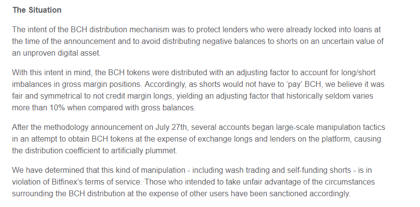

# [Wash Tradeing](https://bitfalls.com/hr/glossary/#wash-trading) Bitcoinom ili kako Bitfinex ostvaruje korist od fiktivnog trgovanja...

*Wash trading* je epidemija na Bitcoin tržištu. Za one koji još nisu svjesni značenja pojma - to je kada osoba ili entitet prodaje i kupuje vlastite naloge na tržištu kapitala.

Za detaljnije objašnjenje pogledajte [ovdje](http://www.investopedia.com/terms/w/washtrading.asp) ili kraće [tu](https://bitfalls.com/hr/glossary/#wash-trading).

Od mojeg prvog posta nadalje, upozoravam ljude na *[WT](https://bitfalls.com/hr/glossary/#wash-trading)*. [(Link)](https://medium.com/@bitfinexed/meet-spoofy-how-a-single-entity-dominates-the-price-of-bitcoin-39c711d28eb4)

Izvorno sam mislio da se sve to odvija preko dva odvojena računa koja kontrolira isti entitet. Naime, kako sam saznao iz pouzdanih izvora, ovo je čak i jednostavnije od moje početne pretpostavke. Nove informacije koje sam sakupio od raznih *tradera* ukazuju da je ovo djelovanje vrlo vjerojatno u rangu kriminalne operacije. Naime mislio sam da se radi o dva odvojena računa - jer kako bi [Bitfinex](www.bitfinex.com) dopustio konkurentne naloge prodaje i kupnje sa **ISTOG** korisničkog računa? To bi stvarno bilo izrazito glupo, nije je li tako?

> **E PA BIO SAM U KRIVU**

## Prljava tajna Bitfinex-ovog *trade* enginea...

Želim da zamislite kompaniju koja izrađuje avione. 

Kako bi kompanija bila u mogućnosti sastaviti avion potrebno je sakupiti sve resurse potrebne da dobijemo konačan proizvod. Naime, trebamo izgraditi krila, pilotsku kabinu, trup, rep, motore, prozore i vrata te sustave za održavanje života - kao i sve ostale druge dijelove koji sačinjavaju sam avion.

Sada želim da pomislite kako Bitfinex gradi svoj avion. Njihov avion ima sve što izvana izgledom djeluje kao pravi avion. Laiku sve djeluje normalno na prvi pogled. Jer smo naučeni da ako izgleda kao patka, ako se glasa kao patka i ako hoda kao patka - da je to onda zasigurno patka. Ali...

Potrebno je da zamislite kako taj avion zapravo nema spremnik za gorivo. I Bitfinex prodaje taj avion, znajući da nema spremnik za gorivo. 

Vrlo je izgledno kako niti jedan odgovoran proizvođač aviona na svijetu ne bi sebi dopustio pogrešku tog reda veličine - jer je toliko velika da biste se morali zapitati je li to namjerno napravljeno.

Sada imamo predodžbu Bitfinex-a kao kompanije - koja je izgradila avion i koja je s namjerom izostavila uključiti i spremnike za gorivo. Nitko razuman neće očekivati da će takav proizvod ispravno funkcionirati, no oni su unatoč svemu napravili takav avion i prodali ga svojim investitorima. 

I **znali** su cijelo vrijeme što čine. 

## PSA: Bitfinexov *trade engine* dozvoljava *Wash Trade*

Znači, na Bitfinexu možete komotno kupovati i prodavati vlastite *ordere*, a procedura je kako slijedi... (imajte na umu da bi ovo moglo najvjerojatnije biti "popravljeno" ili pokrpano nakon ovog posta)
1. Postavite *buy* ili *sell* nalog. Za BTC ili bilo koji drugi coin ili *trade* par kojim se može trgovati na Bitfinex-u.
2. Postavite suprotan nalog onome kojeg ste napravili u *Koraku 1*. 
3. *Trade engine* će izvršiti oba naloga. 

Ovako to izgleda vanjskom promatraču:

<iframe width="700" height="393" src="https://www.youtube.com/embed/-gY6VOEk2r4" frameborder="0" allowfullscreen></iframe>

*Ovo je najočitiji primjer WT-a. Ispravno odrađen WT je neuočljiv vanjskom promatraču.*

Developer koji piše kod za *exchange engine*, na nekom regularnom *exchangeu*, kao prvi zadatak isplanira programirati kod koji ne dopušta izvršenje oprečnih naloga sa istog korisničkog računa.

Ne postoji niti jedna legitimna isprika niti valjan razlog zašto bi se trebalo moći trgovati sam sa sobom tj. moći izvršiti *WT* - osim kako bi se manipuliralo tržištem. No najveći razlog zašto bi neki *exchange* želio zabraniti *WT* je zato jer je **TO ILEGALNA AKTIVNOST**.

*[(Izvor)](http://www.cftc.gov/ConsumerProtection/EducationCenter/CFTCGlossary/glossary_wxyz)*

Ukoliko mi ne vjerujete i mislite da samo širim [FUD](https://bitfalls.com/hr/glossary/#fud) o *WT-u* i da ga koristim "za sve stvari koje nisu crypto" - tu je primjer iz stvarnog svijeta. 

LedgerX je novo lice na tržištu i mjesto je za razmjenu BTC-a. Potpuno je reguliran od strane CFTC-a. Primijetiti ćete u dokumentaciji njihovog API-a da će bez problema odbiti svaki nalog koji bude detektiran kao *WT*.

*http://docs.ledgerx.com/*

Kod Bitfinexa ne postoji takva mehanika koja bi priječila izvršenja sličnih naloga. 

Kao rezultat svega navedenoga, možemo svjedočiti događajima gdje su ljudi uspješno *WT-ali* desetke milijuna dolara u Bitcoinu. To je pomoglo umjetno napuhati volumen trgovanja na Bitfinexu.

*WT short pozicija na Bitfinexu*

**Bitfinex priznaje kako ima Wash Tradere među svojim korisnicima**

*[(Izvor)](https://www.bitfinex.com/posts/214) [(Arhiva)](http://archive.is/lNWAY)*

Ironija u svemu ovome jest:

1. Tvrde kako je *WT* direktno kršenje njihovog T.O.S.-a.
2. Njihov vlastiti engine dopušta izvršenje konkurentskih naloga istog računa. Nešto što je trivijalno za spriječiti.
3. Nisu popravili *trade engine* nakon 01.08.2017, gdje su imali desetke milijuna dolara u *WT-u*.

Kako smo mogli vidjeti u drugim člancima, *traderi* na Bitfinexu su dobro iskoristili priliku prilikom BCH distribucije i načina na koji je sprovedena. Misliti kako neće *WT-ati* cijenama i uzrokovati rast ili pad istih je daleko od stvarnosti. 

Isti su izvršili 10 milijuna dolara u lažnim transakcijama kako bi "ukrali" BCH. Bez razmišljanja su iskoristili *WT* kako bi izbrisali pozicije regularnih ljudi u bilo kojoj situaciji. Garantiram kako je vrlo vjerojatno da Bitfinex nije zabranio djelovanje iti jednom takvom *traderu*. 

Kao što ne zabranjuju djelovanje *spoofera*, što je isto tako nelegalna aktivnost.

**Gle, očito ovo mora biti neki Bug...**

Pa i ne baš. Phil Potter koji je Chief strategy officer, u jednom od intervjua je upitan sljedeće pitanje:
>"Da razjasnimo, da li još uvijek dopuštate praksu samo-financiranja i izvršavanja onoga što zovemo *1x hedge shorts*? Da li je ovo još generalno dopušteno?

**OPASKA: Ovo je vrlo KREATIVAN način da se opiše Wash Trade!**

>Phil Potter, CSO - Ovisi o svrsi takvog naloga.

Kasnije Phil Potter spominje: "Mnogo ljudi je izvršavalo WT naloge sami prema sebi."

Ovo je samo moguće ukoliko *trade engine* to omogućuje - što na koncu konca i jest omogućno. 

Pitanja idu dalje...

>"Znači, što se pravilnika o djelovanju tiče, izgleda da Bitfinex još uvijek dozvoljava ovakvo trgovanje, ali situaciju sagledava od slučaja do slučaja. Da li to znači kako je bilo određenih slučajeva gdje su te manipulacije iziskivale sankcije za uključene *tradere*?

Phil Potter, nažalost, daje krivi odgovor. 

>Nisam u mogućnosti potvrditi da je način na koji ste to izrazili točan...

*[Wash Trade](https://bitfalls.com/hr/glossary/#wash-trading)* je ilegalna aktivnost, čak i gora od *spoofinga*, jer volumen trgovanja direktno utječe na vrijednost njihove kompanije. Phil Potter **zna** da će njihov *trade engine* izvršiti *WT* naloge. 

On nije glup čovjek.

Uzgred budi rečeno, velik broj ljudi u kripto svijetu čvrsto vjeruje u "KOD JE ZAKON" mantru, a kako je Bitfinex-ov *trade engine* programiran da dozvoljava izvršenje *WT-a*, sve je jasno. Njihov **KOD** za ključan dio trgovanja je u direktnom kršenju njihovog Term-s of Service-a.

I tako je to bilo od dana kada je Bitfinex započeo sa radom.

<iframe width="700" height="393" src="https://www.youtube.com/embed/_xiXP8HsRUw" frameborder="0" allowfullscreen></iframe>

*Bitfinex dopušta WT...*

**Bitfinex je prevario svoje investitore**

Bitfinex jer vrlo vjerojatno provodio *WT* od početka svojeg rada. Pitanje koje nam sada ostaje jest - koji postotak ukupnog volumena otpada na *WT*? Ne znamo.

Ako se sjećate, Bitfinex je izdao temeljni kapital i prodao ga ljudima u obliku BFX tokena. A kako su odredili vrijednost kompanije? **Volumenom trgovanja i očekivanim naplatama naknada za trgovanje**.

Bitfinex je znajući kako je njihova vrijednost virtualno napuhana samim *trade engineom* koji dopušta *WT* svejedno prodao ljudima patku. 

U ožujku 2017, Bitfinex povećava vlastitu valuaciju sa $200 na $250 milijuna dolara. Phil Potter priznaje kako je ovaj potez ponukao investitore da ulože u temeljni kapital društva. 

<iframe width="700" height="393" src="https://www.youtube.com/embed/8ax46xdds5A" frameborder="0" allowfullscreen></iframe>

*3. travnja, intervju s temom povećanja valuacije*

Bitfinex se je našao u škripcu. Tvrdili su kako im njihov vlastiti "BFX" token uzrokuje probleme u reviziji poslovanja kao i priječi uspostavljanju odnosa sa bankama, te su brzo pokušali umiroviti tokene i uvjeriti vlasnike istih da ulože novac u kompaniju.

Iako je prošlo 6 mjeseci nakon što su umirovili BFX token, još uvijek nema banaka sa kojima posluju. 

**Vrednovanje kompanije**

Interesantno je vidjeti kako se vrednovanje vrijednosti kompanije mijenja gubljenjem potpore banaka. 

Originalno njihova valuacija je bila $120 milijuna dolara (temeljena na 6x zaradi koja se je pak temeljila na volumenu trgovanja...), i planirali su tražiti dodatnih $80 milijuna dolara financiranja što možemo vidjeti iz informacija za *shareholdere*.

*Shareholder info*

Ono što je zanimljivo je da su uspjeli prikupiti novac izdajući BFX tokene koji su bili I.O.U. prema investitorima. Ukoliko su se i investitori složili zamijeniti ovo dugovanje za udio u temeljnom kapitalu to zapravo nije stavilo novac na račun koji bi Bitfinex mogao koristiti. To je vrlo vjerojatno razlog zbog kojeg su dodatno povećali valuaciju za $50 milijuna USD. 

Ali kako se čini, kada izgubiš potporu banaka, to ti poveća vrijednost za $50 milijuna. Tko bi rekao? 

*Gdje smo ovo već mogli vidjeti? [(Točno tu)](http://archive.is/Zl3SD).*

Siguran sam kako su svi koji su imali BFX token, a koji su izgubili novac u *hacku* i koji su bili pitani da zamjene svoj I.O.U. za udio u vlasničkoj strukturi bili informirani o svemu ovome prije nego je ta zamjena izvršena?

Ukoliko to nije slučaj, ovo djeluje kao kriminalni akt sa ciljem utaje ključnih informacija. 

Bitfinex je bio svjestan svojih bankovnih problema već 23. ožujka, dok je službena obavijest koju su primili od Wells Farga stigla 31. ožujka. 

Pitanje je samo koliko su BFX tokena pretvorili između 23.03 i 03.04. bez da su informirali ljude o situaciji u kojoj se nalaze.

*Bitfinex priznaje kako je njihova tužba prema Wells Fargu - njesra, čak i prije nego su je predali sudu.*

Ne znam za Vas, ali ja bih rekao kako bi javna objava Bitfinexa da imaju probleme sa bankama definitivno imala negativan utjecaj na konverziju BFX tokena u vlasničke udjele... pa su pričekali dok se sve ne završi prije nego su ljudima javili loše vijesti.

**Bitfinex je iskoristio takozvane rezerve kako bi isplatili preostale tokene koji nisu bili pretvoreni u vlasničke udjele u temeljnom kapitalu.**

<iframe width="700" height="393" src="https://www.youtube.com/embed/19kng-Bm-l4" frameborder="0" allowfullscreen></iframe>

*Isplata novcem korisnika*

1. Ove rezerve su došle od sredstava koja su pasivno zaplijenili od svojih korisnika sa depozitima. 
2. Nemojmo zaboraviti da nakon sto su se našli u blokadi od banaka, korisnici nisu bili u mogućnosti isplatiti dolare na svoje račune. Jedini način na koji su ljudi mogli doći do svojih sredstva je bilo kupiti Bitcoin od Bitfinexa. To je uzrokovalo vrtoglav porast cijene. 
3. Svi ovi intervjui su od 03. travnja. Nigdje se ne spominje situacija sa bankama. Ključna informacija. Pitanja nisu bila postavljana oko ove teme. Jedan od sugovornika u intervjuu djeluje kao da je svoje tokene zamijenio za udio i uopće ne spominje ovu ključnu informaciju što daje naslutiti da tu informaciju u tom trenu nisu niti dali trenutnim vlasnicima udjela kao niti potencijalnim ulagačima. 

## Pregledajmo informacije:

Bitfinex vrednuje vlastitu kompaniju temeljem ostvarene zarade koja se bazira na volumenu trgovanja, statističkom podatku, za kojeg su znali da kako ga je moguće umjetno napuhati kroz *wash trade*.

Bitfinex je vrlo vjerojatno ispustio izvjestiti trenutne BFX token investitore o svojim problemima sa bankarskim sektorom. Što je indirektna prevara. 

Da ste Vi u poziciji BFX token holdera, i da su Vas pitali da na brzinu zamijenite BFX za udjele u kompaniji, a da ste u isto vrijeme bili svjesni problema - biste li to učinili?

Da ste znali da je njihov *exchange* mjesto gdje se odobrava *WT* i da je vrijednost njihovih udjela temeljena na volumenu trgovanja, biste li prihvatili udjele u toj kompaniji?

Vrlo vjerojatno - **NE**.

Predložak novog loga Bitfinexa.

*Prijedlog Novog Logotipa za Bitfinex - samo su zaboravili napomenuti da je kiseli okus dio trgovanja kod nas...*

## Zaključak:

Istina jest, da nikada nećemo saznati koji je točan udio u ukupnom volumenu trgovanja otpada na *Wash Trade*. A šanse su, da ako su svjesno dopustili *WT*, nisu ostavili mnogo dokaza kroz logove koji su vjerojatno "tanki" ili možda čak i lažni. 

Vjerojatno nisu imali namjeru da im transakcijski logovi procure i da svi shvate što se događa, kako su i transakcijski logovi Mt. Goxa procurili i gdje su svi mogli vidjeti detalje o Marcusu i WillyBot-u.

Bez tih logova, do danas ne bismo znali što se je dogodilo sa Mt. Gox-om.

Vrlo je izgledno da se je *WT* odvijao na Bitfinexu od prvog dana. Činjenica je kako je osoba koja je osnovala Bitfinex isto tako bila dio kruga koji je promovirao Ponzi shemu, a i pokušao zavrtiti vlastiti spinoff istoga. 

A i trenutni ključni ljudi Bitfinexa ne zaziru od korištenja manje etičkih pristupa poslovanju... kao što je insider trgovanje i slično.

<iframe width="700" height="393" src="https://www.youtube.com/embed/DcIed4A8NIM" frameborder="0" allowfullscreen></iframe>

*Phil Potter ne trguje Bitcoinom. Prodaje ga kada raste i kupuje kada pada. Suprotno uvriježenom mišljenju - ovo zaista nije bilo samo trgovanje.*

Bitfinex će vrlo vjerojatno odbaciti sve ove optužbe, ili će tvrditi kako će popraviti svoj *trade engine* - moguće čak i na način da Vi ili ja nećemo moći izvršiti *WT*, ali možda [Whale]( https://bitfalls.com/hr/glossary/#whale) bude mogao. 

Njihov *engine* koji dopušta *WT* je namjerno programiran sa tim *feature-om* na umu, a ne nešto što je slučajno bilo zaboravljeno uvrstiti u kod. 

Dodatna potvrda te namjere je činjenica da to nisu ispravili nakon 01.08.2017.

Sve njihove tvrdnje treba uzeti sa dozom skepse, jer se možete sjetiti kako je Phil Potter iz Bitfinexa prvo nijekao *spoofing*, a ja sam prikazao video sa dokazom $14 milijuna USD teške *spoof* aktivnosti. 

Zato i snimam sve trade aktivnosti, jer grafovi i povijest kretanja cijena rijetko daju pravu sliku onoga što se je odvijalo.

Trgujte pažljivo...

-Bitfinexed
