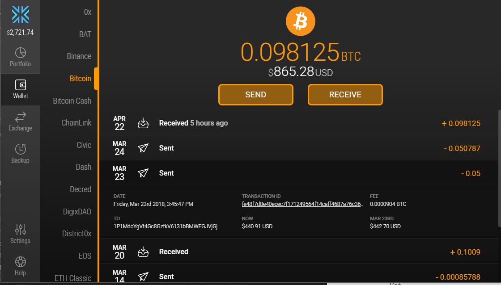
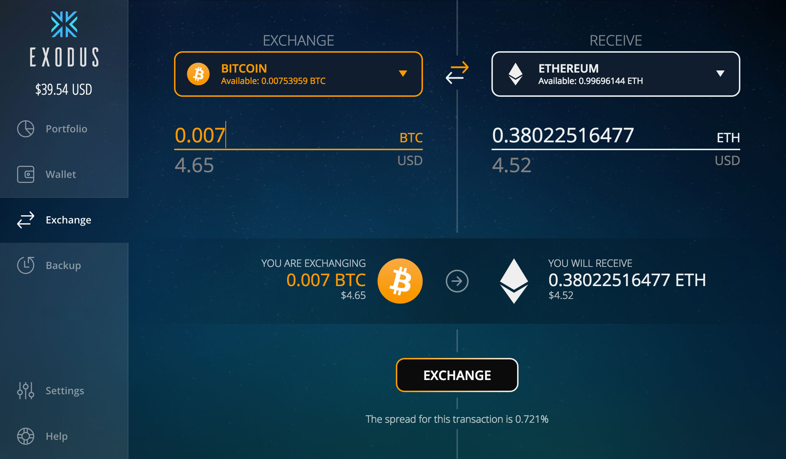
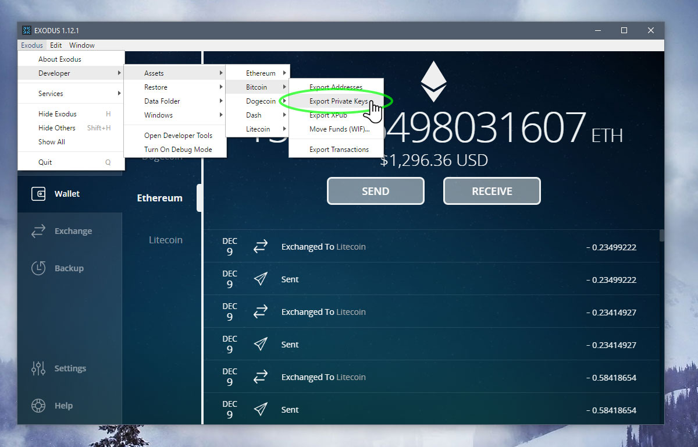

## Uvod
Uz veliki broj kriptovaluta na tržištu, postaje jako teško biti u toku sa svim i prebacati se sa walleta na wallet pogotovo ako imate širok portfolio. Postoji rješenje za to.  
[Exodus][exodus] je lijepo dizajniran i jednostavan za upotrebu desktop wallet sa podrškom za više kriptovaluta(BTC LTC ETH DASH...) i  [ERC20][eth] tokena. Interfejs je pristupačan čak i nekome ko je nov u kripto svijetu. Za svaku valutu dobijate posebnu adresu i QR kod. Istorija transakcija je dostupna za sve adrese, i tu možete vidjeti i neke detalje poput vrijednosti transakcije i vrijednosti u dolarima kada je poslata i danas, kao što se može vidjeti na slici ispod. 

Pored standardnih funkcija za slanje i primanje novca, tu su i neke dodatne kao što su backup i exchange.

### Exchange u walletu
 
Exodus ima mogućnost razmjene kriptovaluta u walletu, koji se u pozadini oslanja na Shapeshift servis i ima dodatne provizije.  To je i način monetizacije za Exodus tim, pošto sam softver i ostale usluge se ne naplaćuju.
Sam proces razmjene valuta je jako jednostavan i vizualno dobro riješen, tako da korisnik ako želi da drži sredstva isključivo u novčaniku, exchange funkcija mu pruža razmjenu za sve podržane valute s tim što postoje određeni limiti za minimalne transakcije. Za BTC prodaju to je oko 100$ protivvrijednosti dok za ETH je granica dosta niža i iznosi trećinu BTC limita.

### Sigurnost walleta
Za backup walleta postoje dvije opcije, email backup  i šifra od 12 riječi. Email backup znači da vam šalju jedinstveni link preko koga možete povratiti pristup uz kucanje postojeće lozinke, dok 12-riječna šifra daje potpuni pristup Exodus walletu i tu morate kucati novu lozinku da bi zaštitili pristup na tom računaru.
Iz Exodusa ne preporučuju čuvanje većih suma kripta na ovom walletu ako se nalazi na računaru koji koristite na dnevnoj bazi zbog opasnosti od keyloggera i malwarea. Takodje iako je pristup zaštićen šifrom, još uvjek nije implementirana 2F autentikacija.
Za više detalja i sigurnije alternative pogledati [ovdje.][security]

### Export privatnih ključeva
Ako koristite adrese iz Exodusa za airdropove ili neke druge namjene može vam zatrebati i da eksportujete privatni ključ na neki drugi servis poput [MyEtherWallet][mew]. To možete da uradite tako što pritisnete Ctrl+Shift+D i pristupite developer meniju, posle toga prema slici idete na export private keys opciju, s tim što trebate biti jako pažljivi jer će Exodus eksportovati ključeve u csv formatu bez enkripcije!
 

## Zaključak
[Exodus][exodus] je sjajan posebno za novajlije u kripto svijetu. Zbog toga što se može lako instalirati, nema čekanja za sinhronizacijom [blockhaina][bc] a i veliki je broj podržanih [kriptovaluta][cc]. Šteta je što ne postoji mobilna verzija ali makar ima podršku za sve desktop platforme u upotrebi.

[bc]: https://bitfalls.com/hr/2017/08/20/blockchain-explained-blockchain-works/
[cc]: https://bitfalls.com/hr/2017/08/20/cryptocurrency/
[eth]: https://bitfalls.com/hr/2017/09/19/what-ethereum-compare-to-bitcoin/
[exodus]: https://exodus.io
[mew]: https://bitfalls.com/hr/2018/02/19/first-ethereum-address-learning-use-myetherwallet/
[security]: https://support.exodus.io/article/45-can-exodus-safely-store-large-amounts