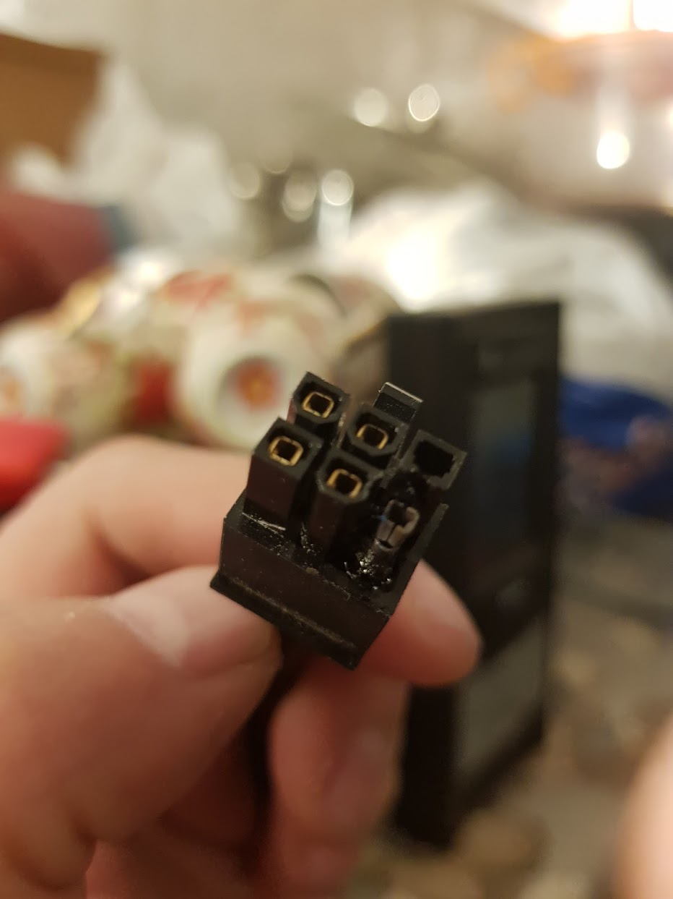
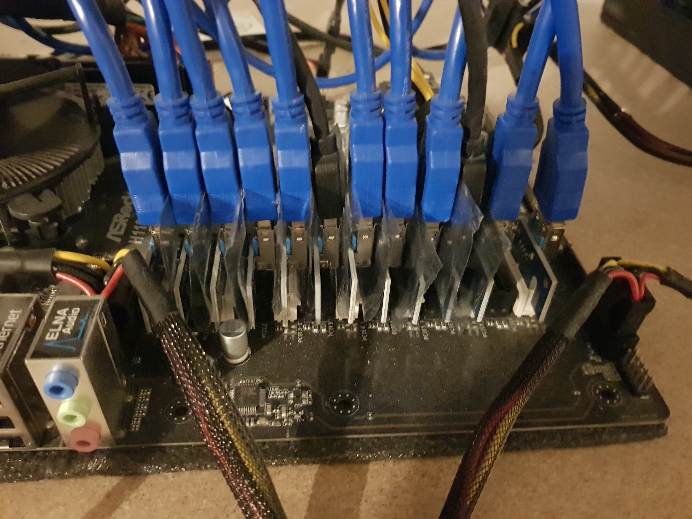
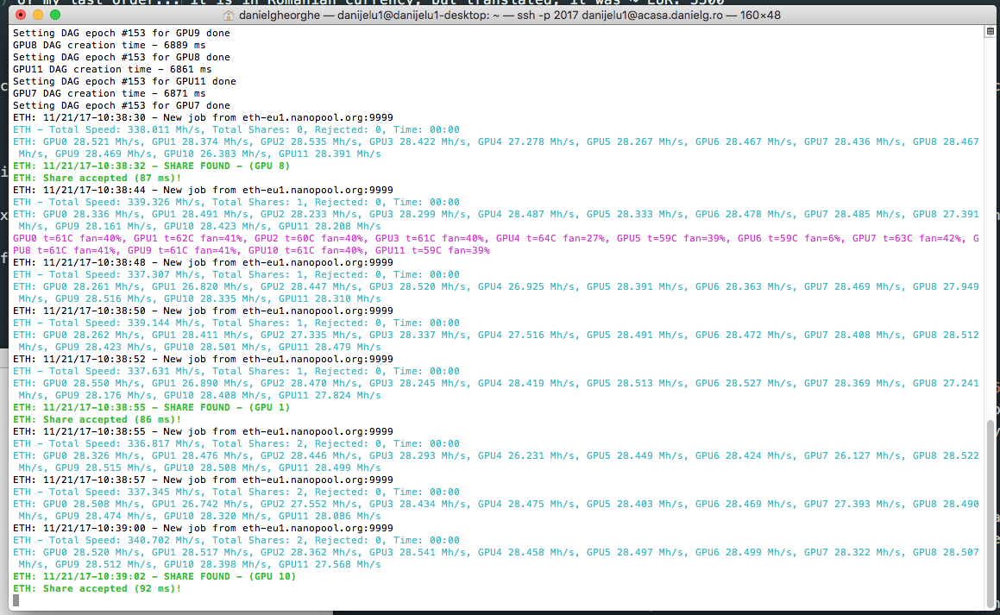

#Ethereum home mining gotchas and profitability

##What is mining

You've probably heard legends about people making millions of dollars through a process called "mining" crypto-currencies. 

In simple terms mining is the process through which, using raw computational power, transactions on some blockchains are validated. In return, the person who "rents" that processing power is rewarded with crypto coins.

Ethereum mining in particular is no different - One rents his multi-gpu machine and earns ETH in return.

I already heard you say "I want in!" so let me warn you: It's not that easy!

##Home mining is not for noobs

If you have never assembled a computer yourself, never over-clocked your CPU, don't know what `bash` is or if the word `Ubuntu` sounds like an incantation - than you can stop reading and you can still get into the crypto rush by buying some Ether.

Just like a game has system requirements, the "recommended" skills for mining Ethereum at home are:
	
	* Some PC hardware assembly experience
	* Basic Linux command line knowledge
	* Debugging capabilities if anything goes wrong

You probably noticed, I haven't mentioned "Windows" and this is because it is both expensive and not as efficient to mine using Windows. More on that later...

##Plan ahead!

Before you start mining you should take into account the fact that the initial acquisition costs will be significant and the return of investment is going to happen over time - somewhere around one year in current market/difficulty conditions.

One other thing to consider before taking any action is the infrastructure required to set up a tiny mining farm. As an example, setting up 2 machines, each with 12 GTX 1070 graphics cards will have a power consumption close to 3000 W/h (3kW/h) (excluding the AC) and it will generate lots of heat. This being said, make sure you have at least a power socket with an independent circuit breaker (mine are 20A circuit breakers for each power socket) and a room with air conditioning.

To calculate the efficiency and profitability of your mining rig you can go [here](https://whattomine.com/).

One other aspect is that all these machines will make significant noise so don't expect you'll be able to assemble the rig in your bedroom.

To recap the initial setup cost for one x 12 GPUs mining rig.

- Metal shelf to assemble the rig on ( ~ EUR 100 )
- Electrical wiring and power meter and assembly by a specialist ( ~ EUR 100)
	* Specialized circuit breaker (one for each rig)
	* Fan to blow out the hot air (or any other method to keep things cool)
	* Wall socket(s) and a cheap power meter

- Cheap Air Conditioning and assembly ( ~ EUR 400 )

##Hardware considerations

During my trials, considering every piece of equipment I've tested, taking into account power consumption and current hardware market prices, the most efficient build for one Ethereum mining rig is this: 

- 12 x MSI GeForce GTX 1070 Armor OC 8GB DDR5 256-bit (~ EUR 5000) - this is the most powerful GTX 1070 I've tested and if you can buy it at a price of ~EUR 400 than it is a great deal.
	* If you can't find this model at a reasonable price, other models I've tested and have proven to be good investments are Gainward GeForce® GTX 1070 and ZOTAC GeForce® GTX 1070 AMP Edition.
	* In all cases, try to avoid the "founder edition" or "mini ones" because those tend to be more difficult to over-clock and more difficult to keep cool.
	* You might have noticed I am not suggesting the P106 mining models and that's because I am also taking into account a potential revenue that would come from reselling these boards when you stop mining, whereas with the mining cards you can't resell them to gamers. Even so, P106 is a solid option if you don't plan to resell the cards.

- 1 x ASRock H110 Pro BTC+ and an Intel Core i3 Kaby-Lake CPU (~ EUR 300) * I have tested this motherboard myself and as long as you give it enough juice it will run stable with the 12 GPUs.

- 1 x 8 GB of DDR4 RAM + 1 x 128GB SSD drive + 2 x 1000W PSU units with at least 6 x PCI Express connectors each + One synchronous PSU starter + 12 PCI-E risers ( ~EUR 600 )
	* I chose to buy 8GB of RAM instead of four because with 4GB the memory is almost full at all times and the system takes a hard hit when loading the DAG on miner start... Even so if you are OK with this, you can go with 4GB of DDR4 RAM
	
	* One other thing to take into account is to consider using PSUs that are a bit more expensive 1200+ Watts... otherwise you risk this:
	.

Here's a [link](https://drive.google.com/file/d/1uLYAuTzthcMYtxmntPM5zmdkDszUWUpN/view?usp=drivesdk) of my last order... it is in Romanian currency, but translated, it was ~ EUR. 5500.

### Build gotchas

- When you assemble the rig be careful with the riser connectors on the motherboard, they are very close to each other and if the connectors touch only a little bit the rig won't work. One solution I found is to place small pieces of anti-static bags that come with the board between them.
	

- Make sure to enable the on-board GPU in BIOS and power up your monitor from there instead of the mining GPUs.

- Be careful when powering up the PCI express slots... they have 2 separate Molex Power Connectors that supply extra juice to the PCI Express slots. These need to be powered from the main PSU - the one you have connected the motherboard with.

- Power each GPU and its corresponding riser from the same PSU. In other words don't use one cable from power supply 1 for the riser and one PCI-E cable from the other for the 8-pin GPU power plug.

##Software considerations

###Windows is a no go

Buying a retail license for Windows 10 will cost you an extra EUR 100 and even if you do choose to buy one, [Windows DOESN'T WORK with more than 8 GPUs of the same](https://bitcointalk.org/index.php?topic=1939165.160) type on one machine and [You can only mine hybrid AMD + NVIDIA with this rig on Windows](https://www.asrock.com/microsite/H110ProBTC+/). I've tested this myself and once you add the 9th GPU, Windows simply stops working. One option would potentially be to have 8 Nvidia GPUs and 5 AMD GPUs but that would end up giving you more headaches than profit because you would need to run 2 miners in parallel, over-clock the GPUs independently instead of globally, etc...

###Don't use closed source miners

There are options out there (Claymore's dual miner and even specialized Ubuntu builds) that promise to get you up and running with your mining rig in no time at all. I have never used those (in production mode) because they are closed source and because they require one to pay a 2%-3% fee for using their software. In terms of performance they are exactly the same - Here's a comparison screen between the open source miner I use and Claymore:

Plus there's no way for me to know what other things those miners might be doing while running on my home network. I would never take the risk to run a software I know nothing about on a network where I have everything.

###The setup

I used Ubuntu desktop for all my miners and I advise you to do the same especially if you don't have lot's of experience with Linux, because you will find everything you need with a simple Google search in case you get stuck.

I tested virtually every mining software out there and I've come to the conclusion that the most stable one on the open source market for Nvidia GPUs is [ethminer](https://github.com/ethereum-mining/ethminer). The binary of the miner is already included in my repository and in addition to that we will also make use of a few custom scripts I've written for over-clocking, monitoring and power management.

Below there's a step by step guide to get everything up and running.

1. Assemble the rig with all graphics cards and make sure they're all "spinning"
2. Install Ubuntu desktop from a bootable USB stick by following the on-screen step-by-step guide. If the Ubuntu installer doesn't start, hit F6 during boot and select [nomodeset]()https://drive.google.com/file/d/1mF225NO0mqGZ_adTn0EyxVqzus31bNJJ/view?usp=drivesdk from the options menu in the bottom right area.
2. Once the OS is installed, fire up a terminal and install git. `sudo apt-get install git`
3. Install an ssh server. `sudo apt-get install openssh-server`
4. Go into your router management console and forward a port to port 22 on the mining machine IP address. For example, I forward port 2017 on my router to port 22 on local address 192.168.0.69 which is the reserved IP address of the miner.
5. Edit the `/etc/ssh/sshd_config` and where it says `PasswordAuthentication no` change it to `PasswordAuthentication yes`. This is not the most secure option, but if you know this you will also know how to set up key based authentication over ssh.
6. Press `ctrl + alt + f1` to switch to a text-only terminal.
7. Run `lspci -v | grep VGA` to make sure the system sees all 12 GPUs... if it doesn't something is wrong with the build.
8. Add the Nvidia drivers repository: `sudo add-apt-repository ppa:graphics-drivers/ppa`
9. Update the repository database and install any updates: `sudo apt update && sudo apt upgrade`... then restart: `shutdown -r now`
10. Go back in text mode `ctrl + alt + f1` and install the current Nvidia drivers: `sudo apt-get install nvidia-375`. If the install fails or anything else goes wrong you can always run `sudo apt-get purge nvidia-*` to return to the previous step
11. Select the Nvidia GPUs `sudo prime-select nvidia` and enable them all for over-clocking `nvidia-xconfig --enable-all-gpus`
12. Create a folder somewhere in you home directory and clone my mining repository... `cd YOUR_FOLDER && git clone https://github.com/the-codepunker/ubuntu-nvidia-mining.git .` 
13. Make a copy of the default Xorg configuration file `sudo mv /etc/X11/xorg.conf /etc/X11/xorg_bak_daniel.conf`
14. Enable full over-clocking capabilities for your GPUs `sudo nvidia-xconfig -a --cool-bits=31 --allow-empty-initial-configuration`
15. Execute the commands below to populate the xorg.conf file with the required parameters for enabling over-clocking:
	- `sudo sed -i '/Option         "AllowEmptyInitialConfiguration" "True"/a    Option         "ConnectedMonitor" "DFP-0"' /etc/X11/xorg.conf`
	- `sudo sed -i '/Option         "ConnectedMonitor" "DFP-0"/a    Option         "CustomEDID" "DFP-0:/etc/X11/dfp0.edid"' /etc/X11/xorg.conf`
16. Copy the fake display `dfp0.edid` from my git repo to the X11 folder: `sudo cp dfp0.edid /etc/X11/dfp0.edid`
17. Make sure lightdm doesn't overwrite your xorg.conf file on the next reboot: `sudo chattr +i /etc/X11/xorg.conf` and restart. If everything went well... your xorg file will remain unchanged, but the system will no longer boot in graphics mode so you will need to switch to text-only mode.
18. To fire up the miner you will need to first execute my script for over-clocking located in the root folder of the repo: `sudo ./oc.sh`. If it works it will tell you that it changed the memory frequency of each GPU and the maximum power it can draw.
19. Finally edit the file called `execute.sh` and add your address instead of mine. Then run `sudo ./execute.sh` and you should see this: [video ???].
20. To monitor your miner you can run `nvidia-smi` to see power draw and GPU temperatures. If you run `nvidia-smi -q -d CLOCK` you will see core and memory clocks for each GPU.

This article will be kept updated as the repository updates with better monitoring and over-clocking capabilities to mine more efficiently.
Happy mining!