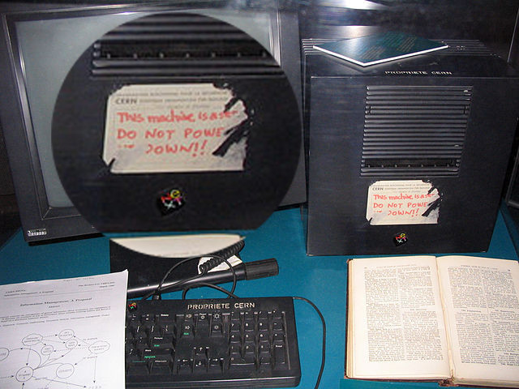
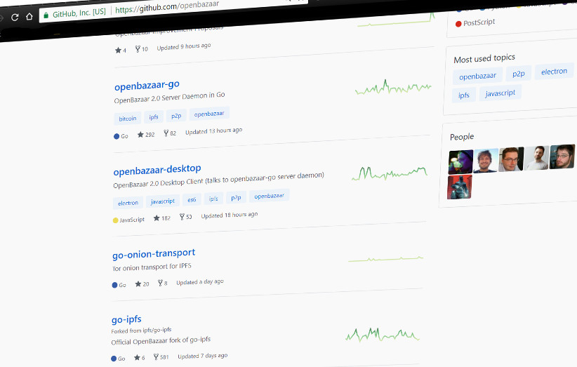

### Internet is conceptually broken

When it started, internet was a huge promise of decentralization & democratization of knowledge and information, both in the consuming and in publishing sense. Before internet, one had to have a newspaper or a broadcaster - or a book publishing company under control to get their message across to general public. The same goes for music & videos. 
Publishing your own music & video work, and putting it before eyes & ears of global audience meant that you had to have a lot of resources.

 Internet changed this. 

Today, if one has quality content, and a tiny bit of technical expertise (or a modest investment), they can make their content accessible to anyone with internet access, across the globe.
The information has been democratized. Knowledge is widely available today. So is publishing. Today, anonymous leakers of classified political information can expect to influence the outcome of elections. Regardless of whether the mainstream media had been bought and owned by any of the parties.
There is much greater liquidity of information than ever in history.

We can say that internet has changed things for our civilization as much as Gutenberg's inventions have.

But things are not as bright as they seem. With mass internet adoption came big money, and with big money, along came monopolies, and centralization of user data, of control, of information.

This is largely centralization by convenience, not by any compulsion, and for this, we have current internet structure to thank. We can find fault in http protocol, client-server architecture, DNS - IP based routing and content adressing.

***On this image is one of the first web servers, by Tim Berners-Lee, with a note: This machine is a server. Do not power down!!***

Internet has strayed. Turkish government has blocked access to Wikipedia in April 2017 because Wikipedia wouldnt take down an article that claimed Turkey was sponsoring Al Qaeda and ISIL. The ban is still active. Chinese government has blocked between 1/5 and 1/6 of world's population from accessing sites like BBC, YouTube, Facebook, Twitter, Amnesty International and many, many others. Its called "The Great Firewall of China". 
Years 2016 and 2017 saw huge internet outages, due to DDOS attacks and data-center errors that brought big parts of the internet down.  These events showed how much we depend on single vendors, like Amazon AWS, CDN-s, DNS providers.
We rely on content stored in particular data centers, in certain countries, behind specific internet backbones. These outages were possible due to the structure of the network. 

**Image above - logo of Wikipedia Turkey**

Not to talk about censorships, server seizures, and similar obstacles.

Our centralized model of data storage, which has been mitigated to a very small degree by CDN providers, is to blame for big wastes in bandwidth & big losses in terms of speed due to latency. If our source data center is geographically too far, we will see significant decrease in loading time / throughput speed of our connection.

### We are dependent on network backbones

If we are accessing a website hosted on a server on other continent, we are relying on one - or perhabs several - internet backbones for access to our website. Because content is stored centrally. Certain big internet players have redundant data centers across the globe, but this merely proves the point that internet has strayed from its mission.

### We are dependent on internet hosts

Our content is stored on servers by hosting / server company (cloud hosts are merely clouding this fact). If the hosting company in question, its data centers or servers go down - our content is down also. Moreover, if your host decided to take down your content - they can do that.

### Our content is easy prey

Under the current model, our content / resources / informations / knowledge is inherently censorable, extinguishable, and corruptible. Hackers alter and deface websites so often, it is hardly news anymore. Government censorship is also something we meet every day. [Archive.org](http://web.archive.org/) has built a kind of internet museum for previous years of internet, but we need internet more resilient to all sorts of decay.

**Image above - burning of Alexandria, Hermann Goll, 1876.**

One can argue that at present point of our civilization, we shouldn't allow single (or several) points of failure for access to internet, which has become a compendium of human knowledge.

## In comes the IPFS

IPFS, or Inter Planetary File System is an open-source project by [Protocol Labs](https://protocol.ai/), started in 2014 by Juan Benet. IPFS concept is very innovative. Maybe closest thing we had before it came along was [Freenet](https://freenetproject.org/),  or Bittorent. IPFS is working to reinvent the internet, on protocol level.

It combines technological advancements of Bittorrent, Git, cryptographic hashing, merkle trees, Kademlia DHT.. And it's aiming to thoroughly redefine how we do things online. 

### IPFS decentralizes storage

This means that any computer on the network can be a server. Storage is decentralized and distributed. Since things / content are not addressed by IP-s, there is no inherent need for static IP addresses. This eliminates the need for dedicated data centers, and reliance on hosting providers.

### It uses content - addressing

This means that content is addressed by its cryptographic hash. Content is named by its content, not by location of its server. If we compare our strayed internet model to addressing a book by physical library address, and number of shelf the book is on, IPFS goes back to naming / addressing a book by it's title.

Content - addressing (by way of hashes) ensures data integrity, because if even one letter in any stored file changes, the hash is completely different. This opens up a possibility of versioning internet content similar to git commits. Reverting, transparency, immutability are all available with this model.

Content-addressing means that we can have CDN-level distribution and efficacy of fetching content, because content can be distributed on hundreds or thousands of nodes all over the internet in a redundant way, that ensures we can still easily require same content regardless from WHERE we are fetching it - even if half of the internet is down. Under this system, circumventing things like Turkish Wikipedia censorship becomes child's play. Users can easily require same content from their local "swarm" of nodes inside Turkey. Any node on IPFS network, once it retrieves content (like web-site for viewing), can cache it and become trustable source of same content.

### It employs Kademlia DHT  *(among other things)*

IPFS uses Bittorrent-like algorithm of *Distributed Hash Table* that doesn't require any central authority for reaching any content. Kademlia algorithm allows for any content lookup to take maximum of ***O(log(n))*** hops / contacts for ***n*** number of nodes on the network. This is like maximum of 30 hops/contacts for 1,000,000,000 nodes. It is fast. It also means **no single point of failure**, **DDOS resistance** and **speed**. If our neighbor next door has some content cached / stored on his machine, we wont need to fetch it from across the planet. And we wont need to worry about data integrity.

Currently, as Juan Benet explained in [his Stanford presentation](https://www.youtube.com/watch?v=HUVmypx9HGI), main work behind IPFS is not the protocol itself, and its algorithms, but rather the integration of it into existing system. For example, there is work to include IPFS content - based addressing and protocol layer into existing browsers. There is work to integrate IPFS with local file systems via [FUSE interface](https://en.wikipedia.org/wiki/Filesystem_in_Userspace) (so we wont need to use http protocol layer to access content). Majority of work is on integrating the new system into the existing one, seamlessly for end-users.

### IPFS opens the way for cloud-computing as it was imagined.

This means resilient, redundant, reachable on demand content with promise of high availability and low latency.. Offshoot of the project is [libp2p](https://libp2p.io/) - MIT-licensed set of libraries for swarm-based, p2p computing.

It is still a work in progress, albeit highly promising. And it is not a purely theoretical mishmash. 
From August to September this year, [largest ICO so far took place](https://www.coindesk.com/257-million-filecoin-breaks-time-record-ico-funding/), raising record-breaking $260 000 000. It was Filecoin ICO, for an application leveraging IPFS infrastructure, by Protocol Labs. To clear things up, 260 million was not all ICO-raised, uninformed money. [52 million was raised in presale, from VC-s](https://www.coindesk.com/filecoin-presale-raises-52-million-ahead-ico-launch/), who - presumably - knew what they were doing.

So the project might be onto something.

One more working product built on top of IPFS is [OpenBazaar](https://www.openbazaar.org/). For those who don't know, OpenBazaar is a pioneer where future of the internet, and internet decentralization is concerned. It is a revolutionary decentralized, p2p market which is well out of idea stage (it is at 2.0 version at time of this writing). It works, and it works pretty smooth. And it uses IPFS for storage.

One more working product that is implementing IPFS is [Steemit](https://steemit.com) - which plans to use IPFS for storage.

[Digix](https://digix.global/) is another blockchain-based startup / token with market cap of $130 million at the time of this writing. It builds on IPFS, among other things.

[Mediachain](http://www.mediachain.io/) is another blockchain-based project using IPFS.

There is Orbit - distributed, peer-to-peer chat application built on top of IPFS, and giving birth to some further new app layer on top of it - [orbit-db](https://github.com/orbitdb/orbit-db) - a "distributed peer-to-peer database for the decentralized web". You can check out Orbit [here](https://orbit.chat/#/connect).

The list goes on, you can check some of the projects [here](https://github.com/ipfs/awesome-ipfs).

To sum it up - crypto revolution is powering some really promising developments that are looking to redefine how we do internet, and we will cover more of these in the future.

