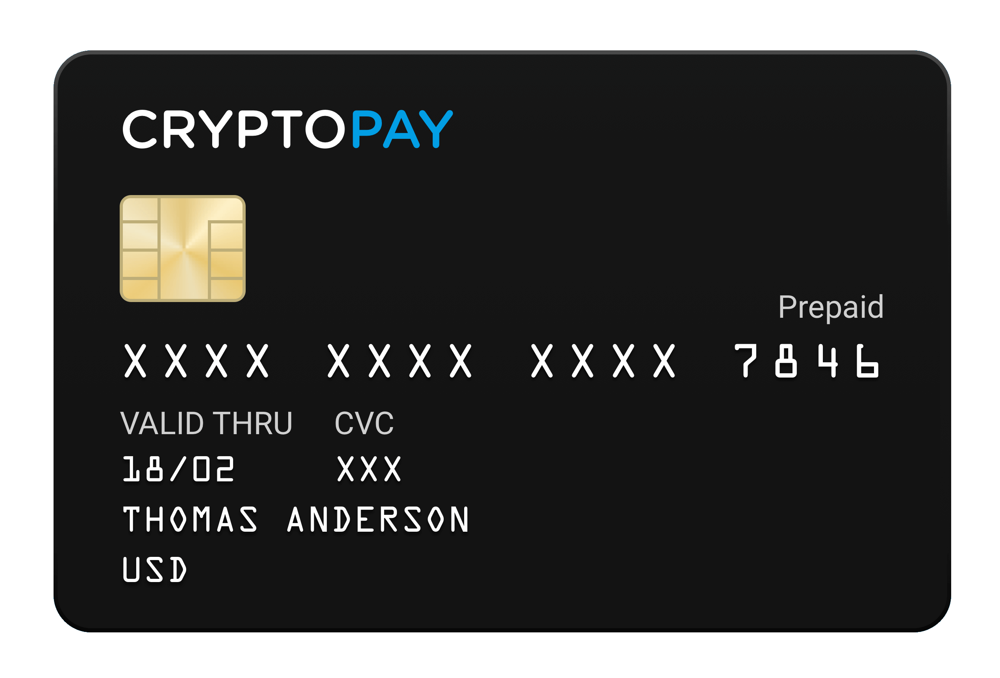
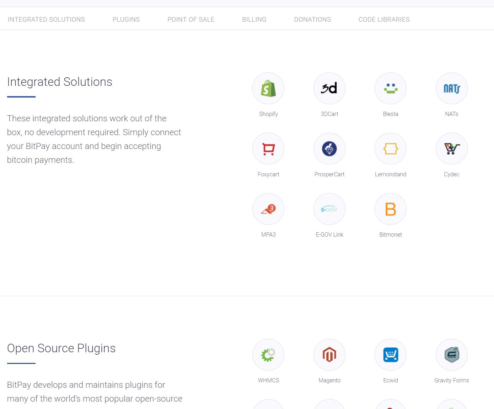
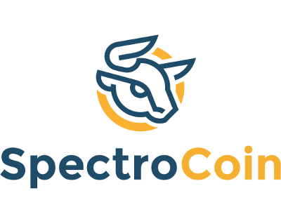
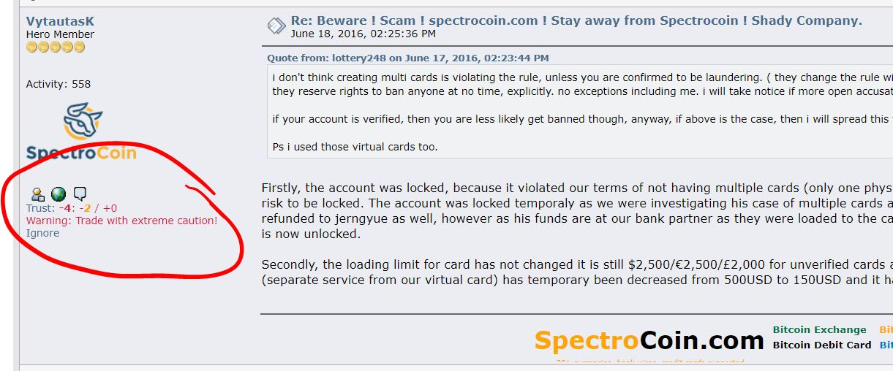
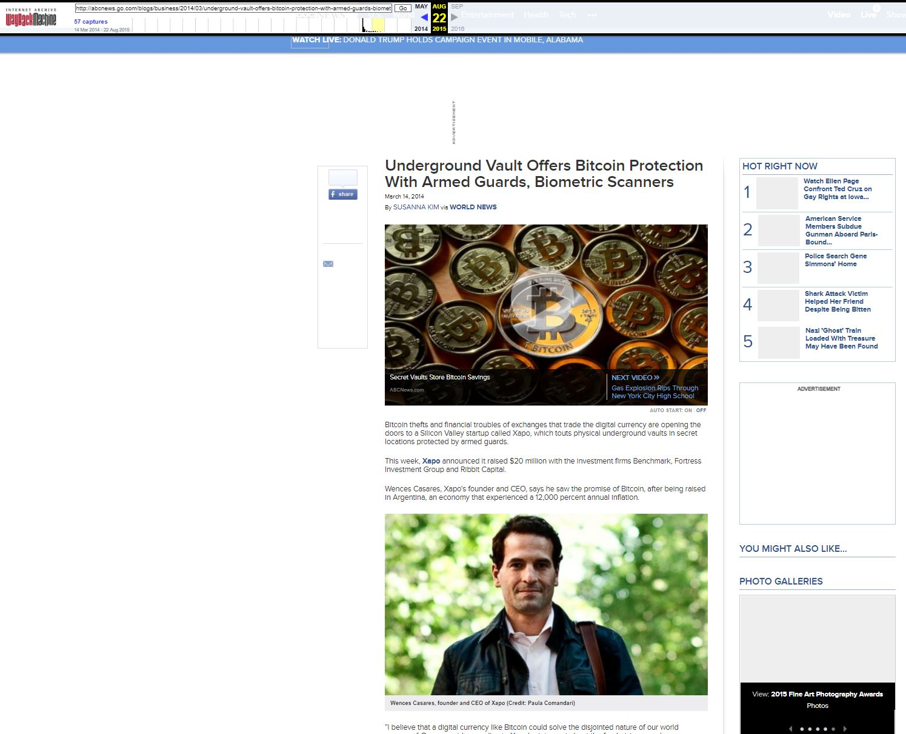

Sve od 2009., [kriptovalute][cc] sve više postaju mainstream, što zbog razumijevanja potencijala [blockchaina][bc], a što zbog spekulativnog interesa i čiste pohlepe tržišta, poznate i kao [FOMO](https://bitfalls.com/glossary/#fomo).

Unatoč nestabilnim cijenama, kriptovalute puštaju korijenje u realnoj ekonomiji, a jedan od glavnih čimbenika za mainstream adopciju je njihova integracija sa postojećim metodama plaćanja, baziranim na fiatu. Povezivanje kriptovaluta sa kartičnim kućama i integracija sa online pružateljima usluga plaćanja i sa bankovnim računima su, bez sumnje, bitni koraci u tom smjeru.

## Suočavanje s preprekama

U posljednjih nekoliko godina, UK fintech startup [Revolut](https://www.revolut.com/)  je uspio prikupiti skoro milijun korisnika nudeći usluge čisto online bankovnih proizvoda pojedincima i kompanijama. Nedavno su [aplicirali za bankovnu licencu u EU](https://blog.revolut.com/why-a-european-banking-licence-will-be-a-huge-deal-for-your-revolut-account/), gledajući da osvoje dio tržišnog kolača u novoj ekonomiji, kojoj se klasične banke ne prilagođavaju tako brzo.

U ovom usponu Revoluta, i njegovim planovima da [počnu nuditi kupovinu i prodaju kriptovaluta](https://blog.revolut.com/how-revolut-are-leading-the-way-with-cryptocurrencies/), postale su očite neke prepreke sa kojima se fintech kompanije susreću kada pokušavaju ponuditi podršku kriptovaluta.

Kako su objasnili [na svom blogu](https://blog.revolut.com/how-revolut-are-leading-the-way-with-cryptocurrencies/), ova će usluga imati ograničenja, u smislu da neće biti moguće uplaćivati kriptovalute sa vanjskih adresa, niti će biti moguće slati kriptovalute na vanjske wallete. Ovo znači da će korisnici biti u mogućnosti kupovati kriptovalute preko njihove platforme, i morati će ih potrošiti ili prodati na samoj platformi. Obećali su [dodati podršku za Litecoin i ether pored Bitcoina](https://community.revolut.com/t/bitcoins-and-others-cryptocurrencies/10993/8), ali će korištenje, odnosno držanje biti u okviru zatvorenog sustava, kako je jedan korisnik na forumu objasnio, zbog

> *propisa protiv pranja novca, i bankovnih tumačenja tih propisa. Što znači da ako nepoznat izvor kreditira  Revolut karticu (što je slučaj s blockchainom, op.prev), to se može koristiti za ‘pranje novca i financiranje terorizma’.*
> *Ovo znači da ako žele udovoljiti zahtjevima bankovnih partnera, uplate na račun moraju dolaziti iz poznatih izvora*

Znajući [koliko bankovni sektor oklijeva](https://news.bitcoin.com/bitcoin-businesses-refused-accounts-as-uk-banks-consolidate-power/) pružati podršku kripto-baziranim firmama, ovo objašnjenje zvuči vjerodostojno.

Sve do kolovoza 2017, dostupnost debitnih kartica izdanih od strane [WaveCrest Holdings ltd.](https://wavecrest.gi/), kompanije registrirane na Gibraltaru i u Floridi, bez obveznih striktnih [KYC](https://en.wikipedia.org/wiki/Know_your_customer) procedura, učinila ih je utočištem za pranje novca, kako je jedan korisnik na bitcointalk forumu [primijetio](https://bitcointalk.org/index.php?topic=1755821.0) u siječnju,

> *kako dugo će Wave Crest biti s nama? jer oni su bankari podzemlja ako nastave izdavati  kartice bez verifikacije bilo kome. Bilo koji kriminalac bi pomislio da mu je to najbolje rješenje, naručiti karticu, napuniti je prljavim kripto novcem, i podići novac sa bilo kojeg ATM-a u blizini.*

Ova je kompanija [izdavač većine kripto kartica na tržištu](https://steemit.com/bitcoin/@bitcoinshirtz/a-full-list-of-bitcoin-debit-cards-for-2017).

U kolovozu su korisnicima kripto-kartica van Europe počele stizati email poruke da će njihove Maestro i Visa kartice biti važeće samo do listopada 2017. 

Bez da ulazimo u analizu koliko za ovo možemo zahvaliti pokušajima etabliranih igrača u fintech industriji da opstruiraju kripto revoluciju, a koliko ovog [trenda](https://news.bitcoin.com/bitcoin-businesses-refused-accounts-as-uk-banks-consolidate-power/) otpada na legitimne regulatorne prepreke, usporedili smo neke od glavnih igrača na tržištu kripto kartica.

## Usporedba kripto kartica

### Bitwala

Bitwala GmbH  je Njemački startup koji je u ovoj branši [otprilike dvije godine](https://cointelegraph.com/news/bitwala-adds-debit-card-to-its-service-portfolio). Imaju sjedište u Berlinu, a CEO Jörg von Minckwitz je i suosnivač *[Bitcoins Berlin](https://all4btc.com/)*, "Europskog Bitcoin Startup Inkubatora". 

Kompanija ima solidan rejting na [Trustpilotu](https://www.trustpilot.com/review/bitwa.la), i nema ozbiljnijih negativnih osvrta [na bitcointalku](https://bitcointalk.org/index.php?action=search2). Jedna stvar koju smo primijetili (što može potvrditi i autor ovog članka iz prve ruke), korisnici se [znaju žaliti](https://bitcointalk.org/index.php?topic=2021328.0) na dugo trajanje topupa, odnosno ulaznih transakcija BTC preko vikenda - uplatama Bitcoina preko vikenda nekad treba sve do utorka da sredstva postanu dostupna na kartici. Ako uzmemo u obzir volatilnost cijene Bitcoina, i izvorno obećanje kriptovaluta - transakcije koje traju nekoliko minuta, a ne dana, ovo je poprilično velika mana. Ovo je problem na strani Bitwala-e - autor je jednom vidio sedam blockchain potvrda transakcije, a i dalje je trebalo čekati nekoliko dana. Kad bi smo se bavili špekulacijama o razlozima, mogli bi prepostaviti da sistem ovisi o ljudskom inputu (kripto uplate radnim danima su dosta brže), ili da se radi o korištenju ovog vremenskog prozora za zaradu na volatilnosti cijena Bitcoina.

S druge strane, topup koji je imao premalen Bitwala fee je (ovo je autorovo iskustvo iz prve ruke), nakon poruke supportu, uplaćen na račun, što pokazuje dobru volju..

Osim ovoga, kompanija ima [relativno dobru reputaciju](https://en.wikipedia.org/wiki/Bitwala#Awards) u svojoj niši.

Izdavač kartica je WaveCrest Holdings ltd, tako da se radi o provideru koji je prestao podržavati korisnike *['izvan EEA regije, Europskih Mikrodržava, EEA prekomorskih teritorija, Izraela i Turske'](https://help.bitwala.com/card/bitwala-prepaid-debit-card-issuance-list)*. Bitwala je također [nedavno priopćila](https://help.bitwala.com/general-information-and-account-verification/information-for-us-customers) da ne može pružati usluge korisnicima iz US, ili *"ikome sa poreznim obvezama u US"*.

Bitwala račun može se koristiti bez striktnih KYC / AML provjera identiteta, ali da biste koristili karticu, koja može biti virtualna ili fizička Visa kartica, Wave Crest / MyChoice zahtijeva dokaz identiteta i dokaz adrese. Ovo također podiže mjesečne limite korištenja na 2000€.

Bitwala prepaid kartice su isključivo u Eurima. Omogućavaju SEPA i SWIFT transfere sa računa i na račun.

Bitwala nudi samo BTC wallet, ali druge kriptovalute se mogu koristiti za topup preko intergacije sa [Shapeshiftom](https://shapeshift.io), što znači da prihvaćaju Ether, Monero, ZCash, Lisk, Maidsafe, Ripple, Vertcoin, Steem, čak i USDT, koji se mijenjaju u BTC i onda loadaju kao Euri na karticu. Proces je prilično bezbolan, i po našem iskustvu nema nerazumnih troškova. Ako imate BTC, možete, naravno, uplatiti na karticu direktno.

Osim osobnih, dostupni su i [poslovni računi](https://help.bitwala.com/business-accounts). 

Bitwala ima [57,000 korisnika i 55 milijuna € u transakcijama do sad](https://vision.bitwala.com/), sa strmim trendom rasta.

Jedna od interesantnih stvari vezanih za ovog vendora, koja bi mogla biti zanimlljiva za kripto-orijentirane kompanije je da [nude API](https://www.bitwala.com/api/) sa mogućnosti programatskih isplata na bankovne račune korisnika / mušterija / dobavljača, izravno iz Bitcoin walleta (moguće ovisno o cijeni Bitcoina u danom trenutku). Moguće je isprogramirati cashout na bankovne račune u najpovoljnijem trenutku.

Nedavno, Bitwala [je objavila ETG](https://www.bitwala.com/bitwala-europes-first-equity-token/) - ***Equity Token Generation*** - ili ICO,  do kraja 2017. godine. Njihov whitepaper se može naći [ovdje](https://vision.bitwala.com/Bitwala%20Whitepaper.pdf ), a [njihova vizija](https://vision.bitwala.com/) je

> ***Izgraditi blockchain banku sa sjedištem u Berlinu. Dizajniranu da nudi financijske i bankovne usluge kripto ekonomiji***

Nekoliko redaka iz njihovog Whitepapera:

> ***Fiat sistem nije dizajniran da funkcionira sa kripto ekonomijom. Know-how  banaka je dosta ograničen i ne postoji strateški fokus, s iznimkom nekih testiranja privatnih blockchaina  u međubankarskim clearing procesima.  Fundamentalni zadatak banaka je da se nose s rizikom. Ovo zahtijeva duboko poznavanje sistema u kojima se to radi. Upravljanje rizikom u fundamentalno drukčijem sistemu kao što je kripto ekonomija zahtijeva potpuno drugačije znanje i skup procesa.***                                                  

Bitwala ima savjetnika i podršku nekih bivših bankara iz istaknutih banaka, te odvjetnika, i suosnivače [Lisk-a](https://www.linkedin.com/in/maxkordek/?locale=en_US)  i [Gnosis-a](https://www.linkedin.com/in/stefangeorge/).

### Cryptopay

Cryptopay ltd. je kompanija [osnovana 2013-te u Ujedinjenom Kraljevstvu](https://beta.companieshouse.gov.uk/company/08730592), kao

> ***wallet i payment platforma gdje firme i potrošači mogu izvršavati transakcije međusobno, uz istodobnu podršku Bitcoin protokola.***

Osnivači su [George Basiladze](https://www.linkedin.com/in/georgebasiladze/) i [Dmitry Gunyashov](https://uk.linkedin.com/in/dgunyashov), Ruski državljani. U ožujku 2014. su [prikupili 100 bitcoina](https://www.coindesk.com/seedcoin-gives-btc-sx-500-bitcoins-funding/) od Seedcoina, podružnice [Consiliuma](https://www.coinsilium.com/), Londonskog early stage blockchain akceleratora.

U vrijeme pisanja ovog članka, imaju 108908 izdanih karata, i 567296 aktivnih korisnika. 

Na Trustpilot stranici, Cryptopay ima rating [8.5 od 10](https://www.trustpilot.com/review/cryptopay.me). Njihova verificirana Facebook stranica [izgleda dosta aktivno](https://www.facebook.com/cryptopayme/), iako reviewi / ratings izgledaju isključeni.

Cryptopay se [oslanja na](https://cryptopay.me/legal/visa_terms) Wave Crest Holdings ltd. sa Gibraltara za izdavanje kartica, tako da sve što smo rekli o Bitwali i zemljama koje podržava, važi i za Cryptopay. Njihov prestanak pružanja usluge korisnicima izvan EEC područja - uključujući Tursku i Izrael - je prouzročio pristojnu količinu prigovora i zahtjeva za povratom sredstava, kako se da vidjeti iz [diskusije na Bitcointalk-u](https://bitcointalk.org/index.php?topic=1384807.0) .

Cryptopay [izgleda dozvoljava](https://help.cryptopay.me/getting-verified/general/why-do-i-need-to-verify-my-account) naručivanje / korištenje kartice korisnicima iz EEC / Turske / Izraela bez potrebe za verifikacijom identiteta, osim za korisnike iz Grčke, Hrvatske, Francuske, Bugarske i Rumunjske. Za povećanje limita, povezivanje bankovnog računa, povlačenje novca sa PayPala, potrebno je potvrditi račun (verificiranje / potvrda identiteta).

Verifikacija podrazumijeva sken osobnog dokumenta, i dokaz prebivališta (recimo račun za režije) i selfi sa osobnim dokumentom. Proces je, izgleda, možda malo stroži nego kod drugih kartica.

Kartica se može puniti Eurima, UK funtama i US dolarima, ili Bitcoinom. Povlačenje je moguće na bankovne račune, dok povlačenje na PayPal ili Skrill ili Payoneer nije, jer ovi pružatelji usluga ne drže bankovne račune na ime korisnika.  

Cryptopay također pruža poslovne račune, povezuje se na bankovni račun firme, na bitcoin payment gateway, a pružaju i [API](https://developers.cryptopay.me) ...

> ***...sa fleksibilnošću hedginga bitcoin tečaja - nikad niste izloženi volatilnosti cijene bitcoina***

Cryptopay su u listopadu 2017 zatvorili ICO rundu, koja je bila otvorena ulagačima iz svih zemalja osim US, Kanade i Singapura. Prema njihovim podacima prikupili su oko15 000 000 €. Jedan od savjetnika je [Jon Matonis](https://www.linkedin.com/in/jonmatonis/), jedan od pionira - direktora [Bitcoin Fundacije](https://en.wikipedia.org/wiki/Bitcoin_Foundation). Njihov whitepaper se može naći [ovdje](https://ico.cryptopay.me/ico_cpay_wp.pdf). 

Trenutna stavka na njihovom roadmapu je Bitcoin burza vrijednosnica:

> *Iz dugoročne perspektive, mnogi holderi kriptovaluta će s vremenom morati ograničiti svoju izloženost držanju kriptovaluta zbog mnogih razloga - počevši od preferiranja likvidnosti do mijenjanja stavova o shvaćanju rizika. Očekujemo da ćemo uskoro vidjeti ulagače koji usmjeravaju svoj portfelj iz digitalnih valuta u tradicionalne vrijednosnice - dionice, obveznice, derivate i čak dugoročne depozite.*
>
> *Vjerujemo da ćemo biti od koristi klasičnim brokerima i portfelj menadžerima jer će ovako dobiti pažnju mladih, relativno bogatih ulagača. Ali, zbog regulative, ovaj preokret će biti popraćen mnogim problemima - zamrzavanjem sredstava, provjerama zakonitosti, gašenjem bankovnih računa, itd.*
> *Tradicionalne financijske institucije niti razumiju ovu novu generaciju mklijenata, niti im mogu ponuditi uslouge na pravi način.*
>
> *Naš je fokus ponuditi tradicionalne financijske usluge kripto zajednici na siguran i legalan način. Korisnici Cryptopay brokerskih usluga će moći prebaciti kapital iz bitcoina u, recimo, dionice Apple-a unutar istog računa, i bez ikakvih dodatnih poteškoća.*
>
> *Kao regulirani entitet, sa plaćanjima i prepaid karticama u najboljem smo položaju da kombiniramo visoki stupanj usluge koji cijene naši korisnici sa regulatornim potrebama.*

U daljim planovima imaju puni spektar bankarskih usluga za klijente, IBAN račune, a kasnije ICO i p2p burzu / platformu.

### Bitpay

Osnovani 2011. u Sjedinjenim Državama, Bitpay je jedan od starijih Bitcoin igrača, etabliran i u US i u Europi. U 2013-toj, privukli su pažnju nekih poznatih investitora, poput Li Ka-Shinga, [tada najbogatijeg čovjeka u Aziji](https://www.forbes.com/profile/li-ka-shing/), zatim Founders Funda - kojim upravljaju osnivači i prvi zaposlenici PayPala, pa Richarda Bransona, Rogera Vera i drugih. Kompanija je prikupila više od $30,000,000 investicijskog kapitala.

Osnivači su [Antonio Gallippi](https://crunchbase.com/person/antonio-gallippi) i [Stephen Pair](https://crunchbase.com/person/stephen-pair), a više podataka o kompaniji može se pronaći [na Crunchbaseu](https://crunchbase.com/organization/bitpay). Sjedište im je u Atlanti, Georgia (US).

Bitpay pruža usluge online plaćanja odnosno payment gatewaya, i tvrde da su već 2013. imali 10 000 kompanija korisnika.  

Jedan od savjetnika je Arthur Levitt, bivši chairman [SEC-a](https://en.wikipedia.org/wiki/U.S._Securities_and_Exchange_Commission), a u upravnom odboru je, između ostalih , Carl Stern, bivši podpredsjednik investicijskog odjela Goldman Sachs-a.

Bitpay izgleda kredibilno što se tiče povjerenja korisnika. Visa karticu su izdali 2016-te, i kripto-kartica je samo jedan dio njihovog poslovanja. Njihov trgovački payment-gateway uključuje POS aplikacije, mnoge integracije sa postojećim softverom, i API softverske biblioteke.

Bitpay među svojim proizvodima nudi [open-source wallet](https://bitpay.com/wallet) za sve platforme, gdje korisnik zadržava kontrolu nad svojim bitcoinima. Također su razvili *[Bitcore](https://bitcore.io/)* - *"full stack za bitcoin i blockchain-bazirane aplikacije"* - skup softwerskih biblioteka - koje služe kao sučelje za komunikaciju sa bitcoin nodeom, koji omogućuju developerima da komuniciraju sa BTC nodeom koristeći javascript / node.js.

Radi se o...

> *infrastrukturi za izradi Bitcoin i blockchain aplikacija za iduću generaciju financijskih tehnologija.*

Za one među nama koji su skloni provoditi dane ili noći gledajući u programski kod, Bitpay ima prilično interesantan [Github račun](https://github.com/bitpay).

[Kartica koju nude](https://bitpay.com/card) je Visa prepaid kartica, a Bitpay ne podržava druge kriptovalute / altcoine, [niti ima u planu buduću podršku](https://support.bitpay.com/hc/en-us/articles/203411543-Do-you-support-alternative-payments-like-altcoins-credit-cards-or-PayPal-), ali je moguće uplaćivanje altcoina na karticu preko [Shapeshift.io](http://shapeshift.io/).

Možda zbog bivšeg predsjednika SEC-a i bivšeg Goldman Sachs bankara u svojim redovima, i zahvaljujući njihovim kontaktima ili savjetima, ili zbog vlastite agilnosti i solidne reputacije, Bitpay je jedan od pružatelja usluga kripto kartica koji uspijevaju pružati usluge i US i Europskim korisnicima. Izdavač njihovih kartica u Sjedinjenim Državama je Metropolitan Commercial Bank, a u Europi već spomenuti Wave Crest Holdings ltd. iz Gibraltara.

### Spectrocoin 

[Spectrocoin](https://spectrocoin.com) je [UK / Litvanska kompanija](https://spectrofinance.lt/) osnovana 2013-te u the Ujedinjenom Kraljevstvu. Njihov Crunchbase profil je [ovdje](https://www.crunchbase.com/organization/spectrocoin). Osnivači su [Vytautas Karalevičius, Mantas Mockevičius i Justas Dobiliauskas](https://en.bitcoin.it/wiki/SpectroCoin), i za sebe tvrde da su *"Sve-u-jednom rješenje za kriptovalute u Europi"* .

Ono po čemu izgleda da su jedinstveni među ovdje spomenutim providerima, je njihovo nedavno [priopćenje](https://blog.spectrocoin.com/en/2017/11/claim-an-international-bank-account-number-at-spectrocoin/) da njihovi korisnici mogu dobiti IBAN račun na vlastito ime (ne Spectrocoin-ov) , not Spectrocoin's - i da je ovo dostupno svima osim stanovnika US. Ovu je vijest nedavno prenio i [The Merkle](https://themerkle.com/spectrocoin-introduces-a-cryptocurrency-linked-iban-account/). Ova mogućnost je dostupna i za privatne korisnike i za tvrtke. Oni od nas koji smo naišli na prepreke pokušavajući premostiti blockchain i bankovne račune znamo jako dobro koliko je ovaj detalj dobrodošao.

[Ima i prigovora na Spectrocoin](https://bitcointalk.org/index.php?topic=1515839.0). Njihov tim je, čini se, imao nekih problema s korisničkom podrškom. Čak su ih, tu i tamo, optuživali da su prevaranti. Savjetujemo čitateljima oprez, ali moramo reći i da su ovakve optužbe na forumima, poput navedenog linka na bitcointalk raspravu, daleko od toga da ih nazovemo konačnim, i da su oni koji optužuju Spectrocoin ekipu i sami, također, upitne vjerodostojnosti. Dodati ćemo samo da je ovo prilično kompetitivno tržište, tako da [DYOR](https://www.internetslang.com/DYOR-meaning-definition.asp).

Projekat je ambiciozan, i Spectrocoin planira premostiti blockchain, the kripto svijet i tradicionalno bankarstvo svojim [Bankera](https://bankera.com/Bankera_whitepaper.pdf) projektom - čiji je ICO u tijeku u vrijeme pisanja ovog članka.
Do sada, u pre-ICO i ICO fazi, skupljeno je oko 31 milijun Eura. Okupili su tim [talentiranih pojedinaca](https://bankera.com/#team), i savjetnike koji uključuju bankare i zastupnike u EU parlamentu.

Projekt je fokusiran uglavnom na EU područje, i cilja da integrira tradicionalne financijske proizvode poput kredita i kripto fondove. Kripto burza je također u planu za prvu polovicu 2018. godine. Pilot projekt za kripto burzu može se vidjeti [ovdje](https://exchange.bankera.com/) - i već se čini da se radi o funkcionalnom proizvodu.

Bankera token se zove *Banker* - BNK. Bankera predviđa podjelu profita odnosno provizija sa vlasnicima BNK tokena.

Spectrocoin ima [API i pluginove za integraciju](https://spectrocoin.com/en/integration/spectrocoin.html) bitcoin metode plaćanja na web stranice.

Spectrocoin kartica je podržana [u mnogim državama](https://spectrocoin.com/en/countries.html), i ovo je jedna od stavki koje Spectrocoin čine posebnim na ovom tržištu. Mo\e biti denominirana u EUR, GBP ili USD, i mo\e se koristiti svugdje gdje i Visa (ali nismo vidjeli Visa logotip na stranicama odnosno karticama prikazanim na stranici).

Kartica ima USD, GBP i EUR račune / salda (i lokalnu valutu, za mene je to bila HRK), i ETH, BTC, [XAU](https://coinmarketcap.com/currencies/xaurum/), [XEM](https://coinmarketcap.com/currencies/nem/), and BNK crypto wallete. [Druge valute su podržane](https://spectrocoin.com/en/bitcoin-exchange.html). 

Spectrocoin podržava i [niz drugih metoda](https://spectrocoin.com/en/bitcoin-exchange.html) za polaganje i povlačenje sredstava. Dostupne su i virtualne i fizičke kartice.

### XAPO

Xapo je osnovao 2014-te godine argentinski poduzetnik [Wences Casares](https://en.wikipedia.org/wiki/Wences_Casares), koji je prije toga imao iza sebe niz poslovnih poduhvata. [Casares inače sjedi u upravnom odboru Paypala](https://investor.paypal-corp.com/directors.cfm). [Među ulagačima u njegove prethodne poduhvate su George Soros, Microsoft, i Intel](https://techcrunch.com/2009/12/20/the-difference-between-1-billion-plus-in-exits-and-%E2%80%9Csuccess%E2%80%9D/).

Među savjetnicima Xapo-a su Lawrence H. Summers, bivši tajnik državne riznice pod Billom Clintonom, Dee Hock, osnivač VISA-e i John Reed, bivši predsjednik i CEO Citibank-a.

Kompanija je zasnovana u Sjedinjenim Državama, ali je uskoro premjestila svoje sjedište u Švicarsku gdje je postala poznata po Bitcoin "sefovima" (vaults, op. prev) - the Xapo Vaults, koji se sastoje od servera raspoređenih diljem planete, zaštićenih sigurnosnim mjerama, uključujući naoružane stražare na povjerljivim lokacijama i biometrijsku kontrolu pristupa.

Danas, XAPO pruža usluge [kroz više kompanija](https://static.xapo.com/terms/index.html) osnovanih u različitim jurisdikcijama diljem planete. Kako kažu, "inkorporirani su u Hong Kongu, a imaju urede u Palo Altu, u Kaliforniji, i pružaju usluge globalno."

Smatraju se jednim od krupnijih igrača na Bitcoin tržištu.

XAPO kartica je dostupna u svim Europskim zemljama, uključujući Tursku, Izrael, Kanarsko otočje, i Island. Može se koristiti gdje god se prihvaća Visa. 

[Njihov API](https://xapo.docs.apiary.io) omogućava upravljanje rašunom, i bitcoinima na računu, i slanje BTC drugim XAPO korisnicima. Samo Bitcoin je podržan - XAPO ne podržava druge kriptovalute. 

Isto kao i Spectrocoin, imaju loše ocjene  [na Trustpilot-u](https://www.trustpilot.com/review/www.xapo.com), gdje ih nazivaju i prevarantima, ali ove ocjene obično je pametno uzimati s rezervom. 

Većina pritužbi na XAPO [na redditu](https://www.reddit.com/search?q=xapo) se tiče njihove pozicije oko [Segwit2X][segwit] bitcoin ratova i BTC politike, a ne samog proizvoda. XAPO je podržavao Segwit2X, i to su im mnogi zamjerili.

XAPO nije imao ICO, niti su objavili ikakve ambicije za pružanjem bankarskih usluga, i ne nudi nikakva naplatna rješenja za tvrtke. Većinom je poznat po sigurnosnim featurima.

### Drugi igrači

Drugi proiyvodi i kompanije u ovom prostoru koje vrijedi spomenuti su  [AdvCash](https://advcash.com/en/), [TENX](https://www.tenx.tech/) i [Wirex](https://wirexapp.com/) - ali odnedavno je do[lo do eksplozije ovakvih proizvoda i startupa, tako da ih ima još.

[TokenPay](https://www.tokenpay.com/) je projekat [koji je najavljen](https://www.tokenpay.com/) koji će biti fokusiran na privatnost, koji tek treba izbaciti kripto karticu na tržište. [ShakePay](https://shakepay.co/#/) je Kanadski pružatelj Visa kripto kartica sa podrškom za BTC, ETH i Dash, a Roger Ver - de facto glasnogovornik za Bitcoin Cash - [je također najavio][ver] proizvod za ovo tržište.

### Konačna usporedba:

|                         |   Bitwala   |  Cryptopay  |  Bitpay  | Spectrocoin |    XAPO     |
| ----------------------- | :---------: | :---------: | :------: | :---------: | :---------: |
| Cijena kartice          |   € 8.00    |   €15.00    |  $15.00  |    €8.00    |    € 18     |
| Mjesečni trošak         |    €1/m     |    €1/m     |    -     |    €1/m     |      -      |
| Trošak podizanja        | €2.25/€2.75 | €2.25/€2.75 |  €2/€3   | €2.25/€2.75 | €2.25/€2.75 |
| Trošak polaganja        |    0.50%    |    1.99%    |  1.99%   |  do 5%/50€  |      -      |
| Dostupnost              |     EEA     |     EEA     | EEA & US |  Worldwide  |     EEA     |
| Altcoin podrška         | Shapeshift  |     Ne      |    Ne    |     Da      |     Ne      |
| ICO                     |     Da      |  Da, CPAY   |    -     |   Da, BNK   |      -      |
| Naplatni alati za firme |      -      |     Da      |    Da    |     Da      |      -      |

[cc]: https://bitfalls.com/2017/08/20/cryptocurrency/
[bc]: https://bitfalls.com/2017/08/20/blockchain-explained-blockchain-works/
[fiat]: https://bitfalls.com/glossary/#fiat
[segwit]: https://bitfalls.com/2017/11/07/segwit2x-fork-can-expect-whos-behind/
[ver]: https://twitter.com/rogerkver/status/940253050731679744
