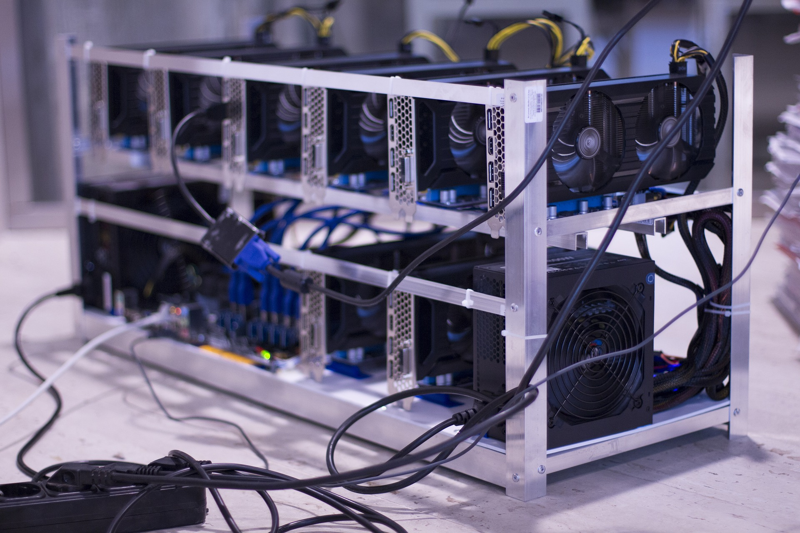
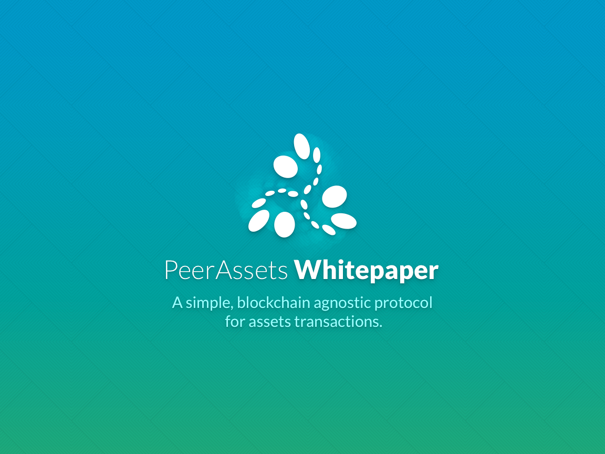
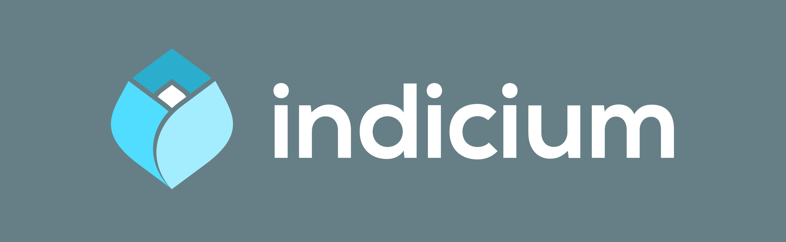

# Peercoin – pionir proof-of-stake metode
Skalabilnost, utrošak energije, sporost, skupe transakcije – sve su to potencijalni problemi s kojima se već danas suočavaju snažne kriptovalute poput Bitcoina. Naime, većina današnjih kriptovaluta za generiranje novih tokena, kao i za održavanje interne mreže sigurnom koriste proces koji uključuje izuzetno zahtjevne zadatke rješavanja kompleksnih matematičkih problema. Taj proces se u terminologiji kripto svijeta naziva [proof-of-work (PoW)][1], te iziskuje konstantan rad kompleksnih računalnih sustava koji se međusobno natječu koji će prvi uspjeti riješiti zadani problem – nešto što je poznato i pod nazivom [rudarenje][2]. Dugoročno, postavlja se pitanje isplativosti ovakvog pristupa, uzevši u obzir tendenciju porasta cijene energenta, kao i smanjenja rudarske nagrade koja tu kriptovalutu čini zanimljivom rudarima. Tu u priču ulazi Peercoin s alternativnim pristupom.

U nastavku ćemo analizirati ključne funkcionalnosti Peercoina, uključujući njegovu arhitekturu, novi koncept stvaranja tokena nazvan proof-of-stake, kako ga kupiti te koji se projekti razvijaju pod njegovim okriljem. U slučaju da vam je tematika relativno nepoznata, svakako preporučujemo da pročitate naš [uvod u kriptovalute][3], te u tehnologiju koja je omogućila njihovo postojanje,[blockchain] [4]. 

## Što je Peercoin i kako funkcionira?

Poznat i pod akronimima PPCoin i PPC, **Peercoin je kriptovaluta koja pionizira upotrebu proof-of-stake (PoS) metode osiguranja mreže.** Začeta je objavom [tehničkog opisa][5] u drugoj polovici 2012. godine, koji su formirali developeri Sunny King i Scott Nadal. Prema tom dokumentu, Peercoin, iako direktno naslonjen na Bitcoinovu tehnologiju, u praksi kombinira PoW i PoS metode. PoW metoda se snažnije koristila u početnim fazama generiranja tokena te je gotovo u potpunosti zamijenjena PoS metodom. Ona je nastala kao odgovor na potencijalne probleme sigurnosti i dugoročne održivosti čistog PoW sustava. 

U prvom redu, činjenica da se rudarska nagrada s vremenom smanjuje može negativno utjecati na prisutnost iznimno važnih rudara u ekosustavu, te omogućiti koncentraciju rudarske snage na jednom mjestu. Osoba koja kontrolira preko polovice rudarske moći teoretski može duplicirati sve transakcije i poslati sve tokene na svoju adresu te ozbiljno ugroziti stabilnost kriptovalute, što se naziva [51% napad][6]. Također, količina utrošene električne energije na rad posebnih kompjutora za rudarenje je enormno velika, što čini PoW metodu upitno isplativom, posebice u kombinaciji s već navedenim smanjenjem nagrade rudarenja. Kompenziranje smanjenja nagrade s povećanjem troškova transakcije kako bi se zadržalo rudare, međutim, smanjuje praktičnost i uporabljivost kriptovalute. Rudarima je bitnija isplativost njihovog posla nego sentimentalne veze prema određenoj kriptovaluti, pa će ona isplativija automatski biti poželjnija za rudarenje i, generalno, sigurnija.

Proof-of-stake metoda označava generiranje novčića na osnovu količine i starosti onih koje korisnik čuva u svom [novčaniku][7]. Peercoin je predlaže kao glavnu osnovu za očuvanje sigurnosti blockchain mreže, a mehanizam izbora idućeg tvorca bloka je baziran na tzv. starosti novčića (*coin day*). Ova jedinica je u principu produkt količine tokena i vremena koje su tokeni proveli u korisnikovom novčaniku. Novi koncept je doveo do modifikacije izvornog Bitcoinovog blockchaina dodajući vrijeme (*time stamp*) svake transakcije, kako bi se lakše mogla izračunati starost novčića.

**PoS metoda ujedinjuje rudare i vlasnike novčića tako da svaki sudionik u mreži ima obje uloge.** Bitno je naglasiti da samo novčići koji se u novčaniku nalaze minimalno 30 dana mogu konkurirati kod pokušaja pronalaska novog bloka. Povećanjem starosti povećavaju se i šanse za generiranje novih blokova, no nakon 90 dana starosti posljednje transakcije, šanse dostižu svoj vrhunac.

Peercoin je potencijalnom problemu monopola korisnika koji posjeduju jako velike količine novčića koji su u njihovom novčaniku netaknuti dug vremenski period doskočio na zanimljiv način. Prilikom generiranja bloka, odvija se transakcija u kojoj korisnik koji je pronašao novi blok sam sebi pošalje svoje novčiće. Tako dolazi do utroška, odnosno uništavanja starosti novčića, a korisnik u zamjenu dobiva nagradu za kreiranje novog bloka. Kako bi ponovno mogao sudjelovati u pronalasku novog bloka, korisnik mora te iste novčiće držati minimalno 30 dana u novčaniku, te proces kreće ispočetka. Ovdje treba naglasiti da je nagrada kod [„mintanja“][8] (naziv za pronalazak bloka putem PoS metode) manja u odnosu na rudarenje kod drugih kriptovaluta, pošto ne uključuje sumu svih troškova transakcija. Ovi troškovi (trenutno oko 0.02 USD po transakciji) kod Peercoina imaju drugačiju svrhu, o čemu ćemo detaljnije govoriti nešto kasnije.

## Prednosti Peercoina

Koncept starosti novčića efikasno rješava i problem određivanja glavnog lanca nakon grananja, odnosno razdvajanja blockchaina u 2 istovjetna lanca ([*fork*][9]) u slučajevima kada se dio zajednice ne slaže s planom razvoja valute. Dobar primjer za to je nedavni [Bitcoin Gold fork][10] koji je iznimno podijelio zajednicu te pokazao koliko velika količina kriptovalute u krivim rukama, u kombinaciji s mladim tržištem punim neiskusnih trgovaca može ugroziti čitav ekosustav. Kod Peercoina, glavni lanac se određuje na temelju podatka o „utrošenosti“ starosti novčića od svake transakcije u svakom bloku. Glavni lanac je tako onaj koji ima veći zbroj utrošenih starosti novčića – to je dokaz da taj lanac duže postoji.

Također, zbog PoS sustava, Peercoin je neusporedivo sigurniji na potencijalni napad 51%. Naime, obzirom da držanjem Peercoina u novčaniku otključanom samo za „mintanje“ korisnik istodobno štiti mrežu i povećava sebi šanse za generiranje bloka i osvajanje nagrade, većina novčića se nalazi u novčanicima, a ne na burzama. Napadač bi morao posjedovati preko 51% ukupne starosti novčića koji sudjeluju u „mintanju“, što je poprilično teško s obzirom na to da se ne mogu kupiti na burzi. Inicijalno planirana ulaganja za izvršavanje ovakvog napada bi brzo višestruko porasla, jer bi uslijed velike potražnje cijena jednog Peercoina astronomski porasla. Nadalje, prekomjernom kupovinom novčića bi, zapravo, napadač sam sebi naštetio, jer bi njegovi potezi u konačnici rezultirali smanjenjem tržišne cijene same valute kada bi je krenuo prodavati.

Svakako najizraženija prednost ove kriptovalute je dugoročna održivost uslijed značajno smanjenih potreba za električnom energijom. Jedini zahtjevi za električnom energijom su oni najnužniji, za pokretanje kompjutora i uređaja koji funkcioniraju kao mrežni čvorovi (nodes) Peercoina. Također, transakcijski troškovi su značajno manji nego kod mnogo poznatijih kriptovaluta, te se, kao što smo već naveli, ne dodjeljuju kreatorima novih blokova u vidu nagrade. 

Umjesto toga, svi troškovi transakcije se trajno uništavaju kako bi se kompenzirala i ustalila inflacija valute, do koje vremenom dolazi uslijed generiranja velike količine blokova i s njima novih novčića. Usvojena je fiksna cijena od 0.01 PPC po kilobajtu obrađene transakcije što, u kombinaciji sa PoW i PoS generiranjem novčića, rezultira očekivanom godišnjom inflacijom od 1-3%. Uzevši u obzir da je, uz PoS metodu, **Peercoin prvi kreirao blockchain koji nema fiksni broj tokena**, tako da je nepoznat konačan broj tokena koji će biti izdan, ovaj sustav je ekonomski dugoročno održiv, a s druge strane jednostavan i omogućuje brojne primjene, što će biti detaljno objašnjeno kasnije.

## Kontrolne točke

Međutim, jedna od najkritiziranijih funkcionalnosti Peercoina su takozvane kontrolne točke (*checkpoints*). U tehničkom opisu Sunny King ih naziva „zaštitom povijesti“, u slučaju da se stvore uvjeti za napad koji bi mogao preuzeti kontrolu nad mrežom, poput napada dvostruke potrošnje (double spending). Tvrdi kako programerski pokušaji formiranja distribuirane mreže kontrolnih točaka nisu urodili plodom, te su se u konačnici odlučili za centralizirani model emitiranja. Kontrolne točke u praksi služe kao sigurnosni prekidač kod bilo kakvih kritičnih problema u funkcioniranju mreže (slično kao System Restore funkcionalnost u Windowsima).

Naravno, zajednica ima tendenciju oštro osuđivati svaki pokušaj centralizacije kriptovaluta, posebno uzevši u obzir da je decentralizacija jedna od temeljnih pretpostavki ove tehnologije. I sam Sunny King priznaje da je centralizacija kontrolnih točaka privremeno rješenje do pronalaska kvalitetnije alternative. Zamišljene kao zaštita mreže od napada u njenim samim početcima, kontrolne točke su se u praksi održale do danas, no postupnim jačanjem mreže sve više gube smisao. [Ažuriranjem mreže na verziju 0.6][11], korisnicima je ponuđena opcija isključenja primanja kontrolnih točaka, koju je moguće ponovno uključiti po želji – preporučljivo nakon najave kritičnijih ažuriranja, grananja i promjena na mreži.

## Kako doći do Peercoina?

Postoje četiri osnovna načina kako steći svoje PPC tokene:

 - Kupnjom na burzi,
 - Zamjenom druge kriptovalute u mjenjačnici,
 - Rudarenjem,  
 - Posjedovanjem („mintanjem).

Najčešći i trenutno vjerojatno najbrži način dolaska u posjed Peercoina je putem kupnje na burzi. Pristup burzi je načelno jako jednostavan – otvorite svoj korisnički račun, unesete tražene podatke, zaštitite ga i prebacite novac sa svog bankovnog računa. [CoinMarketCap][12] sadrži najažurniji popis burzi koje podržavaju trgovanje Peercoinom, a među njima su i poznata imena poput Bit-Z, Bittrex, Poloniex, HitBTC i ostalih. Odabirom provjerenih i sigurnih burzi teško ćete pogriješiti, a što se tiče koncepta trgovanja, on je praktički isti na svakoj – prodajete postojeću valutu (najčešće USD ili neku drugu kriptovalutu) za Peercoine.

Nažalost, Peercoin trenutno ne podržava ni jedna poznata mjenjačnica kriptovaluta. U većini slučajeva, posebno kada vam treba brza promjena između valuta, ovakve mjenjačnice su idealno rješenje jer nude brzinu i fiksne transakcijske troškove. [Shapeshift][13], jedna od najpoznatijih takvih mjenjačnica je do nedavno podržavala i Peercoin, međutim podrška je u međuvremenu ukinuta zbog, kako kažu, „nedostatne rasprostranjenosti Peercoina na burzama“. Možda se stvari pokrenu u dogledno vrijeme.

Za one koji se žele okušati u rudarenju Peercoina treba napomenuti da, pošto je direktno naslonjen na Bitcoinov blockchain i njegov SHA-256 algoritam, Peercoin danas u praksi zahtjeva snažnije i specijalizirane strojeve za pronalazak blokova putem PoS metode, takozvane [ASIC rudare][14]. Ovdje se, naravno, postavlja pitanje dugoročne isplativosti investicije koja u startu iznosi i do nekoliko tisuća dolara, obzirom da se radi o valuti koja ne preferira takav način zaštite sustava i generiranja blokova. Rudarenjem se blokovi veličine 820 bajtova generiraju otprilike svakih 10 minuta, uz nagradu od otprilike 90 USD po bloku čime je profitabilnost, sukladno inicijalnom dizajnu, bitno smanjena. Za one koji se ipak odluče na rudarenje ili žele doznati nešto više o samom procesu, dobar vodič s popisom glavnih rudarskih grupacija (mining pools) se može pronaći na [službenim stranicama][15]. Naravno, prije upuštanja u samu proceduru, savjetujemo da sami napravite izračun same profitabilnosti rudarenja putem nekog od [online kalkulatora][16].

Posljednji, već opisani način dolaska do novčića Peercoina je putem „mintanja“. Koncept kojim ujedno postajete vlasnik i rudar valute, te doprinosite općoj sigurnosti mreže, odlično je opisan na službenom [blogu][17], gdje možete pronaći i razloge zašto se uključiti, kako omogućiti „mintanje“ na svom novčaniku, koliko je proces siguran i slično. „Mintanje“ vam u praksi donosi zaradu od 1% količine novčića koju držite u novčaniku na godišnjoj bazi.

Koju god varijantu da odaberete, svakako morate posjedovati novčanik za dugotrajno čuvanje novčića. Peercoin ima vlastiti [desktop novčanik][18] za Windows, Mac i Linux računala koji vam daje sve bitne funkcionalnosti vezane za transfer i „mintanje“, no imajte na umu da mu je za ispravan rad potrebno preuzimanje čitavog blockchaina. Tu je i službeni [Android novčanik][19], a možete napraviti i vlastiti [papirnati novčanik][20] za sigurno čuvanje. Također, ako preferirate novčanike koji podržavaju više kriptovaluta, [Coinomi][21] je dobro rješenje. 

## Projekti bazirani na Peercoinu

Blockchain Peercoina je, zbog dugoročne samoodrživosti i konstantnih nadogradnji koje prate brzi razvoj Bitcoinove arhitekture, idealna platform za kreiranje naprednijih rješenja. Upravo ovdje leži potencijal i budućnost ove kriptovalute, ponajviše zahvaljujući velikom trudu tima glavnih developera. Ovdje ćemo navesti najperspektivnije projekte koji su trenutno u izradi.

[PeerAssets][22] je jednostavan protokol, neovisan o tipu blockchaina koji se koristi, a služi za kreiranje i razmjenu određenih vrijednosti. Uloga PeerAssetsa je pronalazak najjednostavnije i energetski najefikasnije metode pomoću koje je moguće izdati vrijednosne tokene za bilo koji blockchain. Ovaj pristup se razlikuje od, primjerice, Ethereuma, gdje su mogućnosti prijenosa i izrade vrijednosti ograničene sadržavanjem jedinstvenih podataka u transakcijama, koji se mogu interpretirati samo na matičnom blockchainu. 

Najveće prednosti PeerAssets protokola su:

 - efikasnost u pogledu kompresiranja veličine transakcije, čime se
   većina prostora u bloku predviđenog za pohranjivanje transakcije
   oslobađa i omogućuje pohranjivanje željenog koda,
 - izbjegavanje potrebe za uvođenjem energetski zahtjevnog čvora koji će
   pregledavati čitav blockchain u potrazi za željenim kodom (*parse*)
   uvođenjem platnog sustava javnih adresa koje omogućuju brzo
   prepoznavanje željenih kodova,
 - direktne prednosti pokretanja na Peercoin blockchainu u vidu fiksnih
   troškova transakcije, relativno male veličine blockchaina, sigurnosti
   i održivosti,
 - mala cijena izvršavanja traženih kodova zbog strukture blockchaina i
   veličine oslobođenog prostora.

S druge strane, [Indicium][23] predstavlja decentraliziranu autonomnu tvrtku temeljenu na PeerAssets protokolu za kreiranje i trgovanje indeksima kriptovaluta. Indeksi, u financijskom svijetu prisutni od 1974. godine, predstavljaju relativnu promjenu vrijednosti dionica određene skupine tvrtki, koje predstavljaju određeni dio tržišta. Primjerice, porast vrijednosti indeksa od 2% označava prosječan porast svake dionice tvrtki unutar tog indeksa od 2%. 

Koristeći prednosti sigurnosti i nepromjenjivosti blockchaina, kao i univerzalnost PeerAssets protokola, Indicium planira primijeniti trgovanje indeksima na svijet kriptovaluta. Putem vlastitog Indicium (IND) tokena, korisnici će ostvariti udio u tvrtki i pravo na isplatu dividenda u obliku postotka ukupne zarade, kao i pravo na glasanje o izboru i funkcioniranju izvršnog odbora. Zamislite investicijski fond s kompleksnim automatiziranim algoritmima za trgovanje kriptovalutama uz minimiziranje rizika i decentraliziranim sustavom odlučivanja, i dobili ste osnovnu predodžbu o Indiciumu. 

Predviđeno je pohranjivanje većine vrijednosti u offline novčanike, dok će tek manji dio biti iskorišten za trgovanja na burzi. Za razliku od slovenskog konkurenta Iconomija koji naglasak stavlja na kreiranje vlastitih skupina (baskets) kriptovaluta, Indicium se pouzdaje u moćne algoritme i automatizaciju kreiranja skupina. Dobra vijest je da je Indicum uspješno okončao prvu fazu investiranja, te će se rad na njemu sigurno nastaviti.

## Zaključak

Nećemo pretjerati ako kažemo da je u proteklih pet godina Peercoin dogurao jako daleko. Od samih početaka, izvorni začetnik Sunny King jedini nije napustio projekt, te je i danas aktivni član razvojnog tima. Danas Peercoin tim broji pet developera koji imaju prava na dodavanje novog koda u postojeći, a pridružuju im se i novi zaljubljenici u projekt. Nedavno je izdana nova verzija blockchaina koja, uz sve postojeće kvalitete, dodaje i neke nove mogućnosti. S novim programerskim snagama, te na krilima projekata poput PeerAsseta i Indiciuma, ali i mnogih nadolazećih, budućnost Peercoina je svakako neupitna, posebice otkad kriptovalute uživaju mainstream popularnost. Bit će zanimljivo pratiti razvoj Peercoina u budućnosti, i u pogledu inovacija i u pogledu ukupne tržišne vrijednosti.

Ako vas zanima još informacija o ovoj kriptovaluti, želite pratiti napredak ili doprinijeti razvoju, dobra je vijest da je tim izuzetno aktivan u komunikaciji sa zajednicom. Preporučujemo da posjetite njihov [Telegram][24] kanal na kojem developere možete direktno pitati sve što vas zanima. Također, za najnovije vijesti najbolje je pratiti događanja na službenom [forumu][25], te na [Twitteru][26]. 

Mislite li da će Peercoin nadživjeti neke mnogo poznatije valute? Hoće li PoS na kraju prevladati? Podijelite svoja mišljenja u komentarima!

[1]: https://bitfalls.com/hr/glossary/#proof-of-work
[2]: https://bitfalls.com/hr/2017/10/12/mining-investing-cryptocurrency-better/
[3]: https://bitfalls.com/hr/2017/08/20/cryptocurrency/
[4]: https://bitfalls.com/hr/2017/08/20/blockchain-explained-blockchain-works/
[5]: https://peercoin.net/assets/paper/peercoin-paper.pdf
[6]: https://bitfalls.com/hr/glossary/#51-napad
[7]: https://bitfalls.com/hr/2017/08/31/what-cryptocurrency-wallet/
[8]: https://peercoin.net/minting
[9]: https://bitfalls.com/hr/glossary/#fork
[10]: https://bitfalls.com/hr/2017/10/24/bitcoin-forks-bitcoin-gold-scam-stay-safe/
[11]: https://medium.com/@PeercoinPulse/peercoin-v0-6-release-2831fb4394ad
[12]: https://coinmarketcap.com/currencies/peercoin/#markets
[13]: https://shapeshift.io/
[14]: https://bitfalls.com/glossary/#asic
[15]: https://peercoin.net/mining
[16]: https://whattomine.com/coins/52-ppc-sha-256
[17]: https://talk.peercoin.net/t/the-complete-guide-to-minting/2524
[18]: https://peercoin.net/download
[19]: https://play.google.com/store/apps/details?id=com.matthewmitchell.peercoin_android_wallet
[20]: http://wallet.peercointalk.org/
[21]: https://coinomi.com/
[22]: https://peerassets.github.io/WhitePaper/
[23]: https://indiciumfund.com/
[24]: https://telegram.me/peercoin
[25]: https://talk.peercoin.net/
[26]: https://twitter.com/peercoinppc
