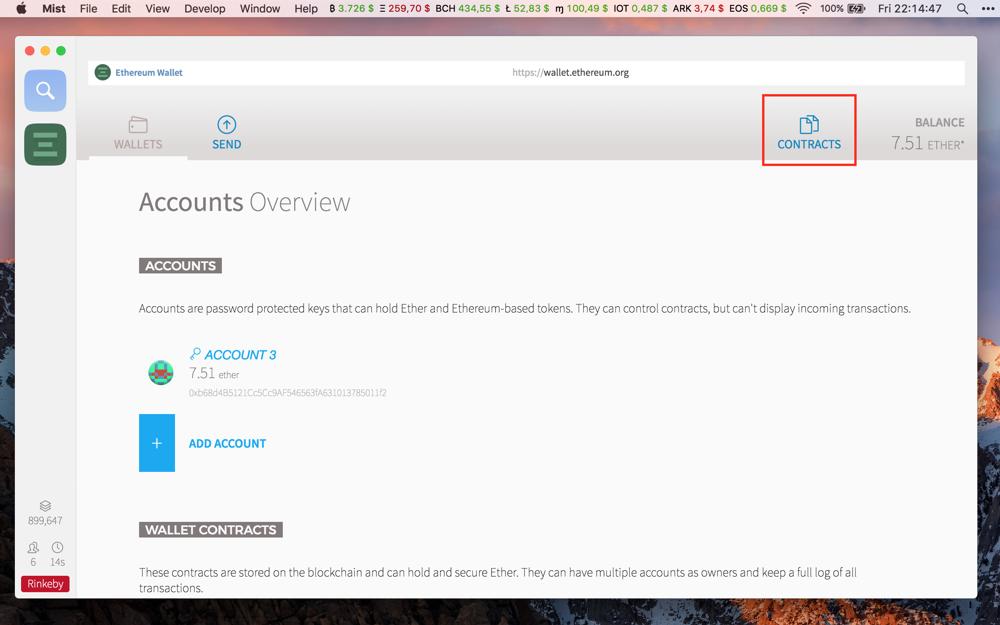
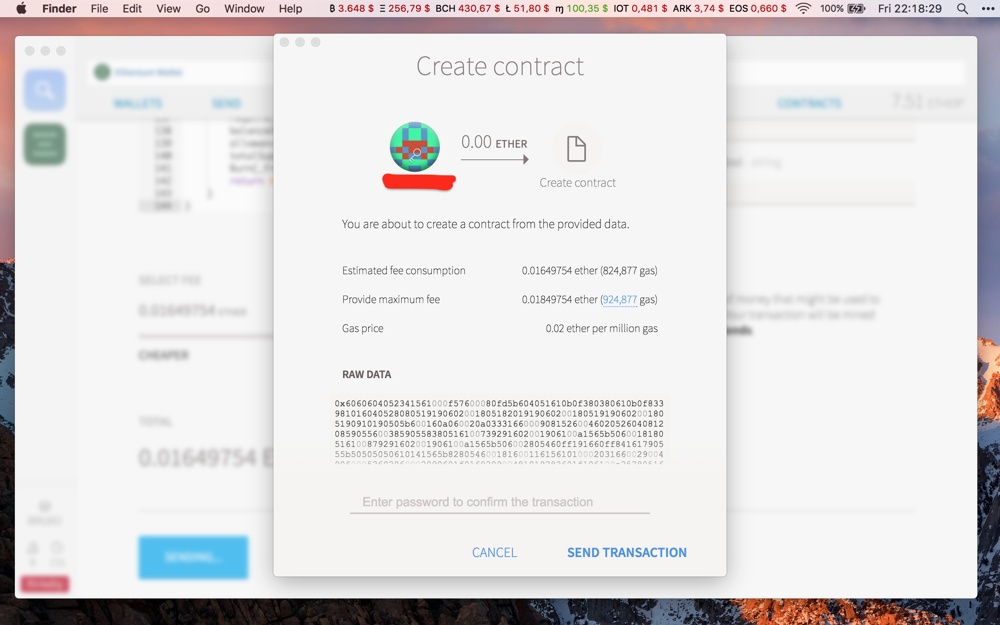
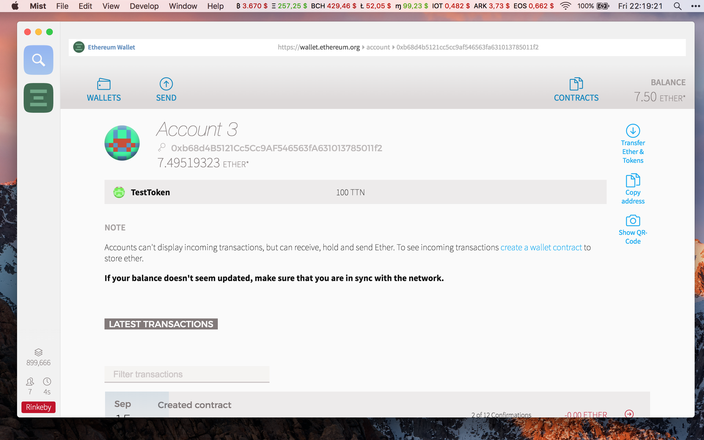

Tokeni su vrlo važan dio Ethereum ekosustava, no zašto su korisni i zašto bi ih htjeli posjedovati i koristiti?
 To pitanje ima vrlo jednostavan odgovor na koji ćemo Vam danas odgovoriti.

## Funkcije tokena

Tokeni na Ethereum mreži mogu imati funkcije kao što su bodovi lojalnosti, vođenje radnih sati u tvrtki, mogućnost glasovanja, kuponi za popuste, digitaliziranje fiat valute kao što su USD, EUR, pa čak je moguće digitalizirati i zlato.

## Kako da napravim svoj token?

Na prvi pogled to sigurno izgleda vrlo komplicirano, pa čak i nemoguće ljudima koji nisu programeri. No na nama je da demistificiramo proces koji je u suštini vrlo jednostavan.

### 1. Skinite Ethereum klijent

Skinite  [Ethereum Wallet ili Mist] klijent na svoje računalo, pri tome pazite koji operativni sustav imate.

Na današnjem primjeru ćemo koristiti Mist

### 2. Pokrenite klijent

Kad pokrenete Ethereum klijent dočekat će vas nešto slično ovome.

 

Ovdje ćemo odabrati na kojoj mreži želimo raditi.

### 3. Kreiranje računa
  3.1 Nakon odabira mreže kreirat ćemo račun tako što ćemo upisati lozinku koja nam omogućuje pristup računu.

   

  3.2 Mreža će se krenuti sinkronizirati. Taj proces može potrajati, tako da slobodno možete otići na kavu.

  

### 4. Financiranje računa
 Nakon inicijalne sinkronizacije mreže, na račun moramo poslati nešto Ethera jer svaka transakcija zahtijeva malu naknadu za održavanje mreže.

### 5. Postavljanje samog tokena

   5.1 Nakon što na račun pošaljemo nešto Ethera, kliknemo na Contracts.
   

   5.2 Kiliknemo  na Deploy new contract.

   

   5.3 Kopiramo [izvorni contract kod] u cijelosti i zalijepimo ga u označeni prozorčić.

   
 
   5.4 Kliknemo na Pick a contract i odaberemo MyToken i ispunimo parametre. 
 
  Koliko tokena želimo, ime samog tokena, koliko decimalnih mjesta ima i na kraju simbol Vašeg tokena.

  Primjer:
   
 
   5.5 Na slideru podešavamo visinu naknade za plasiranje našeg koda na blockchain, kliknemo na deploy i autoriziramo transakciju Vašom lozinkom.
 
  

## 6. Čestitamo!
Nakon što se transakcija uključi u blok, klikom na račun, trebali bi vidjeti token. 

Novostvoreni token možemo koristiti kako želimo.

Tokeni imaju bezbroj upotreba koje mogu olakšati i ubrzati svakodnevicu, postoji dobra mogućnost da ćemo u budućnosti vidjeti sve više i više digitaliziranih valuta, a sve uz pomoć i sigurnost [blockchain] tehnologije.

[izvorni contract kod]: https://github.com/wubwub/Eth-contract/blob/master/Token%20Contract
[Ethereum Wallet ili Mist]: https://github.com/ethereum/mist/releases
[blockchain]: https://bitfalls.com/hr/2017/08/20/blockchain-explained-blockchain-works/