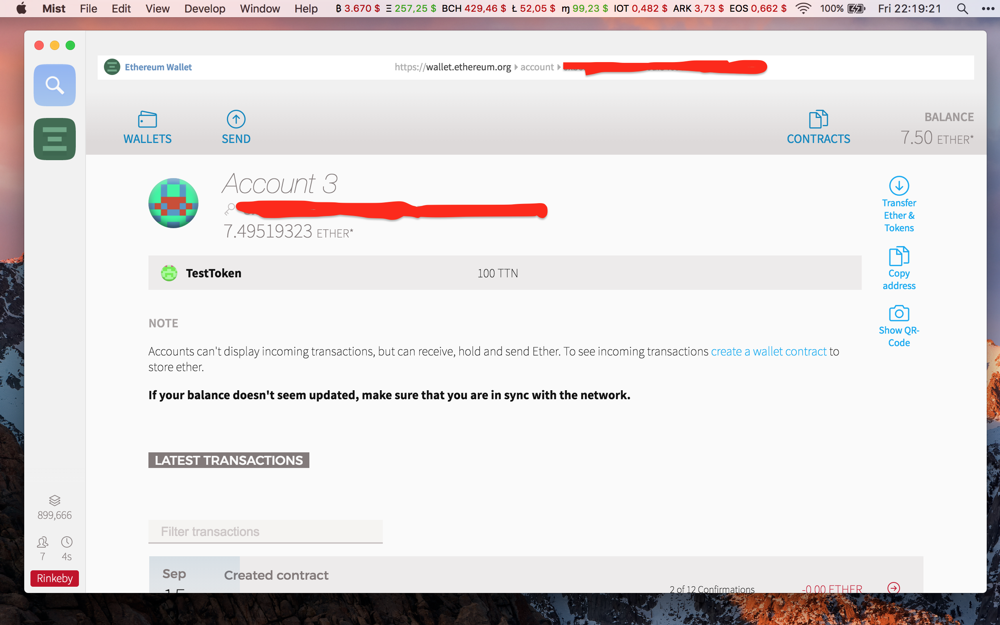

Tokeni su vrlo važan dio Ethereum ekosustava, no zašto su korisni i zašto bi ih htjeli posjedovati i koristiti? [Ovdje možete pronaći informacije o Ethereumu i tokenima na mreži].

## Svi putevi vode u Rim.

U ovom vodiču ćemo proći kroz dvije metode:
 * Metoda u kojoj skidamo cijeli [blockchain]
 * Metoda u kojoj koristimo MetaMask ekstenziju u Google Chrome

Obje metode imaju svoje prednosti i mane, npr. prva metoda zahtijeva da skinemo cijeli blockchain na svoje računalo i pri tome provjerimo legitimnost svake transakcije na mreži. 

Mana ovom pristupu je to što blockchain zauzima puno prostora na disku i što početna sinkronizacija mreže dugo traje.

Prednost druge metode je da ne zahtijeva lokalnu kopiju blockchaina, tako da štedimo na prostoru, no nikako ne možemo provjeriti legitimnost blockchaina i transakcija na njemu, pa moramo vjerovati ostalim čvorovima da svi igrači u igri igraju po zadanim pravilima.

##  1. Ethereum klijent
Ako već nemate Ethereum klijent onda se [upoznajte s osnovama  Ethereuma]

 Pošto ipak kreiramo testni token, koristit ćemo testnu mrežu na kojoj trošimo testni ether koji je **besplatan**, pa nije kraj svijeta ako nešto zabrljamo.
 
 
## 2. Gdje nabaviti testni Ether?
U ovom vodiču koristit ćemo Rinkeby testnu mrežu i Rinkeby faucet.

  ### 2.1 Rinkeby faucet
  Nakon što sinkronizirate Rinkeby testnu mrežu i kreirate [novčanik], koristit ćemo [Rinkeby] faucet da dobijemo testni Ether.

Na izborniku s lijeve strane odaberite Crypto Faucet i doći će te do ove stranice.

 

Rinkeby funkcionira tako da putem GitHub autentifikacije omogući ravnomjernu raspodjelu Ethera i onemogući spamanje i potencijalno zagušenje mreže.

Ako već nemate GitHub, [ovdje se registrirajte].

### 2.2  GitHub gist
Da bi poslali zahtjev za testni Ether, moramo napraviti [GitHub Gist].

U svom Ethereum klijentu kliknite  na svoj račun i kopirajte svoju adresu.
  
Na GitHub Gist obrascu pod Filename možemo staviti bilo što, u ovom slučaju ćemo file nazvati Rinkeby testnet, a u prvu liniju staviti adresu računa, potom kliknuti na Create public gist.
Gist mora biti javno dostupan.

 

Nakon što stvorimo Gist, kopirat ćemo url link iz adresne trake na Rinkeby faucet i odabrati koliko Ethera želite. 7.5 ethera bi trebalo biti i više nego dovoljno za testove.

 
  
Taj Ether će se odmah prebaciti na naš račun, ali nećemo moći tražiti novi Ether dok ne prođe točno 1 dan.

## 3. Kako da napravim svoj token?

   3.1 Nakon što na račun dobijemo  Ether, kliknemo na Contracts.
   
  

   3.2 Kliknemo na Deploy new contract.

  

   3.3 Kopiramo [izvorni kod ugovora] u cijelosti i zalijepimo ga u označeni prozorčić.
   
   
   
 *Za one koje žele znati više o kodu, na kraju članka  bit će pojašnjena svaka funkcija.* 
 
   3.4 Kliknemo na Pick a contract i odaberemo MyToken i ispunimo parametre. 
 
 1. Koliko tokena sveukupno želimo
 2. Ime tokena
 3. Broj decimalnih mjesta
 4. Simbol tokena

  Primjer:
 
 *U ovom ugovoru broj stvorenih tokena je konačan i ne može se povećavati, no postoje ugovori u kojima se tokeni mogu generirati po potrebi.*
  
   3.5 Na slideru podešavamo visinu naknade za plasiranje našeg koda na blockchain, kliknemo na deploy i lozinkom autoriziramo transakciju.
 
 

## 4. Čestitamo!
Uspješno ste stvorili svoj token!

Nakon što se transakcija uključi u blok, klikom na račun, trebali bi vidjeti token.



Novostvoreni token možemo slati tako da na send obrascu umjesto Ethera odaberemo token, dok ostatak procesa ostaje isti.

 


## 5. MetaMask metoda.

Otvorit ćemo Google Chrome pretraživač i instalirat ćemo [MetaMask] add on. kreirat ćemo [novčanik], te odabrati Rinkeby testnu mrežu. 

 
 
 Za financiranje računa imamo tri opcije.
  
  1. Poslati Ether s nekog drugog računa koji je na Rinkeby test mreži.
  2. Uvesti svoj privatni ključ tog računa direktno u MetaMask.
  3. Koristiti [Rinkeby] faucet kako je opisano u koraku 2.

Ovdje ćemo poslati Ether s našeg Mist novčanika zbog jednostavnosti.

### 5.1 Solidity online compiler
Koristit ćemo [Solidity online compiler] da ugovor pošaljemo na blockchain.

5.1.1 Nakon što otvorimo Solidity kompajler, obrisat ćemo primjerni kod i zalijepiti naš [izvorni kod ugovora].

 
 
 5.1.2 Morat ćemo zadati parametre našeg tokena:
 
 1. Koliko tokena sveukupno želimo
 2. Ime tokena
 3. Broj decimalnih mjesta
 4. Simbol tokena

*U ovom ugovoru broj stvorenih tokena je konačan i ne može se povećavati, no postoje ugovori u kojima se tokeni mogu generirati po potrebi.*

5.1.3 Uredite kod u crvenom okviru po uzoru na sliku ispod i kliknite na create  i pričekajte da se transakcija ugovora uključi u blockchain.


*Za one koje žele znati više o kodu, na kraju članka  bit će pojašnjena svaka funkcija.* 
 

 5.1.4 Pošto MetaMask sam ne zna da smo postali vlasnik novostvorenog tokena, morat ćemo ga o tome obavijestiti.
 
 Klikom na copy address ćemo kopirati adresu ugovora koju ćemo ubaciti u MetaMask.


Otvorite MetaMask i kliknite na tokens, potom na add token.
Tada ćemo zalijepiti adresu ugovora u prvu kućicu a ostale će se same ispuniti.


 
 Nakon što dodamo token, prikazat će se broj tokena koji imamo na računu.
 

 
 ## 6. Čestitamo!
 
 Uspješno ste stvorili svoj token!
 
 Novostvoreni token u samom sučelju MetaMaska ne možemo slati, za tu svrhu ćemo koristiti [My Ether Wallet]. 
 
 Kliknite na Send Ether & Tokens, odaberite Metamask i otvorite svoj novčanik.
 


Da bi vidjeli i mogli slati tokene u My Ether Wallet, morat ćemo ponoviti isti postupak kao u MetaMask u koraku 5.1.4.


 
Nakon što se uvjerimo da sve radi kako želimo, možemo se prebaciti na Main Ethereum Network i plasirati naš token na glavnu Ethereum mrežu.

Pravi Ether možete kupiti na brojnim mjenjačnicama, a možete ga kupiti i [direktno od nas.]


Objašnjenje koda:

``` solidity 
    pragma solidity ^0.4.11;  // Verzija kompajlera
   
    interface tokenRecipient { function receiveApproval(address _from, uint256 _value, address _token, bytes _extraData); } 
    
    //deklaracija i ime ugovora
    contract MyToken {
         // Javne varijable tokena
        string public name;    // Ime tokena
        string public symbol;    // Simbol tokena
        uint8 public decimals;    // Broj decimala tokena 
        uint256 public totalSupply;    // Konačan broj tokena
    
        // Stvara niz svih adresa koje posjeduju ovaj token
        mapping (address => uint256) public balanceOf;
        mapping (address => mapping (address => uint256)) public allowance;
    
        // Generira javni event na blockchainu koji obavještava sve klijente
        event Transfer(address indexed from, address indexed to, uint256 value);
    
        // Generira javni event na blockchainu  koji obavještava sve klijente o  broju
            uništenih tokena na jednoj adresi
         event Burn(address indexed from, uint256 value);
    
       // Konstruktor funkcija MyToken (mora biti istog imena kao i ugovor)
        function MyToken   
        (
            uint256 initialSupply    // Početni broj tokena
            string tokenName,    // Ime tokena
            uint8 decimalUnits,    // Broj decimala (Standardno je 18)
            string tokenSymbol    // Simbol tokena
      ) 
      {
          balanceOf[msg.sender] = initialSupply;    // Daje sve tokene kreatoru
          totalSupply = initialSupply;                        // Ažurira sveukupni broj tokena 
          name = tokenName;                                   // Ovdje upisujemo ime tokena koji korisnici vide. (Mora biti string)
          symbol = tokenSymbol;                               // Ovdje upisujemo simbol tokena koji korisnici vide. (Mora biti string)
          decimals = decimalUnits;                            // Broj decimala za prikaz
    }

       function _transfer(address _from, address _to, uint _value) internal {
            require(_to != 0x0);                               // Sprječava slanje na 0x0 adresu, umjesto toga treba koristiti burn()
            require(balanceOf[_from] >= _value);                // Provjerava ima li pošiljatelj dovoljno sredstava
            require(balanceOf[_to] + _value > balanceOf[_to]); // Provjerava ima li overflowa
            balanceOf[_from] -= _value;                         // Oduzima sredstva pošiljatelju
            balanceOf[_to] += _value;                           // Ista ta sredstva dodaje primatelju
            Transfer(_from, _to, _value);    // Transfer pošiljatelj, primatelj, vrijednost
    }
    
    // Šalje vrijednost  _value tokena na odredišnu adresu _to s računa 
    function transfer(address _to, uint256 _value) 
    {
        _transfer(msg.sender, _to, _value);
    }
      // Šalje vrijednost _value tokena na adresu _to u ime adrese _from 
     function transferFrom(address _from, address _to, uint256 _value) returns (bool success) {
          require(_value <= allowance[_from][msg.sender]);     // Check allowance
          allowance[_from][msg.sender] -= _value;
          _transfer(_from, _to, _value);
          return true;
        }
        // Ne dozvoljava _spender da potroši više nego vrijednosti _value  tokena
        function approve(address _spender, uint256 _value)
            returns (bool success) {
            allowance[msg.sender][_spender] = _value;
            return true;
    }
        
        // Ne dozvoljava _spender da potroši više nego vrijednosti _value  tokena i onda pinga ugovor.
        function approveAndCall(address _spender, uint256 _value, bytes _extraData)
            returns (bool success) {
            tokenRecipient spender = tokenRecipient(_spender);
            if (approve(_spender, _value)) {
                    spender.receiveApproval(msg.sender, _value, this, _extraData);
                    return true;
        }
    }
    
    // Funkcija uništava vrijednost _value tokena bespovratno
    function burn(uint256 _value) returns (bool success) {
        require(balanceOf[msg.sender] >= _value);   // Provjerava ima li pošiljatelj dovoljno sredstava
        balanceOf[msg.sender] -= _value;            // Oduzima vrijednost od pošiljatelja
        totalSupply -= _value;                      // Ažurira konačan broj tokena
        Burn(msg.sender, _value);    // Uništava tokene (pošiljatelj, broj tokena)
        return true;
    }
     // Uništava tokene s računa _from
     function burnFrom(address _from, uint256 _value) returns (bool success) {
          require(balanceOf[_from] >= _value);                // Check if the targeted balance is enough
          require(_value <= allowance[_from][msg.sender]);    // Check allowance
          balanceOf[_from] -= _value;                         // Subtract from the targeted balance
          allowance[_from][msg.sender] -= _value;             // Subtract from the sender's allowance
          totalSupply -= _value;                              // Update totalSupply
          Burn(_from, _value);
          return true;
    }
    }
```

[blockchain]: https://bitfalls.com/hr/2017/08/20/blockchain-explained-blockchain-works/

[Ovdje možete pronaći informacije o Ethereumu i tokenima na mreži]: https://bitfalls.com/hr/2017/09/19/what-ethereum-compare-to-bitcoin/

[novčanik]: https://bitfalls.com/hr/2017/08/31/what-cryptocurrency-wallet/

[Rinkeby]: https://www.rinkeby.io

[ovdje se registrirajte]: https://github.com/join?source=header-home

[Github Gist]: https://gist.github.com

[izvorni kod ugovora]: https://github.com/wubwub/Eth-contract/blob/master/Token%20Contract

[MetaMask]: https://metamask.io

[Solidity online compiler]:https://remix.ethereum.org/#version=soljson-v0.4.11+commit.68ef5810.js

[My Ether Wallet]: https://www.myetherwallet.com

[direktno od nas.]: contact@bitfalls.com