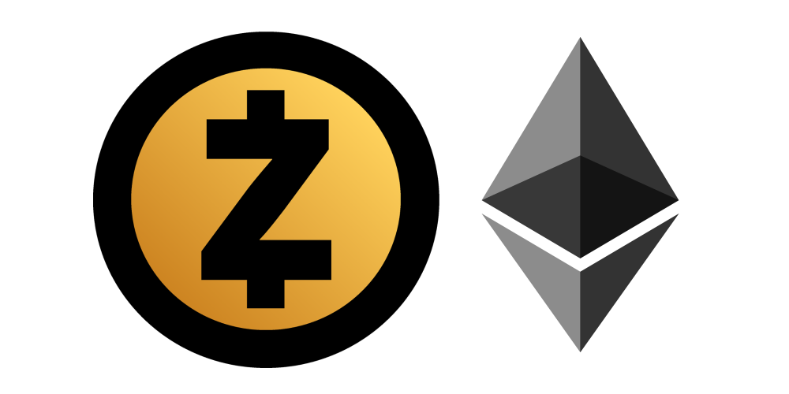

The [Ethereum] project, although full of potential,  it's still in its infancy. The two-year-old cryptocurrency still goes forth technologically due to its creator Vitalik Buterin and his team of developers. The good news is that they do not plan to stop anytime soon.

The Ethereum project is divided into 4 stages of development:

  1. Frontier
  2. Homestead (The current phase)
  3. Metropolis
  4. Serenity

## Frontier

Frontier is the first phase of Ethereum development, launched in July 2015.
It was intended primarily for people with technical background. Considering that interaction with the network itself was primarily through the terminal (An interface which not all of people are familiar with).

 Frontier is a barebone network made of basic parts needed for it to function. The purpose was to develop and test decentralized applications, to test different tools and to start mining the Ether.

## Homestead

Homestead is the second phase of Ethereum development, launched March 14. 2016 (Pi day), activated on the 1,150,000 block and it brings many protocol improvements which lay the foundations to future upgrades and speeding up the transactions on the network.

## Metropolis

The third Ethereum phase is very interesting and it brings us many changes and novelties like security updates, smart contracts getting smarter permitting a larger degree of automatization, Metropolis also eases using Ethereum for regular people with light clients (programs which do not need the whole blockchain downloaded locally, which could take a hundreds of gigs.) like [Status] for iOS and Android devices.

### Ice age

So-called "Ice age" is an initiative which will disable mining with graphics cards in Proof of Work (PoW) consensus with the intention of using a more economical approach with a Proof of Stake (PoS) consensus. 

*Proof of Stake will be explained in the Serenity part*

Taught by the dead end of development in the Bitcoin community due to disagreements between the miners and the core development team (a group of programmers that work on the Bitcoin protocol)  brought a two-year bickering about improving the scalability and permeability of the Bitcoin [blockchain].

Meanwhile,  Bitcoin transaction fees grew to outrageous proportions of $5 to a $100 or even more, depending on the current network traffic.

Ethereum developers implemented the _Ice age_, so people wouldn't have a choice rather than accept the PoS consensus, in the other terms, the miners can't hold the project hostage and hold the development back like it was the case with Bitcoin.

With time, the ice age raises the difficulty of mining and slows down the production of blocks until the network is completely frozen and unusable, hence the name.

With _Metropolis_ the beginning of the _ice age_ is postponed by 18 months, and the miner reward is decreasing from 5 Ether every ~20 seconds (which is the block interval) to 3 Ethers per block, as a preparation for PoS when the reward will decrease even more.

### ZK-Snarks

ZK-Snarks (Zero-Knowledge proof) is the technology behind a cryptocurrency called Zcash
It enables us to verify the transaction without us processing it, so we don't know what is in the transaction, but we know that the transaction is valid. In the other words, ZK-Snarks enables anonymous transactions on Ethereum. In particular, the principles of  _zero knowledge_ is described as "I know something happened, I can prove that something happened, but I don't know what happened."

 

Ethereum is a public blockchain, so the companies who want to implement the Ethereum blockchain in their business are afraid to put potentially sensitive and confidential data onto blockchain. In this case, the ZK-Snarks would enable privacy of sensitive data.

### Byzantium i Constantinople

Metropolis upgrade will be split up into two stages, that is,  two separate upgrades called  Byzantium and Constantinople.

The first upgrade _Byzantium_ contains EIP-s (Ethereum Improvement Proposal) 100, 140, 196, 197, 198, 211, 214, 649 i 658. While Constantinople brings EIP 86 and 96.

[Here you can see what every EIP brings]

Byzantium is currently in its testing period on the Ropsten testnet, the testing period is considered to last between 2-4 weeks, and if everything is in order, we can expect it to be on the main net around the end of October 2017.

## Serenity

### Casper Proof of Stake
                                
The last phase of Ethereum _Serenity_ will bring us long-awaited Proof of Stake consensus. The main difference between PoW and PoS algorithm is that PoW uses powerful hardware which calculates the  [blocks hash][hash] and validates blocks and transactions. As the name says, Proof of Work, the machines invest time and work to get the right hash.

 

In Proof of Stake mining is virtual. The validator (the one who confirmes validity of transactions by [sealing the blocks][blockchain]) sends a special transaction onto the blockchain which will lock up his Ether for a certain time. We could consider that as a bank deposit on which the validator gets dividends on.

Essentially, the validators are betting which block will be next appended to the blockchain. If a validator plays by the protocol rules and includes legitimate transactions in the block, he will get a dividend.

In case that a validator wants to include illegitimate transactions in the block, he will lose the staked Ether, so every cheating attempt costs real money.

### How is PoS better than PoW algorithm?

* There is no need for spending large quantities of electricity. It's estimated that the daily cost of mining Bitcoin and Ethereum costs over a million dollars in electricity and hardware

* With decreased electricity consumption, we can reduce inflation in a way that we reduce the issuance of the new coins and create an equilibrium between the newly created coins and coins that are lost or destroyed over time, we could even have [deflation][defl].

* PoS is fighting against mining centralization, which we can see with Bitcoin in China. Also, PoS also prevents miners to damage the network, something we also saw in Bitcoin.

* [51% attacks] in which the attacker tries to take over the network having more than 51% of the hashing power become enormously expensive than in the PoW algorithm. The attacker has to have 51% of the cryptocurrency in circulation among the validators. If the potential attacker really has that much money, it would be more feasible for the attacker to go to early retirement and forget all about this. Otherwise, he would lose it all.

### Sharding

Every blockchain has the same weakness, and that's scalability. When a blockchain comes to the saturation point and there are more transactions than the network can process, the speed is declining, something like when a road goes from 4 lanes to 2 lanes.

As the 4 lanes become 2 lanes, they become overcrowded and cars are moving extremely slow, in the same way, transactions can't fit into a block and have to wait their turn, but a more pressing problem is that who pays a bigger transaction fee has the bigger priority. Which means that not only the network is slowed down, but it gets more expensive to transact.

*In comparison, Bitcoin can process ~3-7 transactions per second, while Ethereum can process ~7-15.*

The basic idea behind Sharding is to slice the blockchain on a lot of small parts, so-called "Shards."

An example of sharding on Ethereum would look like this,  every address that begins with  0x00 are put into one shard, every address that begins with 0x001 are put into another shard and so on.
This way lets us process transactions in a parallel manner, instead of a serial manner.

Let me explain further: currently, every full blockchain node (every miner) has to synchronise the whole network starting with the Genesis (first) block and then one after another, as the network synchronizes, the node is executing and checking every transaction that happened on the blockchain and it makes sure they are legitimate.

In sharding, every node in a particular shard verifies just that shard, in another shard, nodes verify its own shard and so on.

This enables us to speed up the transaction throughput because the nodes don't have to verify the whole blockchain, but rather just a part of it, depends on the shard it belongs to. Of course, sharding will have a positive impact on the disk space usage that a node requires

Sharding is still in development, we expect it's implementation along with Casper in the Serenity upgrade.

## Raiden Network

Raiden network is an off-chain solution for increasing scalability on Ethereum.
Off-chain means that the Raiden infrastructure is built upon Ethereum, but it's not connected to the blockchain per se. Raiden brings nearly instant transactions of  [ERC20 tokens] without the regular need for global blockchain consensus. This is possible due to digitally signed transfers called **balance proofs**.

Raiden functions in a way that two parties open a "payment channel" which enables payments in both ways with very little fees.

After we create a payment channel, it's needed to make a deposit of a token we want to use as a payment

Let's say that Mark and Steve both have 200 tokens on the channel.

Mark sends 150 tokens to Steve as an exchange for some service, payment channel records that and Steve now has 350 tokens.

Steve sends 25 tokens to Mark as an exchange for some service, payment channel records that and Steve now has 325 tokens, and Mark has 75 tokens.

Mark again sends 50 tokens to Steve in exchange for some service,  Steve then sends 100 tokens to Mark. To keep it simple we'll stop here and assume they've finished their business and they close the payment channel.

The payment channel calculates the difference and only two transactions are sent to the blockchain:

Steve sent 125 tokens to Mark. 

Mark sent 200 tokens to Steve.

End balance:

Steve has: 275 tokens.

Mark has: 125 tokens.

Payment channels are useful when microtransacting, instead of sending hundreds of transactions of 10 cents for example, and paying a fee for each of that transaction, plus waiting for every transaction to be mined isn't really feasible. It's a far better way to use Raiden payment channels and then send it in just one transaction to the blockchain. 

## Conclusion

Ethereum has a lot of development ahead of itself, it'll take years until we have a finished product. But the whole crypto industry is still in its infancy, but we can expect great thing as the blockchain technology advances. Blockchain disrupted a lot of industries that functioned on outdated principles, and this is just a beginning in a new chapter of history.

[Ethereum]: https://bitfalls.com/2017/09/19/what-ethereum-compare-to-bitcoin/

[blockchain]: https://bitfalls.com/2017/08/20/blockchain-explained-blockchain-works/

[hash]: https://bitfalls.com/glossary/#hash
[Status]: https://status.im
[defl]: https://bitfalls.com/glossary/#deflation

[Here you can see what every EIP brings]: https://github.com/ethereum/EIPs#accepted-eips-planned-for-adoption

[ERC20 tokens]: https://bitfalls.com/2017/09/19/what-ethereum-compare-to-bitcoin/

[51% attacks]: https://bitfalls.com/glossary/#51-attack
