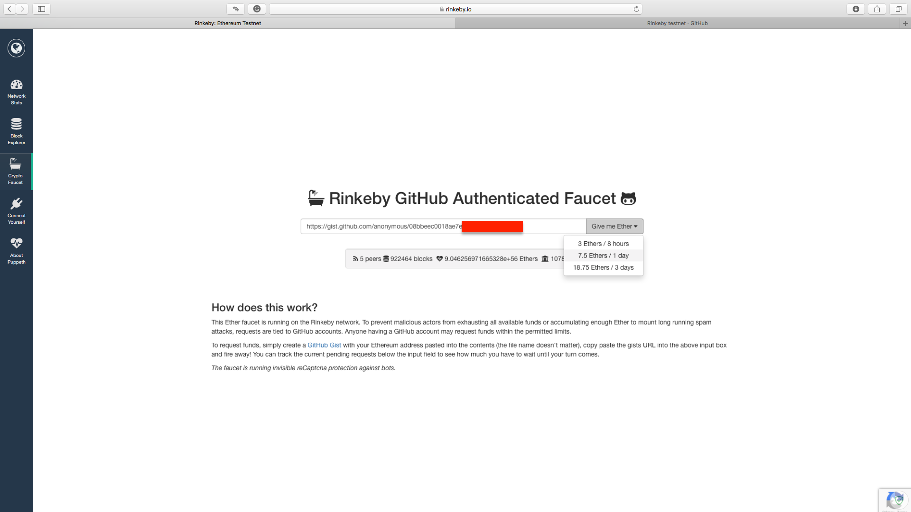
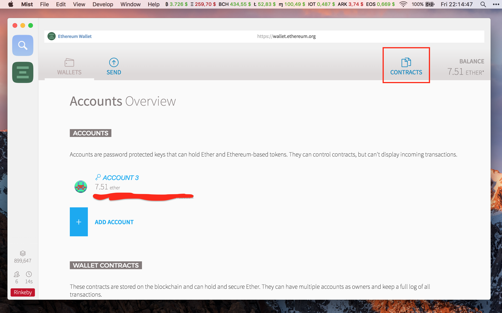
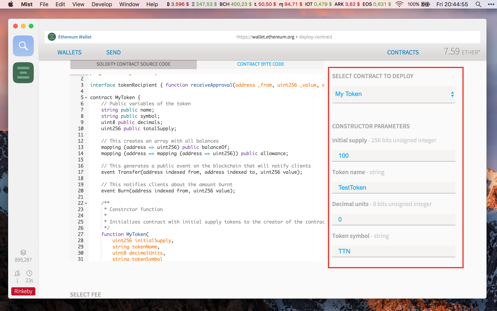
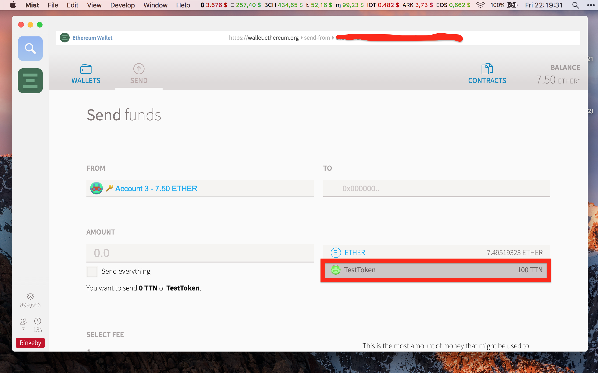
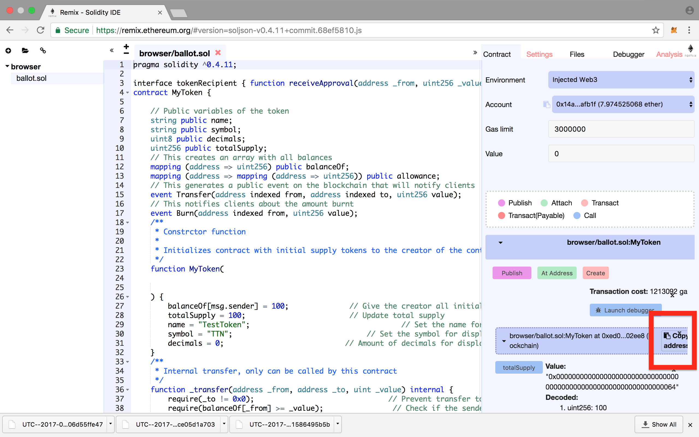
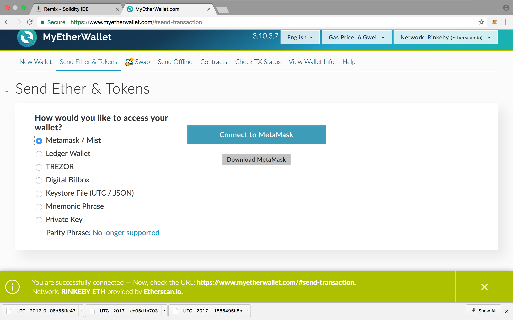
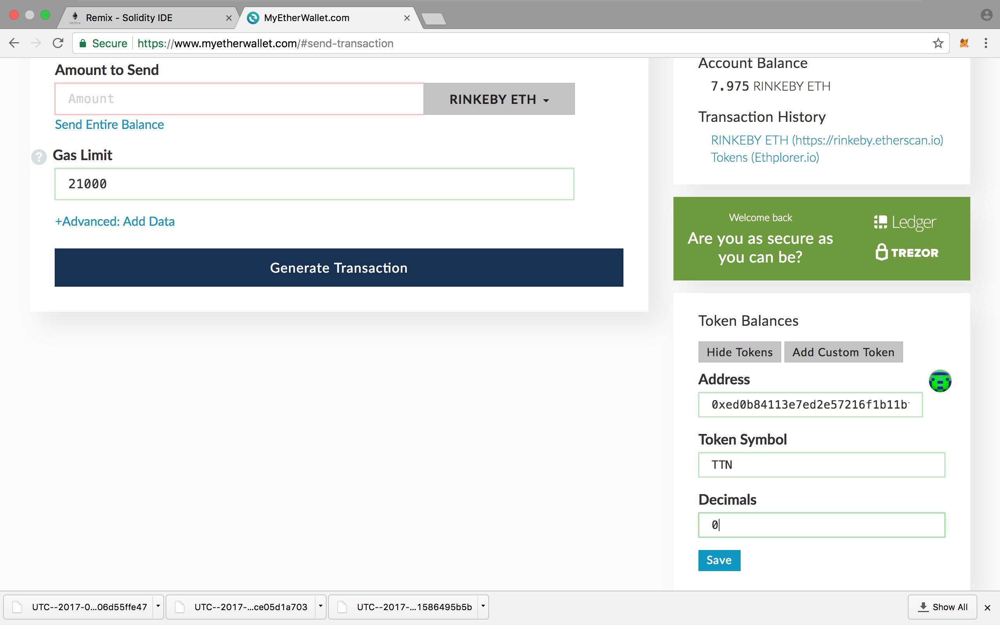

Tokeni su vrlo važan dio Ethereum ekosustava, no zašto su korisni i zašto bi ih htjeli posjedovati i koristiti? [Ovdje možete pronaći informacije o Ethereumu i tokenima na mreži][ethereum].

## Svi putevi vode u Rim.

U ovom vodiču ćemo proći kroz dvije metode:
 1. Metoda u kojoj skidamo cijeli [blockchain]
 2. Metoda u kojoj koristimo MetaMask ekstenziju u Google Chrome

Obje metode imaju svoje prednosti i mane, npr. prva metoda zahtijeva da skinemo cijeli blockchain na svoje računalo i pri tome provjerimo legitimnost svake transakcije na mreži. 

Mana ovom pristupu je to što blockchain zauzima puno prostora na disku i što početna sinkronizacija mreže dugo traje.

Prednost druge metode je da ne zahtijeva lokalnu kopiju blockchaina, tako da štedimo na prostoru, no nikako ne možemo provjeriti legitimnost blockchaina i transakcija na njemu, pa moramo vjerovati ostalim čvorovima da svi igrači u igri igraju po zadanim pravilima.

##  Ethereum klijent
Ako već nemate Ethereum klijent onda se [upoznajte s osnovama  Ethereuma]

 Pošto ipak kreiramo testni token, koristit ćemo testnu mrežu na kojoj trošimo testni ether koji je **besplatan**, pa nije kraj svijeta ako nešto zabrljamo.
 
 
## Gdje nabaviti testni Ether?
U ovom vodiču koristit ćemo Rinkeby testnu mrežu i Rinkeby faucet.

  ###  Rinkeby faucet
  Nakon što sinkronizirate Rinkeby testnu mrežu i kreirate [novčanik], kliknite [ovdje][Rinkeby] da dobijemo testni Ether.

Na izborniku s lijeve strane odaberite Crypto Faucet i doći ćete do ove stranice.

 

Rinkeby funkcionira tako da putem GitHub autentifikacije omogući ravnomjernu raspodjelu Ethera i onemogući spamanje i potencijalno zagušenje mreže.

Ako već nemate GitHub, [ovdje se registrirajte][gitregister].

###  GitHub gist
Da bi poslali zahtjev za testni Ether, moramo napraviti [GitHub Gist].

U svom Ethereum klijentu kliknite  na svoj račun i kopirajte svoju adresu.
  
Na GitHub Gist obrascu pod Filename možemo staviti bilo što, u ovom slučaju ćemo file nazvati Rinkeby testnet, a u prvu liniju staviti adresu računa, potom kliknuti na Create public gist.
Gist mora biti javno dostupan.

 

Nakon što stvorimo Gist, kopirat ćemo url link iz adresne trake na Rinkeby faucet i odabrati koliko Ethera želite. 7.5 ethera bi trebalo biti i više nego dovoljno za testove.

 
  
Taj Ether će se odmah prebaciti na naš račun, ali nećemo moći tražiti novi Ether dok ne prođe točno 1 dan.

## Kako da napravim svoj token?

### 1. Metoda: Ethereum klijent s cijelim blockchainom

  Nakon što na račun dobijemo  Ether, kliknemo na Contracts.
   
  

   1.2 Kliknemo na Deploy new contract.

  

 1.3 Kopiramo [izvorni kod ugovora][sourcecode] u cijelosti i zalijepimo ga u označeni prozorčić.
   
   
 
   1.4 Kliknemo na Pick a contract i odaberemo MyToken i ispunimo parametre. 
 
 1. Koliko tokena sveukupno želimo
 2. Ime tokena
 3. Broj decimalnih mjesta
 4. Simbol tokena

  Primjer:
 
 *U ovom ugovoru broj stvorenih tokena je konačan i ne može se povećavati, no postoje ugovori u kojima se tokeni mogu generirati po potrebi.*
  
   1.5 Na slideru podešavamo visinu naknade za plasiranje našeg koda na blockchain, kliknemo na deploy i lozinkom autoriziramo transakciju.
 
 

## Čestitamo!
Uspješno ste stvorili svoj token!

Nakon što se transakcija uključi u blok, klikom na račun, trebali bi vidjeti token.

Novostvoreni token možemo slati tako da na send obrascu umjesto Ethera odaberemo token, dok ostatak procesa ostaje isti.

 

## 2. Metoda: Metamask

Otvorit ćemo Google Chrome pretraživač i instalirat ćemo [MetaMask] add on. kreirat ćemo [novčanik], te odabrati Rinkeby testnu mrežu. 

 
  
  Izvršite korake pod "Kako nabaviti testni Ether?" da bi uspješno financirali račun.

### 2.1 Solidity online compiler
Koristit ćemo [Solidity online compiler] da ugovor pošaljemo na blockchain.

2.2 Nakon što otvorimo Solidity kompajler, obrisat ćemo primjerni kod i zalijepiti naš [izvorni kod ugovora].

 
 
 2.3 Morat ćemo zadati parametre našeg tokena:
 
 1. Koliko tokena sveukupno želimo
 2. Ime tokena
 3. Broj decimalnih mjesta
 4. Simbol tokena

*U ovom ugovoru broj stvorenih tokena je konačan i ne može se povećavati, no postoje ugovori u kojima se tokeni mogu generirati po potrebi.*

2.4 Uredite kod u crvenom okviru po uzoru na sliku ispod i kliknite na create, pričekajte da se transakcija ugovora uključi u blockchain.

 2.5 Pošto MetaMask sam ne zna da smo postali vlasnik novostvorenog tokena, morat ćemo ga o tome obavijestiti.
 
 Klikom na copy address ćemo kopirati adresu ugovora koju ćemo ubaciti u MetaMask.

Otvorite MetaMask i kliknite na tokens, potom na add token.
Tada ćemo zalijepiti adresu ugovora u prvu kućicu a ostale će se same ispuniti.

 
 Nakon što dodamo token, prikazat će se broj tokena koji imamo na računu.
 

 
 ## Čestitamo!
 
 Uspješno ste stvorili svoj token!
 
 Novostvoreni token u samom sučelju MetaMaska ne možemo slati, za tu svrhu ćemo koristiti [My Ether Wallet]. 
 
 Kliknite na Send Ether & Tokens, odaberite Metamask i otvorite svoj novčanik.
 

Da bi vidjeli i mogli slati tokene u My Ether Wallet, morat ćemo ponoviti isti postupak kao u MetaMask u koraku 2.5

 
Nakon što se uvjerimo da sve radi kako želimo, možemo se prebaciti na Main Ethereum Network i plasirati naš token na glavnu Ethereum mrežu.

Pravi Ether možete kupiti na brojnim mjenjačnicama, a možete ga kupiti i [direktno od nas.][contact]

[blockchain]: https://bitfalls.com/hr/2017/08/20/blockchain-explained-blockchain-works/

[ethereum]: https://bitfalls.com/hr/2017/09/19/what-ethereum-compare-to-bitcoin/

[novčanik]: https://bitfalls.com/hr/2017/08/31/what-cryptocurrency-wallet/

[Rinkeby]: https://www.rinkeby.io

[gitregister]: https://github.com/join?source=header-home

[Github Gist]: https://gist.github.com

[sourcecode]: https://github.com/wubwub/Eth-contract/blob/master/Token%20Contract

[MetaMask]: https://metamask.io

[Solidity online compiler]:https://yann300.github.io/remix04/#version=soljson-v0.4.0+commit.acd334c9.js

[My Ether Wallet]: https://www.myetherwallet.com

[contact]: contact@bitfalls.com