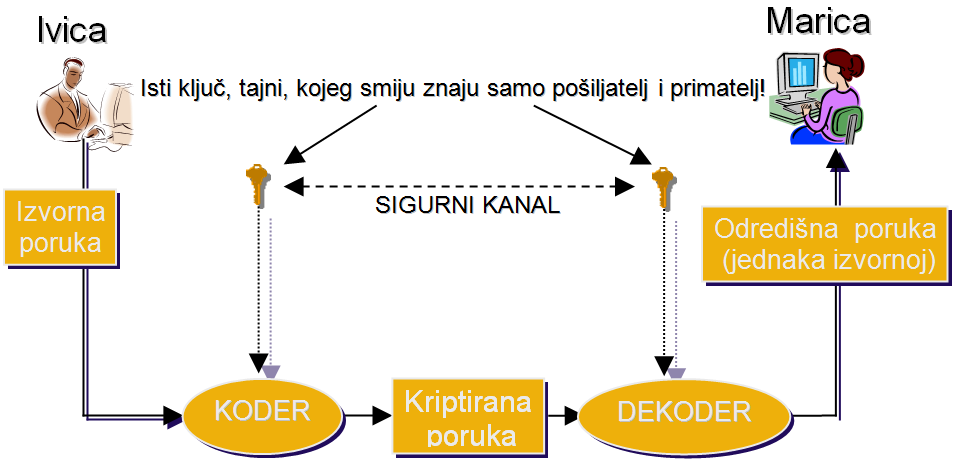
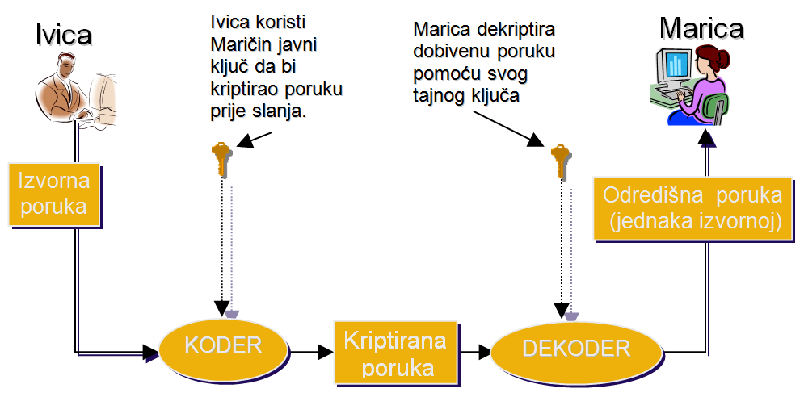
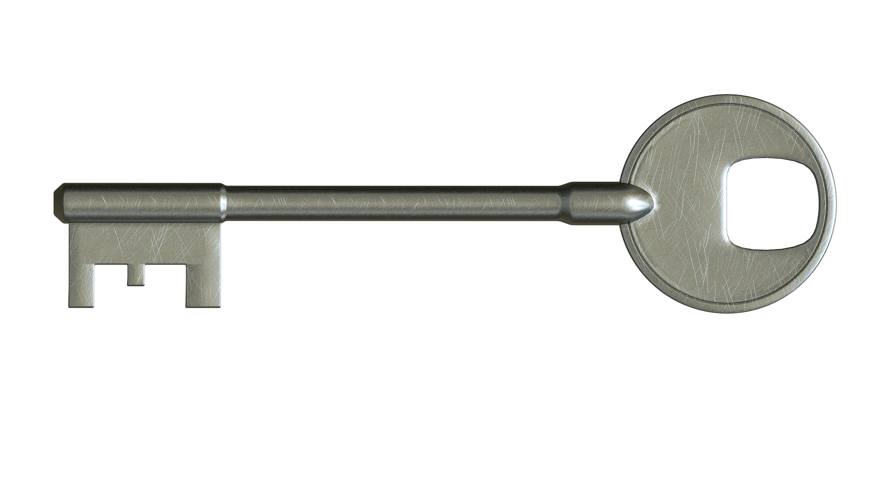

Mediji su puni članaka o  [kriptovalutama][kriptovalute] i svi bruje o važnosti [privatnih][privatni] i [javnih ključeva][javni]. Svi ste čuli za kriptiranje, ali znate li zaista što je to i kako funkcionira? 
Ovim člankom vratit ćemo se na početak priče i pokušati objasniti [osnove kriptiranja][osnove], vidjeti koje vrste kriptiranja postoje i objasniti osnovne algoritme kroz primjere. 

## Zaštitno kodiranje

Kriptografija je znanstvena disciplina koja se bavi proučavanjem metoda za slanje poruka u takvom obliku da ih samo onaj kome su namijenjene može pročitati. Taj proces pretvaranja izvorne poruke u poruku koja je čitljiva samo primatelju zovemo šifriranje, kriptiranje ili zaštitno kodiranje. Zaštitno kodiranje nikako ne  treba miješati s pojmom sigurnosnog kodiranja. Pod sigurnosnim kodiranjem podrazumijevamo nastojanje projektanta da poruka isporučena primatelju bude jednaka izvornoj, poslanoj poruci, odnosno da se greške pri isporuci svedu na minimum.

Za razliku od sigurnosnog kodiranja, zaštitnim se kodiranjem nastoji da poruka koja je poslana nekom primatelju bude čitljiva i razumljiva samo za njega te da bilo tko drugi, tko slučajno ili namjerno dođe do takve poruke, ne može pročitati njen sadržaj, odnosno ne može ga razumjeti.

Evo osnovnih značajki ovih termina:

|Sigurnosno kodiranje                                                                                   |Zaštitno kodiranje                                                                            |
|:-----------------------------------------------------------------------------------------------------:|:--------------------------------------------------------------------------------------------:|
|nastojanje da isporučena poruka bude identična poslanoj poruci, tj. da greška bude što je moguće manja |nastojanje da poruka bude sasvim nerazumljiva bilo kome drugome osim onome kome je namijenjena|

Nas u ovom članku zanima zaštitno kodiranje, odnosno kriptografija.

### Prepoznavanje problema

Čime se, u stvari, ovdje bavimo? Koji problem želimo riješiti? Pretpostavimo da postoje dvoje ljudi koji žele razmjenjivati kriptirane poruke, bez obzira na kanal koji pri tome koriste (pismo na papiru, sms, e-mail, ..). Prva stvar koju moraju napraviti je dogovoriti nekakva pravila koja će primjenjivati prilikom kriptiranja, odnosno dekriptiranja svojih poruka. Ta pravila se svode na funkcije, jednu ili više njih. Ako se takvom funkcijom izvrši kriptiranje podataka, onda mora postojati i druga funkcija koja podatke može dekriptirati, odnosno vratiti ih u izvorni oblik. Matematičkim jezikom bi rekli da funkcija kriptiranja mora biti bijektivna, tj. mora postojati inverzna funkcija kojom bi se poslužili za dekripciju, odnosno dešifriranje.

U tom slučaju pošiljatelj poruke primjenjuje dogovorenu funkciju na skup podataka i dobiva kriptirane podatke koje šalje primatelju. S druge strane, primatelj na dobiveni kriptirani tekst primjenjuje inverz dogovorene funkcije što rezultira početnim, originalnim skupom podataka. Ukoliko se neka treća osoba domogne kriptirane poruke, ta poruka će za nju biti sasvim nerazumljiva ako ne posjeduje inverznu funkciju kojom bi se poruka mogla dekriptirati.

### Ivica i Marica

Ako vam baš nije potpuno jasno kakve su to funkcije o kojima je riječ i možda vam zvuči previše matematički, idemo pogledati jedan primjer. Uzmimo da Ivica želi Marici poslati poruku putem sms-a sadržaja "I LOVE YOU", ali na način da to ne može razumjeti nitko tko slučajno vidi tu poruku na Maričinom mobitelu. Za potrebe kriptiranog dopisivanja, Ivica i Marica se prethodno moraju dogovoriti na koji način će kriptirati i dekriptirati poruke. Pretpostavimo da su oni dogovorili slijedeće pravilo:
Prilikom kriptiranja, svako slovo u izvornom tekstu će zamijeniti dvoznamenkastim brojem koji označava redni broj slova u engleskoj abecedi. Tako će slovo "A" zamijeniti s "01", slovo "B" s "02", slovo "C" s "03" i tako dalje, uz dodatak da će prazno mjesto (razmak) biti "00". To će biti njihova funkcija kriptiranja. Kod kriptiranja će u donjoj tablici za svako slovo pronaći pridruženi broj i prepisati ga.

| kod: znak  | kod: znak | kod: znak |
|------------|-----------|-----------|
| 00: razmak | 09: I     | 18: R     |
| 01: A      | 10: J     | 19: S     |
| 02: B      | 11: K     | 20: T     |
| 03: C      | 12: L     | 21: U     |
| 04: D      | 13: M     | 22: V     |
| 05: E      | 14: N     | 23: W     |
| 06: F      | 15: O     | 24: X     |
| 07: G      | 16: P     | 25: Y     |
| 08: H      | 17: Q     | 26: Z     |
                                 
Ova funkcija je, na prvi pogled možemo zaključiti, bijekcija, dakle za nju postoji inverzna funkcija. Za implementaciju inverzne funkcije ćemo u gornjoj tablici gledati brojeve i prepisati pridruženo slovo.
Vratimo se Ivici koji Marici želi poslati poruku sadržaja "I LOVE YOU" primjenjujući dogovoreno kriptiranje. Pomoću zadane funkcije (tablice), poruka će glasiti ovako:

09001215220500251521

Ukoliko Ivica ovaj sadržaj pošalje sms-om Marici i netko treći vidi poruku, neće znati da je Ivica Marici izjavio ljubav. A Marica, znajući za tajni dogovor i tablicu, lako će dekriptirati poruku i zarumeniti se.

## Simetrično kriptiranje (s tajnim ključem)

Prethodno opisani način kriptiranja nazivamo kriptiranje s tajnim ključem ili simetrično kriptiranje. Ovo *simetrično* u nazivu je zbog toga što je isti ključ poznat objema stranama komunikacije i pomoću istog ključa je moguće poruku kriptirati i dekriptirati. Tajni ključ je upravo ona funkcija koja služi za kriptiranje, a njen inverz za dekriptiranje. Način rada sustava kriptiranja s tajnim ključem (simetrično kriptiranje) možemo grafički prikazati ovako:

Ovakav sustav nam se na prvi pogled čini savršen. Naravno, umjesto jednostavne funkcije u obliku opisane tablice, treba koristiti neku kompleksniju bijektivnu funkciju. Ovaj sustav zaista je sasvim dobar sve dok je tajni ključ moguće razmijeniti na siguran način. Ivica i Marica su se mogli fizički susresti, zajedno generirati tablicu i od tog trenutka imaju tajni ključ i mogu slati i primati kriptirane poruke koje samo oni razumiju. Ako je moguća takva situacija da se dvije osobe fizički sretnu i na taj način razmijene tajni ključ, onda ovaj sustav gotovo da i nema nedostataka.
Međutim, u najvećem broju slučajeva gdje je potrebno kriptiranje podataka, komunikacija se odvija elektronskim putem, a osobe koje komuniciraju se nalaze na velikim udaljenostima. Osim toga, često se nikada nisu niti sreli. U toj situaciji se nameće problem oko načina razmijene tajnog ključa. Ako tajni ključ dvije osobe razmjenjuju nesigurnim kanalom, onda treba pretpostaviti da je taj kanal kompromitiran i da se netko treći mogao domaći tajnog ključa. Dakle, ne dolazi u obzir razmjena tajnog ključa pismom, razgovorom putem telefona ili mobitela, razmjena putem poruka na društvenim mrežama niti bilo što slično što nije potpuno sigurno.
Ovo je ujedno najveći nedostatak sustava kriptiranja s tajnim ključem: mora postojati nekakav sigurni kanal kojim bi se razmjenjivali tajni ključevi.

### Ideja za rješenje

Zaključili smo da se problem sastoji u tome što je, najčešće, teško izvršiti sigurnu razmjenu tajnog ključa jer bi za to trebali koristiti nekakav sigurni kanal, a to je u većini slučajeva neizvedivo.

Ideja za rješenje ovog problema nije u tome da se pronađe način sigurne razmjene tajnog ključa, već da se sasvim izbjegne potreba njegove razmjene. To se može postići tako da se uvede još jedan ključ u sustav. Tada bi jedan od ta dva ključa služio samo za kriptiranje, a drugi bi se koristio samo za dekriptiranje.

Onaj ključ koji služi samo za kriptiranje može biti dostupan svima. On, čak što više, mora biti dostupan svima koji žele slati kriptirane poruke jer ih bez njega ne mogu kriptirati. Taj ključ zovemo javni ključ. 

Drugi ključ služi samo za dekriptiranje i ne postoji potreba da se taj ključ šalje bilo kome. Njega ima samo osoba kojoj su upućene kriptirane poruke. Njega zovemo tajni ključ.

## Asimetrično kriptiranje (s javnim ključem)

 
 

Ako razmotrimo gornju sliku koja prikazuje sustav kriptiranja s javnim ključem, odnosno asimetrično kriptiranje, i usporedimo ga sa sustavom kriptiranja s tajnim ključem, uočit ćemo odmah da kod sustava s javnim ključem nema potrebe za sigurnim kanalom, a upravo to je bio najveći nedostatak sustava s tajnim ključem. Osim toga, asimetrija ovog sustava se ogleda u tome što istim ključem nije moguće kriptirati i dekriptirati poruku, za razliku od simetričnog kriptiranja, već se za svaki od ta dva posla koristi zaseban ključ.

Ako, kao na slici, Ivica želi poslati kriptiranu poruku Marici, on mora znati (imati) njezin javni ključ. Taj javni ključ je mogao dobiti direktno od Marice jer ona želi da joj Ivica može slati kriptirane poruke, ili je Marica jednostavno javno objavila svoj javni ključ (na primjer na Internet stranici) i svatko tko želi može doći do njega.

Dakle, Ivica posjeduje Maričin javni ključ. Kad napiše poruku koju joj želi poslati on je kriptira upravo pomoću tog njenog javnog ključa i pošalje je Marici, bez potrebe za sigurnim kanalom. S druge strane, Marica primi kriptiranu poruku i upotrijebi njezin tajni ključ, koji ima samo ona, i njime dekriptira poruku. Rezultat je poruka čiji je sadržaj identičan izvornoj poruci koju je Ivica napisao.

Ako bi sada Marica htjela Ivici odgovoriti porukom koja je također kriptirana, ona mora imati Ivičin javni ključ kojim će kriptirati poruku prije slanja standardnim komunikacijskim kanalom koji nije siguran. Takvu poruku bi na odredištu Ivica dekriptirao upotrebljavajući svoj tajni ključ.

Da bi ovakvo zaštitno kodiranje bilo održivo i imalo smisla, nužan uvjet je da onaj tko je u posjedu javnog ključa ne može pomoću njega izračunati i kreirati tajni ključ, barem ne u nekom razumnom vremenu.

### Kako to radi?

Da bi se izbjegla mogućnost da se pomoću javnog ključa može dekriptirati poruka, a isto tako da se pomoću javnog ključa ne može doći do tajnog ključa, koristi se matematička podloga jednosmjernih funkcija. Jednosmjerna funkcija je svaka ona funkcija ako je lako izračunati *f(x)* za svaki *x*, ali s druge strane nije moguće računski odrediti *x* ako je poznata vrijednost funkcije za taj *x*, odnosno ako je poznato *y=f(x)*, za svaki *y*.

Postoji više algoritama za izračunavanje takvih funkcija. U ovom članku prikazat ćemo jedan od takvih algoritama i vidjeti kako to zaista radi. Poslužit ćemo se prvim takvim algoritmom čija upotreba je još uvijek jako raširena, RSA algoritam. Akronim RSA je nastao od prvih slova prezimena  njegovih autora (Ron Rivest, Adi Shamir i Leonard Adleman) koji su ga 1977. godine objavili.

Slijede koraci algoritma kroz primjer, čiji je rezultat privatni (tajni) ključ i javni ključ:

1. Izaberemo dva različita prosta broja. [Prosti (ili prim) brojevi][prosti] su brojevi koji su djeljivi bez ostatka samo s jedan i sa samim sobom. Na primjer, izaberimo slijedeće brojeve:  
   *p = 61*  
   *q = 53*   
2. Izračunamo njihov umnožak *n = p x q*:  
   *n = 61 x 53 = 3233*
3. Izračunamo najmanji zajednički višekratnik brojeva *λ(n) (p-1) i (q-1)*:  
   *nzv (p-1,q-1) = nzv (60,52) = 780*   
   Najmanji zajednički višekratnik možemo izračunati jednostavnim algoritmom [opisanim na ovoj stranici][nzv]
4. Izaberemo bilo koji broj između 1 i prethodno izračunatog najmanjeg zajedničkog višekratnika takav da je taj broj relativno prost broj u odnosu na njih, dakle trebamo izabrati relativno prost broj *e*, *1<e<780*.  
   Dva broja su [relativno prosti brojevi][rel_prost] ako im je zajednički djelitelj samo broj 1. U ovom slučaju stoga trebamo izabrati bilo koji prosti broj koji nije djelitelj broja 780. Na primjer, odaberemo slijedeće:  
   *e = 17*
5. Izračunamo multiplikativni inverz od *e (mod nzv)*. Algoritam za računanje je dostupan na [ovoj stranici][multi_inverz]  
   Tražimo takav *d* da je   
   *(d x e) mod nzv = 1*  
   *(d x 17) mod 780 = 1*  
   *d = 413*

Ovim izračunima smo dobili sve potrebne komponente javnog i privatnog ključa. Javni ključ je par *(n,e)*, a privatni ključ je par *(n,d)*. Dakle, javni ključ u našem slučaju je *(n=3233, e=17)*. Javni ključ služi za kriptiranje poruke, a funkcija za kriptiranje poruke sadržaja *m* je:  
*c(m)=m17 mod 3233*  
Privatni ključ je *(n=3233, d=413)*. On služi za dekripciju kriptirane poruke *c* te je funkcija za dekriptiranje slijedeća:  
*m(c)=c413 mod 3233*

Sada kad imamo funkcije za kriptiranje i dekriptiranje, možemo se vratiti Ivici i pomoći mu da pošalje svoju poruku. Obzirom da ove funkcije mogu direktno kriptirati samo brojeve, a ne i slova, moramo prvo slova pretvoriti u brojeve. To je najbolje učiniti na način da slova zamijenimo njihovim ASCII kodovima koje računala koriste prilikom rada sa slovima. Proširena ASCII tablica dostupna je na [www.asciitable.com][ascii], a mi ćemo ovdje prikazati kodove za velika slova engleske abecede: 

| kod: znak  | kod: znak | kod: znak |
|------------|-----------|-----------|
| 32: razmak | 73: I     | 82: R     |
| 65: A      | 74: J     | 83: S     |
| 66: B      | 75: K     | 84: T     |
| 67: C      | 76: L     | 85: U     |
| 68: D      | 77: M     | 86: V     |
| 69: E      | 78: N     | 87: W     |
| 70: F      | 79: O     | 88: X     |
| 71: G      | 80: P     | 89: Y     |
| 72: H      | 81: Q     | 90: Z     |

Za svaki ASCII kod slova iz Ivičine poruke potrebno je izračunati *c(m)*. Prisjetimo se, poruka je "I LOVE YOU". ASCII kod prvog slova "I" je73. Izračunajmo *c(73)*:  
*c(m) = m17 mod 3233*  
*c(73) = 7317 mod 3233*  
*c(73) = 47477585226700098686074966922953 mod 3233*  
*c(73) = 1486*  

Izračunajmo *c(m)* i za ostala slova poruke  
Razmak: *c(32) = 3217 mod 3233 = 1992*  
L: *c(76) = 7617 mod 3233 = 2726*  
O: *c(79)  =7917 mod 3233 = 1307*  
V: *c(86) = 8617 mod 3233 = 1906*  
E: *c(69) = 6917 mod 3233= 28*  
Y: *c(89) = 8917 mod 3233 = 99*  
U: *c(85) = 8517 mod 3233 = 2310*

Nakon što je svako slovo poruke kriptirano, Ivica može Marici poslati poruku. Kriptirajuća funkcija računa *mod 3233* (ostatak dijeljenja s 3233) pa rezultat kriptiranja jednog slova ne može biti veći od 3232 što znači da kriptirani podatak ne može imati više od četiri znamenke. Stoga Ivica svakom kriptiranom podatku s lijeve strane dodaje onoliko nula koliko je potrebno da broj bude četveroznamenkasti:  
1486, 1992, 2726, 1307, 1906, 0028, 1992, 0099, 1307, 2310.  
Sada Marici može poslati poruku:  
1486199227261307190600281992009913072310

Marici je poznat njen privatni (tajni) ključ i ona će pomoću njega ovu poruku moći dekriptirati, tj. pretvoriti je u izvorni oblik. Koristit će prethodno spomenutu inverznu funkciju *m(c)=c413 mod 3233*, pri čemu je sa *c* označena kriptirana poruka. I iz inverzne funkcije se vidi da se računa *mod 3233* te da svaki kriptirani podatak može biti najveće vrijednosti 3232 te se može zaključiti da su podaci četveroznamenkasti. Primljena poruka se dijeli na četveroznamenkaste blokove, a vodeće nule se (ako ih ima) zanemaruju te se dobije niz kriptiranih podataka:  
1486 1992 2726 1307 1906 (00)28 1992 (00)99 1307 2310

Idemo dekriptirati prvi broj 1486:  
*m(c)=c413 mod 3233*  
*m(1486) = 1486413 mod 3233*  
*m(1486) = 1,1060335282256977039647849058382e+1310 mod 3233*  
*m(1486) = 73*

Vidimo da smo od kriptiranog podatka 1486 nakon primjene privatnog ključa inverzne funkcije dobili broj 73. Ako pogledamo tablicu ASCII kodova za velika slova engleske abecede, pronaći ćemo broj 73 kraj slova "I".  
Primjenom tajnog ključa na ostale kriptirane podatke kao rezultat dobivamo slijedeće:  
*m(1992) = 1992413 mod 3233 = 32*, ASCII 32 = razmak  
*m(2726) = 2726413 mod 3233 = 76*, ASCII 76 = L  
*m(1307) = 1307413 mod 3233 = 79*, ASCII 79 = O  
*m(1906) = 1906413 mod 3233 = 86*, ASCII 86 = V  
*m(28) = 28413 mod 3233 = 69*, ASCII 69 = E  
*m(1992) = 1992413 mod 3233 = 32*, ASCII 32 = razmak  
*m(99) = 99413 mod 3233 = 89*, ASCII 89 = Y  
*m(1307) = 1307413 mod 3233 = 79*, ASCII 79 = O  
*m(2310) = 2310413 mod 3233 = 85*, ASCII 85 = U  

Dobili smo cijelu poruku "I LOVE YOU".

Prisjetimo se zašto je asimetrično kriptiranje bolje od simetričnog. Kod simetričnog kriptiranja imamo samo jedan ključ koji služi i za kriptiranje i za dekriptiranje. Ako dvije strane žele kriptirati svoju komunikaciju simetričnim kriptiranjem, prvo moraju na neki siguran način razmijeniti tajni ključ. U slučaju da su osobe fizički jako udaljene, to postaje veliki problem i zapreka za praktično korištenje ove vrste kriptiranja.
Kod asimetričnog kriptiranja postoji javni ključ koji javno objavljujemo i dostupan je svima koji nam žele slati kriptirane poruke jer javni ključ služi za kriptiranje.
Privatni ključ nikome ne šaljemo, čuvamo ga u tajnosti i koristimo ga za dekriptiranje poruka koje su kriptirane našim javnim ključem. Nema potrebe za bilo kakvim sigurnim kanalom za slanje ključeva te je iz tog razloga asimetrično kriptiranje puno praktičnije i sigurnije od simetričnog.

Promatrajući algoritam asimetričnog kriptiranja te odnos javnog i tajnog ključa, nameće se pitanje u vezi mogućnosti izračunavanja tajnog ključa iz poznatog javnog ključa.

### Zašto je tajni ključ teško doznati?

Pogledajmo još jednom ove dvije funkcije:  
* Kriptirajuća funkcija:   *F(x)=xe mod (p x q)*
* Dekriptirajuća funkcija je:   *F-1(c)=cd mod (p x q)*

Kriptirajuća funkcija, odnosno par *(p x q, e)* predstavlja javni ključ. Ako nam je taj par poznat i ako želimo saznati dekriptirajuću funkciju, odnosno tajni ključ, moramo pronaći brojeve *p* i *q*. To znači da moramo faktorizirati umnožak *(p x q)*.

Ako pretpostavimo da su brojevi *p* i *q* 1024-bitni, tada je *(p x q)* 2048-bitni broj. Ako bi tako veliki broj htjeli faktorizirati, i najmoćnije računalo današnjice bi trebalo nezamislivo puno vremena za taj posao. Time je invertiranje kriptirajuće funkcije praktički onemogućeno, odnosno mogućnost invertiranja kriptirajuće funkcije je direktno ovisno o veličini prostih brojeva *p* i *q*.  
Faktorizaciju velikog broja nije nemoguće napraviti. Postoje posebni algoritmi koji su razvijeni upravo zato da bi poboljšali i ubrzali faktorizaciju velikih brojeva.
Trenutno najučinkovitiji algoritam za faktorizaciju je [GNFS (kratica od General Number Field Sieve)][gnfs]. Taj je algoritam posebno pogodan za faktorizaciju brojeva koji imaju više od 110 znamenaka.  
U donjoj tablici je procjena trajanja faktorizacije GNFS algoritmom izražena u MIPS godinama s obzirom na duljinu upotrijebljenog ključa. Veličinom od 1 MIPS-a (*Million Instructions per Second*) izražava se mogućnost računala da obavi jedan milijun računskih operacija u sekundi. Analogno tome, jedna MIPS godina je broj računskih operacija koje može izvesti računalo "snage" 1 MIPS ako radi jednu godinu. Ako milijun operacija u sekundi, koliko označava 1 MIPS, preračunamo u broj operacija u MIPS godini, dobijemo da je 1 MIPS godina ekvivalent 3.1536 x 1013 operacija.

|Duljina ključa|Potreban broj MIPS godina za faktorizaciju|
|--------------|------------------------------------------|
|512-bitni     |30.000                                    |
|768-bitni     |200.000.000                               |
|1024-bitni    |300.000.000.000                           |
|2048-bitni    |300.000.000.000.000.000.000               |

          
Ako pretpostavimo da su u primijenjenom algoritmu pomnoženi 1024-bitni brojevi, onda je njihov umnožak 2048-bitni. Današnji najjači procesori osobnih računala imaju mogućnost računanja [nešto više od 300.000 MIPS][mips]. Uzmemo li najoptimističniju procjenu da postoje već operabilna quantum računala koja dostižu 100 milijuna MIPS (što ni priližno nije istinito), i takvom računalu bi trebalo 3.000.000.000.000 godina da faktorizira 2048-bitni broj. 

### Mersenneovi brojevi

Pošto su veliki prosti brojevi glavna ideja RSA algoritma, sve je bitnije moći pronaći velike proste brojeve.

Postoji jedna zanimljiva klasa prostih brojeva, takozvani Mersenneovi brojevi. To su prosti brojevi oblika 2n-1, a naziv su dobili po francuskom redovniku imena Marin Mersenne, koji je 1644. naveo (pogrešno!) prvih 11 brojeva rečenog oblika.

Danas postoji pravi pokret za traženje i pronalaženje što većeg Mersenneovog broja. Detalji o tome se mogu pronaći na Internet stranicama na adresi [www.mersenne.org][mersenne].

Zadnji najveći takav broj je pronađen 07.01.2016. godine. Broj ima 22.338.618 znamenaka a glasi 274.207.281-1. To je do sada tek 49. poznati Mersenneov broj ikada pronađen. Prije njega, 48. poznati Mersenneov broj, je pronađen 25.01.2013. godine. To je broj 257.885.161-1. On ima 17.425.170 znamenki, dakle gotovo 5 milijuna znamenaka manje od 49. broja!

I još jedna zanimljivost u vezi prostih brojeva. The Electronic Frontier Foundation nudi nagrade za pronalaženje velikih prostih brojeva. Na [njihovoj web stranici][eff] se može vidjeti da su neke nagrade već podijeljene, $50.000 za prosti broj od najmanje 1 milijun znamenaka te $100.000 za prosti broj od najmanje 10 milijuna znamenaka. Još uvijek se nudi nagrada od $150.000 za pronalaženje prostog broja od najmanje 100 milijuna znakova te nagrada od $250.000 za pronalaženje prostog broja od najmanje 1 milijardu znakova! Ako imate ideju za dobar algoritam koji bi pronašao takve tražene proste brojeve, pokušajte, možda uspijete osvojiti nagradu!

## Asimetrično kriptiranje i Bitcoin

A kakve ima veze sve ovo prethodno rečeno s kriptovalutama, osim što dijele zajednički korijen *kripto*?  
Uzmimo primjer najpoznatije i najstarije kriptovalute Bitcoin. Kao i kod svih drugih kriptovaluta, i kod Bitcoina se koristi par ključeva, javni i privatni. Javni ključ, odnosno jedan njegov oblik, kod Bitcoina služi kao adresa na koju je moguće poslati neki iznos. Znamo od prije iz ovog članka da naš javni ključ služi da bi nam netko drugi mogao poslati kriptiranu poruku. Tako i kod Bitcoina, naš javni ključ, odnosno Bitcoin adresa, služi da bi nam netko drugi mogao poslati sredstva. S druge strane, privatnim ključem možemo odobriti, potpisati, obaviti transakciju kojom sredstva sa svog računa (adrese) šaljemo nekom drugom, na neku njegovu adresu.  
Iako je ideja ista, kod Bitcoina se par ključeva izračunava na nešto drukčiji način nego je prethodno prikazano pomoću algoritma RSA. Privatni ključ Bitcoina je zapravo jedan 256-bitni broj. Naravno, obično se radi se o nekom velikom broju koji je odabran slučajnim odabirom iz skupa brojeva u kojem se nalazi 2256 brojeva. To je nešto više od 1077 brojeva. Možda se ne čini puno, ali ako znamo da je [u cijelom univerzumu oko 1080 atoma][atomi], onda se ipak možemo zamisliti na veličini skupa brojeva. Samo da bi pobrojili sve te brojeve koji mogu biti privatni ključevi, kada bi svake sekunde pobrojili njih bilijun, za taj posao bi nam trebalo milijun puta više vremena od starosti univerzuma!
Dakle, imamo privatni ključ koji samo mi znamo i koji nitko (u razumnom vremenu) ne može pogoditi. Kod Bitcoina se iz privatnog ključa izračunava javni ključ pomoću ECC algoritma (*Elliptic-curve cryptography*). Ovaj algoritam se bazira na krivulji čiju funkciju možemo zapisati kao *y2=x3+ax+b*. Kao rezultat, dolazimo do javnog ključa. Na [ovoj][ecc1] i [ovoj][ecc2] adresi mogu se saznati detaljni koraci ovog algoritma.

Kod Bitcoina javni ključ nije ujedno i adresa, ali se relativno jednostavno od javnog ključa može izračunati adresa. Pojednostavljeno, postupak se svodi na slijedeći izračun:  
*Adresa = RIPEMD160 (SHA256 (privatni ključ))*  
Dakle, nad javnim ključem treba provesti postupak SHA2 te nad rezultatom postupak RIPEMD160. Na [ovom linku][pub2addr] se nalaze detalji oko pretvaranju javnog ključa u Bitcoin adresu.

## Zaključak

Treba razlikovati zaštitno od sigurnosnog kodiranja. Sigurnosno kodiranje je nastojanje da isporučena poruka bude identična poslanoj poruci, tj. da greška bude što je moguće manja, dok je zaštitno kodiranje nastojanje da poruka bude sasvim nerazumljiva bilo kome drugome osim onome kome je namijenjena.

Postoji više vrsta zaštitnog kodiranja, odnosno kriptiranja, a glavne dvije su simetrično i asimetrično. Kod simetričnog kriptiranja koristi se jedan tajni ključ koji služi i za kriptiranje i za dekriptiranje. Moraju ga znati obje strane koje sudjeluju u komunikaciji, što je ujedno i najveći nedostatak ovog sustava. Da bi obje strane bile upoznate s tajnim ključem, mora postojati sigurni kanal za njegovu dostavu. Asimetrično kriptiranje rješava problem sigurnog kanala uvodeći još jedan ključ. Javni ključ može biti dostupan svima i on služi za kriptiranje poruke. Privatnim (tajnim) ključem poruka se može dekriptirati, a taj ključ nije potrebno (niti bi se smjelo) slati drugim sudionicima komunikacije.
Prednosti asimetričnog kriptiranja koriste i kriptovalute kao što je Bitcoin. Kod kriptovaluta privatni ključ služi samo za potpisivanje transakcija prilikom slanja iznosa nekom drugom, a javni ključ predstavlja adresu na koju nam netko drugi može poslati sredstva, bez potrebe poznavanja našeg privatnog ključa. 
  

[kriptovalute]: https://bitfalls.com/hr/2017/08/20/cryptocurrency/
[privatni]: https://bitfalls.com/hr/glossary/#private-key
[javni]: https://bitfalls.com/hr/glossary/#public-key
[osnove]: https://bitfalls.com/hr/2017/10/13/crypto-cryptocurrency-matter/
[prosti]:https://en.wikipedia.org/wiki/Prime_number
[nzv]:https://en.wikipedia.org/wiki/Least_common_multiple
[rel_prost]:https://en.wikipedia.org/wiki/Coprime_integers
[multi_inverz]:https://en.wikipedia.org/wiki/Modular_multiplicative_inverse
[ascii]:http://www.asciitable.com/
[gnfs]:http://citeseerx.ist.psu.edu/viewdoc/download?doi=10.1.1.219.2389&rep=rep1&type=pdf
[mips]:https://en.wikipedia.org/wiki/Instructions_per_second#Timeline_of_instructions_per_second
[mersenne]:http://www.mersenne.org/
[eff]:https://www.eff.org/awards/coop/rules/
[atomi]:https://www.thoughtco.com/number-of-atoms-in-the-universe-603795
[ecc1]:https://www.cryptocompare.com/wallets/guides/what-is-elliptic-curve-cryptography/
[ecc2]:https://en.wikipedia.org/wiki/Elliptic-curve_cryptography
[pub2addr]:https://en.bitcoin.it/wiki/Technical_background_of_version_1_Bitcoin_addresses
