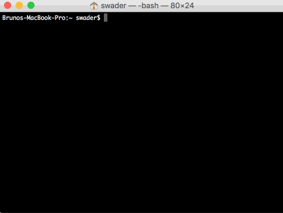
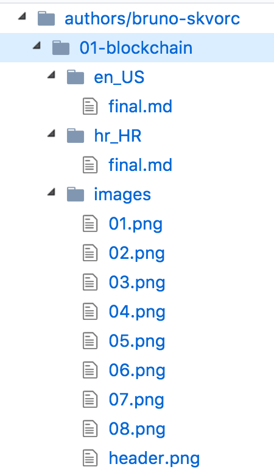
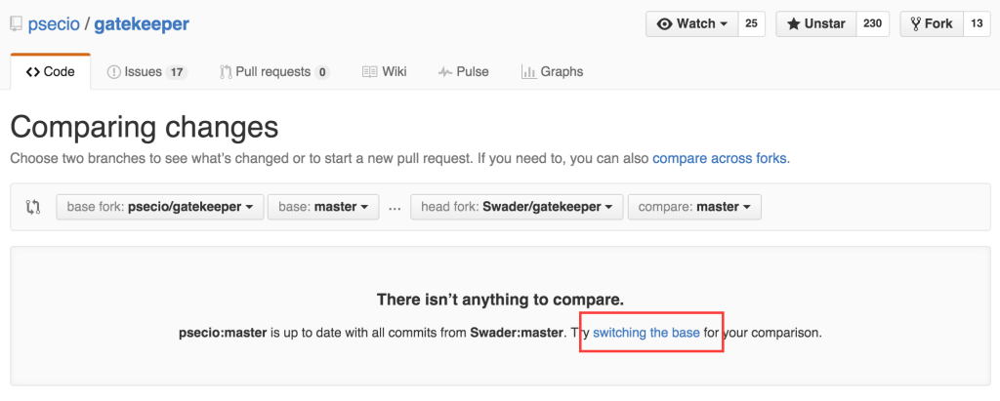

Ovaj dokument opisuje kako poslati skicu članka na pregled u ovaj repozitorij, kako bi je drugi autori pregledali, ostavili komentare, i kako bi se ista kolektivno ispeglala do stanja u kojem se je može s ponosom objaviti.

_Prije nego počnete, korisno je biti upoznat s temama opisanim na [Github Guides](https://guides.github.com). Iskreno preporučamo korištenje aplikacije [Git Bash](https://git-scm.com/downloads) ako ste na Windows sustavu, ili Terminal na Linux ili Mac OS sustavu. Malo je kompliciranije od samog klikanja na sučelju, ali omogućava da svi imaju iste komande i olakšava praćenje donjih koraka._

## Priprema: Github i autorski tim

Ako ga još nemate, napravite račun na Github.com. Prijavite se kao član autorskog tima mailom kako je to opisano na [ovoj stranici][wfu]. Nakon odobrenja, biti ćete dodani u tim i možete početi s donjim koracima.

## Korak 1: Fork

Ako prvi puta šaljete rad u repozitorij, potrebno je napraviti vlastitu kopiju (ogranak, u daljnjem tekstu _fork_) repozitorija na svom Github računu. To se radi pomoću Fork gumba.


Ako već imate svoj fork našeg repozitorija, gumb _Fork_ će vas odvesti do njega. U tom slučaju, moguće je da se od kada ste prvi puta _forkali_ repozitorij pojavilo još sadržaja, te vaš fork treba sinkronizirati s originalom. Taj postupak je opisan u sekciji "Dodatno" pri dnu ovog dokumenta.

Svoj fork tada preuzmite na vaše računalo koristeći komandnu liniju operativnog sustava koji koristite ([Git Bash](https://git-scm.com/downloads) ili CMD za Windows, Terminal za Mac OS ili Linux), ili koristeći jednu od brojnih vizualnih aplikacija za isto, poput službene [Github aplikacije](https://desktop.github.com/).

Evo kako to izgleda putem komandne linije:



U gornjoj snimci primjetite da sam klonirao repozitorij na vlastitom računalu, zatim komandom `cd bifalls_content` ušao u taj _lokalni repozitorij_, i komandom `ls` izlistao sadržaj mape, i zatim podmape `authors`. Da je mapa `bitfalls_content` već postojala na mom računalu, `git pull` komanda u toj mapi bila bi dovoljna da povuče najnoviju verziju s Github.com.

## Korak 2: Struktura

Svi poslani članci moraju pratiti određenu strukturu:

- u mapi "authors" naći ćete svoje korisničko ime s kojim ste se prijavili na Github.com
- za svaki novi članak, napravite novu mapu koja počinje s brojem za 1 većim od prethodnog, i završava s `-naslov`. Npr. ako pišete temu "Uvod u Solidity" i to vam je prvi članak na našoj platformi, nazovite datoteku `01-uvod_u_solidity`.
- svaki članak se (trenutno) objavljuje u 2 jezika: engleskom i hrvatskom. Ovisno o tome na kojem jeziku šaljete članak, potrebno je napraviti odgovorajuću podmapu u mapi članka: `en_EN` za engleski i `hr_HR` za hrvatski. Ako će članak imati neke slike (moraju biti public domain - slobodne za korištenje bez licenci), dodatna mapa je potrebna: `images`. 
- sadržaj mora biti u [Markdown](https://guides.github.com/features/mastering-markdown/) obliku
- ime datoteke u kojoj se nalazi sam sadržaj članka mora biti `final.md`, pa tako članak koji ima oba jezika i slike izgleda ovako:
  

Samo jedan članak po *grani* - ako pišete više članaka istovremeno, koristite više grana. Recimo da ste dobili odobrenje za pisanje "Uvod u solidity" i "Napredni solidity" članka. Koraci su sljedeći ako koristite komandnu liniju (kao što smo gore preporučili):

1. Preuzimanje svog forka: `git clone https://github.com/mojeime/bitfalls_content` ili ako ga već imate na svom računalu ali ne najnoviju verziju: `git pull` kada ste u `bitfalls_content` mapi
2. kreiranje novog brancha (grane) za prvi članak: `git checkout -b 00-uvod-u-solidity`
3. pisanje članka prema strukturi spomenutoj gore
4. kada je prvi članak gotov, komande `git add -A` i `git commit -am "Prvi članak gotov"` spremaju granu za kasnije slanje
5. kreiranje novog brancha (grane) za drugi članak: `git checkout -b 01-napredni-solidity`
6. ako se usred izrade drugog članka sjetite potrebne izmjene na prvom, `git add -A` i `git commit -am "Clanak u tijeku"` će spremiti trenutni članak u tijeku za poslije i dopustiti da se vratite na prijašnji branch s `git checkout 00-uvod-u-solidity`, napravite promjene, i opet ih spremite s `git add -A` i `git commit -am "Neke promjene"`. Zatim se lako vratite na `01-napredni-solidity` branch s `git checkout 01-napredni-solidity` i nastavite s radom, i tako u nedogled.
  
## Korak 3: Slanje

Kada ste spremni za slanje članka u repozitorij, prvo ga pošaljite u svoj fork repozitorija. 

Ako koristite komandnu liniju, sljedeće komande izvršene redom kada se nalazite u glavnoj datoteci repozitorija svog forka (`bitfalls_content`) spremiti će sadržaj za slanje (kao što smo to opisali u prijašnjem koraku):

```bash
git add -A
git commit -am "Dodajem clanak 01-neki-naslov"
```

Pazite da se nalazite na grani koju želite poslati. Provjerite na kojoj ste komandom `git branch`. Nakon što ste sigurni da se nalazite na grani s člankom kojeg želite poslati u repozitorij, sljedeća komanda će to učiniti:

```bash
git push origin GRANA
```

(zamijenite GRANA s imenom grane koje ste prije odabrali, npr. `01-uvod-u-solidity`)

Ako koristite neku aplikaciju poput Git Tower ili Github Desktop, pratite upute te aplikacije kako biste postigli isti rezultat.

Nakon što je članak na Github.com na kopiji vašeg repozitorija, pošaljite pull request:

- na svom forku repozitorija na Github.com kliknite "Create Pull Request" - opcija će biti prisutna na glavnom ekranu vašeg forka nakon što ste poslali promjene na Github.com
- ispunite ponuđena polja ako imate komentare, ili ostavite prazno ako nemate
- kliknite "Create Pull Request" da potvrdite

Pull Request će biti kreiran u originalnom repozitoriju, i urednici i autori će ga moći pregledati.

## Korak 4: Peer Review

Počekajte na osvrte drugih autora, i obratite pozornost na njihove komentare. Diskutirajte prijedloge, i nemojte komentare shvaćati osobno - svima nam je cilj proizvesti najbolji mogući sadržaj, te zajedno radimo na tome.

Za vrijeme čekanja na osvrte na vlastiti rad, slobodno pogledajte radove drugih autora i komentirajte, predložite promjene, pohvalite rad, itd. Drugi autori cijeniti će vaše povratne informacije i priliku da se poboljšaju.

Za članke koji trebaju osvrt, pratite etiketu [Peer Review Needed](https://github.com/Swader/bitfalls_content/labels/Peer%20Review%20Needed).

_**Obavezno komentirajte na engleskom ako autor ne priča hrvatski!**_

## Korak 5: Publikacija i isplata

Nakon što je dovoljno ljudi pregledalo članak, ili urednik odredi da je članak spreman za objavu, biti ćete obaviješteni o tome mailom i vaš Pull Request biti će absorbiran u repozitorij. U tom momentu, članak izlazi na platformi i vrši se isplata prema dogovoru.

Članak tada postaje intelektualno vlasništvo Bitfalls d.o.o., no autor ostaje deklariran kao autor i zadržava pravo da se identificira kao takav u svim medijima. Za ponovno objavljivanje drugdje, autor **mora** tražiti dopuštenje od Bitfalls d.o.o. i dobiti ga u pismenom obliku.

## Odbijanje članka

U nekim slučajevima, vaš pull request može biti odbijen. To se može desiti ako je članak u tako lošem stanju da ga je nemoguće popraviti bez kompletne prerade, ako je plagijat, ako tvrdi neistine, itd. U tom slučaju **ne isplaćujemo** honorar, ali niti preuzimamo intelektualno vlasništvo - slobodno ga objavite drugdje ako želite. Imajte to na umu kada pišete - dajte sve od sebe za najbolji mogući rad, i šansa za odbijanjem će biti minimalna.

## Dodatno

### Sinkroniziranje postojećeg _forka_ s originalnim

Process je detaljno opisan [ovdje](https://www.sitepoint.com/quick-tip-sync-your-fork-with-the-original-without-the-cli/), no ukratko, postupak je sljedeći:

- otvorite svoj fork na Github.com

- kliknite "New Pull Request" da biste došli na "Comparing Changes" ekran

- usred teksta u centru ekrana biti će poveznica "switching the base", kao u slici dolje - kliknite na nju:
  
  
- kliknite na "Create Pull Request", ostavite polje koje vam se nudi prazno (ili upišite opis da se sjetite zašto ste ovo radili kada u budućnosti pogledate prošlost svojih akcija). Opet kliknite "Create Pull Request" da finalizirate odluku.

- Kliknite na "Merge Pull Request" da dovršite sinkronizaciju

### Rizik krađe

Mnogi smatraju da je imati sadržaj koji tek dolazi na ovako javnom mediju naivno, i da će konkurentske publikacije ukrasti isti da bi ga prijevremeno objavile. To je moguće, no smatramo da su transparentnost i otvorenost prema peer review metodi bitniji od mogućeg rizika krađe - ako to toga dođe, lako će biti identificirati plagijatore i javno ih prozvati, kao i obraniti se legalnim mjerama (kao tvrtka, imamo pravo na zaštitu intelektualnog vlasništva). Zbog toga svakako preporučujemo svim drugim publikacijama da se radije jave u svrhu suradnje, za koju smo u većini slučajeva veoma otvoreni.

### Zašto ovako komplicirano?

Često pitanje je zašto ne jednostavno primati članke putem e-maila kao ostale platforme. Odgovor je da ovi umjereno komplicirani koraci osiguravaju sljedeće:

1. Osnovnu tehničku pismenost autora, što je bitno kada se radi o predstavljanju tehničkih tema široj javnosti. Kriptovalute su, ipak, još uvijek tehnička tema koju nastojimo učiniti ne-tehničkom
2. Javnu diskusiju i kolektivni rad na člancima, kako bi se poboljšala kvaliteta samog završnog dokumenta

Ta dva faktora zajedno osiguravaju visoku kvalitetu pisanih radova, i sprječavaju monopol urednika.

[wfu]: https://bitfalls.com/hr/write-for-us